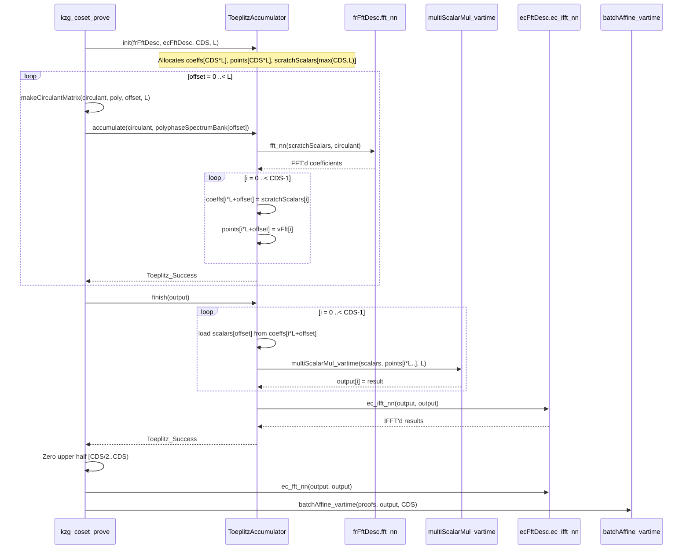
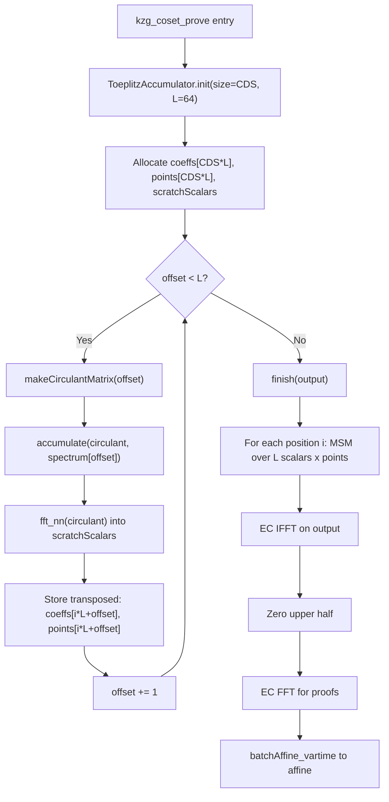
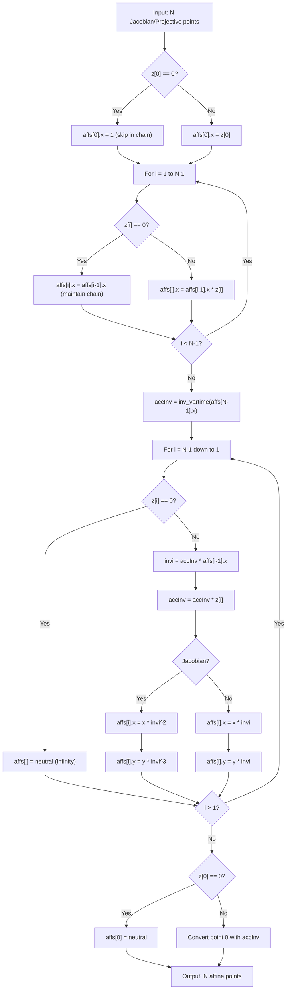

---
**Branch:** `master` → `peerdas-perf-fix-rebased2` (commit `74d1839c`)
**Diff file:** `.REVIEWS/RID-202605022039-peerdas-perf-fix-rebased2-74d1839c/RID-202605022039-changes_under_review.diff`
**Date:** 2026-05-02
**Reviewer:** Final Report Synthesis
**Scope:** PeerDAS FK20 multiproof performance fixes: ToeplitzAccumulator with MSM-based accumulation, batchAffine_vartime for points with infinity, polyphase spectrum bank in affine form, and Alloca-tag elimination
**Focus:** Comprehensive defense-in-depth review
---

<h3>Review Summary</h3>

This branch implements a comprehensive performance optimization of the FK20 (Fri-KZG-20) multiproof pipeline for PeerDAS. The core changes replace per-offset FFT/Hadamard/IFFT operations with a new `ToeplitzAccumulator` object that uses batched MSM (multi-scalar multiplication) via Pippenger's algorithm, add `batchAffine_vartime` variants for elliptic curve batch affine conversion that skip infinity points (~50% of polyphase spectrum), and switch the polyphase spectrum bank from Jacobian to Affine storage for a ~33% memory reduction. Across 26 files (+1310/-527 lines), the diff introduces architectural changes to `toeplitz.nim`, new batch operations in elliptic curve modules, and in-place FFT optimizations throughout the KZG proving path.

- **P1 – Compilation-breaking stale variable references in `bit_reversal_permutation` (BUG-A-001)**: Two `debug:` assertions in `fft_common.nim` reference undefined variables (`buf` in the two-parameter version, `src` in the single-parameter version) after the function was split into aliased/non-aliased overloads. This causes **hard compilation failure in debug builds** (default Nim mode), blocking all development and testing. VERIFIED against source code at lines 311 and 328.

- **P2 – Defense-in-depth regression in `computeAggRandScaledInterpoly` (BUG-A-002)**: The function changed from returning `bool` with runtime validation to returning `void` with `doAssert` guards. While mitigated by caller-side validation in `kzg_coset_verify_batch`, the `doAssert` calls compile away in release builds, removing the inner validation layer. Flagged by 11 independent reviewers; practical risk is currently low but the regression weakens the safety contract.

<h3>Important Files Changed</h3>

| Filename | Overview |
|----------|----------|
| `benchmarks/bench_kzg_multiproofs.nim` | Updated to use `ToeplitzAccumulator` API; benchmark includes `init()` in timed loop (1 Medium finding) |
| `benchmarks/bench_matrix_toeplitz.nim` | Renamed from `bench_toeplitz_multiproofs.nim`; benchmarks `ToeplitzAccumulator` and `toeplitzMatVecMul` |
| `benchmarks/bench_matrix_transpose.nim` | New benchmark: 5 transpose strategies comparison (1 Medium finding: not registered in build system) |
| `constantine.nimble` | Added `bench_matrix_toeplitz` to `benchDesc` (1 Medium finding: `bench_matrix_transpose` missing) |
| `constantine/commitments/kzg.nim` | Switched `batchAffine` to `batchAffine_vartime` in `kzg_verify_batch` |
| `constantine/commitments/kzg_multiproofs.nim` | Rewritten `kzg_coset_prove` with `ToeplitzAccumulator`; polyphase bank affine; in-place FFT (3 Medium, 1 Low finding) |
| `constantine/commitments/kzg_parallel.nim` | Switched `batchAffine` to `batchAffine_vartime` in parallel KZG verification |
| `constantine/commitments/eth_verkle_ipa.nim` | Switched `batchAffine` to `batchAffine_vartime` in IPA proof generation (1 Low finding) |
| `constantine/commitments_setups/ethereum_kzg_srs.nim` | `polyphaseSpectrumBank` changed from Jacobian to affine form |
| `constantine/lowlevel_elliptic_curves.nim` | Exported `batchAffine_vartime` for Short Weierstrass and Twisted Edwards |
| `constantine/math/elliptic/ec_shortweierstrass_batch_ops.nim` | Added `batchAffine_vartime` (projective + Jacobian); 4 Low findings |
| `constantine/math/elliptic/ec_twistededwards_batch_ops.nim` | Added `batchAffine_vartime`; refactored zero tracking; 2 Low findings |
| `constantine/math/elliptic/ec_scalar_mul_vartime.nim` | Switched wNAF scalar mul to `batchAffine_vartime`; removed `Alloca` tag |
| `constantine/math/matrix/toeplitz.nim` | Replaced `toeplitzMatVecMulPreFFT` with `ToeplitzAccumulator` (8 Medium, 6 Low, 1 Info findings) |
| `constantine/math/matrix/transpose.nim` | New file: 2D tiled matrix transpose (1 Low finding) |
| `constantine/math/polynomials/fft_common.nim` | Added `bit_reversal_permutation` with alias detection; **1 Critical compilation-breaking bug**, 1 Medium, 1 Low finding |
| `constantine/math/polynomials/fft_ec.nim` | Removed `Alloca` tag from all EC FFT functions |
| `constantine/data_availability_sampling/eth_peerdas.nim` | In-place IFFT in `recoverPolynomialCoeff` |
| `metering/m_kzg_multiproofs.nim` | Simplified to run `kzg_coset_prove` directly with metering |
| `tests/commitments/t_kzg_multiproofs.nim` | Updated FK20 tests with affine spectrum bank |
| `tests/math_elliptic_curves/t_ec_conversion.nim` | Added `batchAffine_vartime` tests |
| `tests/math_elliptic_curves/t_ec_template.nim` | Added vartime dispatch and new test cases |
| `tests/math_matrix/t_toeplitz.nim` | Added `ToeplitzAccumulator` error path tests |

### Context Diagrams

**`constantine/commitments/kzg_multiproofs.nim` / `constantine/math/matrix/toeplitz.nim`:**



**`constantine/math/matrix/toeplitz.nim`:**



**`constantine/math/elliptic/ec_shortweierstrass_batch_ops.nim`:**



<h3>Production Readiness & Safety Verdict</h3>

**Production Readiness:** 2/5

**Safety Verdict:** Not safe to merge as-is

The diff contains a **Critical compilation-breaking bug** (stale variable references in `bit_reversal_permutation`) that prevents the code from compiling in debug builds — the default Nim compilation mode. This blocks all development, testing, and CI on debug configurations. Beyond the critical issue, there are 12 Medium findings including a defense-in-depth regression flagged by 11 reviewers, multiple test coverage gaps, and architectural concerns with the new stateful `ToeplitzAccumulator` API. The LGTM findings confirm the performance optimizations are architecturally sound, but the code cannot ship until the compilation error is fixed.

---

## Summaries

### Findings

**Order by file path (alphabetical), then by line number. This enables deterministic comparison between runs and agents.**

| ID | Severity | Confidence | File | Issue |
|----|----------|------------|------|-------|
| CONS-A-001 | Medium | 0.95 | benchmarks/bench_kzg_multiproofs.nim:104-113 | `ToeplitzAccumulator.init()` inside benchmark loop — inconsistent with `bench_matrix_toeplitz.nim` pattern |
| CONS-B-001 | Medium | 1.0 | constantine.nimble | `bench_matrix_transpose.nim` not registered in `benchDesc` or nimble tasks |
| BUG-A-002, BUG-B-003, BUG-B-004, SEC-B-001, ARCH-A-002, ARCH-B-004, MATH-A-001, CONS-A-007, CONS-B-007, COV-A-004, COV-B-001 | Medium | 0.95 | constantine/commitments/kzg_multiproofs.nim:502-579 | `computeAggRandScaledInterpoly` bool→void return type change — defense-in-depth erosion (mitigated) |
| ARCH-A-001, ARCH-B-003 | Medium | 1.0 | constantine/commitments/kzg_multiproofs.nim / constantine/commitments_setups/ethereum_kzg_srs.nim | Breaking public API: `polyphaseSpectrumBank` Jacobian→Affine type change |
| PERF-B-003 | Low | 0.8 | constantine/commitments/kzg_multiproofs.nim:355-370 | `computePolyphaseDecompositionFourier` allocates ~2.4 MB temporary buffer |
| SEC-A-001 | Low | 0.5 | constantine/commitments/eth_verkle_ipa.nim:225,260,649 | Variable-time batch affine in IPA proving path — theoretical side-channel |
| COV-A-005 | Medium | 0.8 | constantine/commitments/kzg_multiproofs.nim:352-415 | Polyphase spectrum bank vartime batch-inversion with ~50% infinity points: no explicit verification |
| QA-001 | Low | 1.0 | constantine/math/elliptic/ec_shortweierstrass_batch_ops.nim:185-334 | New public `batchAffine_vartime*` functions lack `##` docstrings |
| QA-005 | Low | 0.9 | constantine/math/elliptic/ec_shortweierstrass_batch_ops.nim:202-280 | Comment inconsistency between projective/Jacobian overloads |
| COV-A-008, COV-B-005 | Low | 0.8 | constantine/math/elliptic/ec_shortweierstrass_batch_ops.nim:188-190 | `batchAffine_vartime` N≤0 early-return guard untested |
| CONS-B-005 | Low | 0.8 | constantine/math/elliptic/ec_shortweierstrass_batch_ops.nim:211-328 | `.bool()` vs `.bool` convention drift |
| QA-002 | Low | 1.0 | constantine/math/elliptic/ec_twistededwards_batch_ops.nim:98-150 | New public `batchAffine_vartime*` (Twisted Edwards) lacks `##` docstring |
| CONS-B-002 | Low | 0.9 | constantine/math/elliptic/ec_twistededwards_batch_ops.nim:28 | `.noInline` tag removed from Twisted Edwards but kept in Short Weierstrass batch ops |
| SEC-B-003, ARCH-A-004, ARCH-B-007, MATH-A-002 | Low | 0.9 | constantine/math/matrix/toeplitz.nim:281-295 | `ToeplitzAccumulator` scratch buffer type-punned via `cast` with `sizeof` invariant |
| CONS-B-003 | Low | 0.8 | constantine/math/matrix/toeplitz.nim:40 | `checkCirculant*` exported but only used in `debug:` block |
| CONS-B-004 | Low | 0.8 | constantine/math/matrix/toeplitz.nim:155-177 | `checkReturn`/`check` templates overlap with patterns in other modules |
| QA-003 | Low | 1.0 | constantine/math/matrix/toeplitz.nim:146-150 | Public `ToeplitzStatus` enum has no docstring |
| QA-004 | Low | 1.0 | constantine/math/matrix/toeplitz.nim:213-248 | `ToeplitzAccumulator.init` has no docstring |
| QA-007 | Low | 1.0 | constantine/math/matrix/toeplitz.nim:276 | `ToeplitzAccumulator.finish` docstring is terse |
| QA-006 | Info | 0.9 | constantine/math/matrix/toeplitz.nim:155-172 | Missing trailing period in `checkReturn`/`check` template docstrings |
| ARCH-B-001 | Medium | 0.9 | constantine/math/matrix/toeplitz.nim | Procedural API replaced by stateful object — `ToeplitzAccumulator` |
| ARCH-B-002 | Medium | 0.9 | constantine/math/matrix/toeplitz.nim | Dual error type hierarchy (`ToeplitzStatus` / `FFT_Status`) |
| PERF-B-001 | Medium | 0.9 | constantine/math/matrix/toeplitz.nim:308-378 | `toeplitzMatVecMul` with L=1 uses Pippenger MSM for single-scalar multiplications |
| PERF-B-002 | Medium | 0.8 | constantine/math/matrix/toeplitz.nim:288-299 | `ToeplitzAccumulator.finish()` strided memory access pattern |
| COV-A-002, COV-B-002 | Medium | 0.9 | constantine/math/matrix/toeplitz.nim:249-270 | `ToeplitzAccumulator.accumulate` error path untested |
| COV-A-003 | Medium | 0.9 | constantine/math/matrix/toeplitz.nim:308-378 | `toeplitzMatVecMul` input-validation error paths untested |
| COV-B-004 | Medium | 0.8 | constantine/math/matrix/toeplitz.nim:281-299 | `ToeplitzAccumulator` happy-path (init→accumulate→finish) not directly tested |
| COV-A-007 | Low | 0.8 | constantine/math/matrix/transpose.nim | New `transpose` module has no tests |
| BUG-A-001, BUG-B-001, BUG-B-002, CONS-A-002 | Critical | 1.0 | constantine/math/polynomials/fft_common.nim:311,328 | Undefined variables `buf`/`src` in debug assertions — compilation failure in debug builds |
| COV-A-001, COV-B-003 | Medium | 0.9 | constantine/math/polynomials/fft_common.nim:307-322 | `bit_reversal_permutation(dst, src)` aliasing detection branch untested |
| PERF-A-002, PERF-B-004 | Low | 0.8 | constantine/math/polynomials/fft_common.nim:315-320 | In-place FFT allocates temporary buffer for bit reversal aliasing |
| COV-B-006 | Low | 0.7 | constantine/commitments/kzg_multiproofs.nim:717-809 | `kzg_coset_prove` internal error paths not focused-tested |
| COV-B-007 | Info | 0.6 | constantine/commitments/kzg_multiproofs.nim:659-715 | `computePolyphaseDecompositionFourier` in-place IFFT tested only end-to-end |

> **Key takeaways:**
> 1. **Fix immediately**: BUG-A-001 — stale variable references `buf`/`src` in `fft_common.nim` cause compilation failure in debug builds (Critical, 4 reviewers agreed, confidence 1.0)
> 2. **Defense-in-depth regression**: BUG-A-002 — `computeAggRandScaledInterpoly` bool→void change removes inner validation; mitigated by caller-side checks but flagged by 11 reviewers
> 3. **Test coverage gaps**: 5 Medium findings across `toeplitz.nim` and `fft_common.nim` for untested error paths and aliasing detection
> 4. **Documentation debt**: 5 Low findings for missing `##` docstrings on exported public APIs
> 5. **Net positive performance**: 24 LGTM findings confirm substantial allocation reduction (~50× on FK20 hot path), ~33% memory savings, and correct mathematical implementation

### Per-File Summary

| File | Critical | High | Medium | Low | Info | Status |
|------|----------|------|--------|-----|------|--------|
| benchmarks/bench_kzg_multiproofs.nim | 0 | 0 | 1 | 0 | 0 | ⚠️ NEEDS CHANGES |
| constantine.nimble | 0 | 0 | 1 | 0 | 0 | ⚠️ NEEDS CHANGES |
| constantine/commitments/kzg_multiproofs.nim | 0 | 0 | 3 | 2 | 1 | ⚠️ NEEDS CHANGES |
| constantine/commitments/eth_verkle_ipa.nim | 0 | 0 | 0 | 1 | 0 | ⚠️ NEEDS CHANGES |
| constantine/math/elliptic/ec_shortweierstrass_batch_ops.nim | 0 | 0 | 0 | 4 | 0 | ⚠️ NEEDS CHANGES |
| constantine/math/elliptic/ec_twistededwards_batch_ops.nim | 0 | 0 | 0 | 2 | 0 | ⚠️ NEEDS CHANGES |
| constantine/math/matrix/toeplitz.nim | 0 | 0 | 7 | 5 | 1 | ⚠️ NEEDS CHANGES |
| constantine/math/matrix/transpose.nim | 0 | 0 | 0 | 1 | 0 | ⚠️ NEEDS CHANGES |
| constantine/math/polynomials/fft_common.nim | 1 | 0 | 1 | 1 | 0 | ⚠️ NEEDS CHANGES |
| benchmarks/bench_matrix_toeplitz.nim | 0 | 0 | 0 | 0 | 0 | ✅ APPROVED |
| benchmarks/bench_matrix_transpose.nim | 0 | 0 | 0 | 0 | 0 | ✅ APPROVED |
| benchmarks/bench_elliptic_template.nim | 0 | 0 | 0 | 0 | 0 | ✅ APPROVED |
| constantine/commitments/kzg.nim | 0 | 0 | 0 | 0 | 0 | ✅ APPROVED |
| constantine/commitments/kzg_parallel.nim | 0 | 0 | 0 | 0 | 0 | ✅ APPROVED |
| constantine/commitments_setups/ethereum_kzg_srs.nim | 0 | 0 | 0 | 0 | 0 | ✅ APPROVED |
| constantine/data_availability_sampling/eth_peerdas.nim | 0 | 0 | 0 | 0 | 0 | ✅ APPROVED |
| constantine/lowlevel_elliptic_curves.nim | 0 | 0 | 0 | 0 | 0 | ✅ APPROVED |
| constantine/math/elliptic/ec_scalar_mul_vartime.nim | 0 | 0 | 0 | 0 | 0 | ✅ APPROVED |
| constantine/math/polynomials/fft_ec.nim | 0 | 0 | 0 | 0 | 0 | ✅ APPROVED |
| metering/m_kzg_multiproofs.nim | 0 | 0 | 0 | 0 | 0 | ✅ APPROVED |
| tests/commitments/t_kzg_multiproofs.nim | 0 | 0 | 0 | 0 | 0 | ✅ APPROVED |
| tests/math_elliptic_curves/t_ec_conversion.nim | 0 | 0 | 0 | 0 | 0 | ✅ APPROVED |
| tests/math_elliptic_curves/t_ec_template.nim | 0 | 0 | 0 | 0 | 0 | ✅ APPROVED |
| tests/math_matrix/t_toeplitz.nim | 0 | 0 | 0 | 0 | 0 | ✅ APPROVED |

---

## LGTM

**These are positive changes in the diff, not issues to fix. They are excluded from Detailed Findings, per-file severity counts, and Recommendations.**

| ID(s) | File | Improvement |
|-------|------|-------------|
| PERF-A:1 | kzg_multiproofs.nim, toeplitz.nim | **50× heap allocation reduction on FK20 hot path** — from ~256 allocs (4 per L=64 iteration) to ~5 one-time allocs |
| PERF-A:2 | ec_shortweierstrass_batch_ops.nim | **`batchAffine_vartime` skips 50% of points** — polyphase spectrum has ~50% infinity points; vartime batch inversion saves significant compute |
| PERF-A:3 | kzg_multiproofs.nim, ethereum_kzg_srs.nim | **~33% memory reduction in polyphase spectrum bank** — Jacobian→Affine storage (1.1 MB → 786 KB) |
| PERF-A:4 | kzg_multiproofs.nim | **In-place FFT in `kzg_coset_prove`** — eliminates one ~36 KB heap allocation per proof |
| PERF-A:5 | ec_twistededwards_batch_ops.nim | **Eliminated `allocStackArray(SecretBool, N)`** — reuses `affs[i].y` as inline zero-flag storage |
| PERF-A:6 | kzg_multiproofs.nim | **In-place IFFT in `computeAggRandScaledInterpoly`** — eliminates per-column temp allocation |
| PERF-A:7 | fft_ec.nim | **Correct `Alloca` tag removal** — iterative FFT implementations don't use VLA; removing tag improves effect tracking |
| BUG-A:1 | ec_shortweierstrass_batch_ops.nim, ec_twistededwards_batch_ops.nim | **`N≤0` early return in all `batchAffine` variants** — prevents division-by-zero or OOB on empty batches |
| BUG-A:2 | toeplitz.nim | **`checkCirculant` r=1 bounds fix** — correctly handles edge case where `r=1` by checking `r+1 < k2` before access (old code had latent OOB bug) |
| BUG-A:3 | fft_common.nim | **`bit_reversal_permutation` aliasing support** — new detection prevents data corruption during in-place FFT operations |
| ARCH-A:1 | toeplitz.nim | **`ToeplitzAccumulator` design** — excellent RAII with `=copy{.error.}`, `=destroy` nil-checking, defensive double-init |
| ARCH-A:2 | toeplitz.nim | **`ToeplitzStatus` + `check`/`checkReturn` templates** — structured error handling with zero overhead |
| BUG-A:4 | kzg_multiproofs.nim | **`kzg_coset_prove` in-place optimization** — reuses `u` buffer for both IFFT input/output, reduces peak memory |
| PERF-B:1 | toeplitz.nim | **Pippenger MSM replaces per-element scalarMul for L>1** — for L=64, bucket-based MSM amortizes additions across all L points |
| PERF-B:2 | kzg_multiproofs.nim | **`computePolyphaseDecompositionFourierOffset` writes directly to output** — eliminates per-offset temp allocation |
| BUG-A:5 | kzg_multiproofs.nim | **`recoverPolynomialCoeff` in-place IFFT** — eliminates one ~128 KB allocation |
| TEST-A:1 | t_ec_conversion.nim, t_ec_template.nim | **Comprehensive `batchAffine_vartime` tests** — happy-path, all-neutral, single-element, varied batch sizes across BLS12-381, BN254, Bandersnatch, Banderwagon |
| TEST-A:2 | t_toeplitz.nim | **`ToeplitzAccumulator` error path tests** — `init` errors (zero-size, non-power-of-2), `finish` errors, `checkCirculant` r=1 |
| TEST-A:3 | t_kzg_multiproofs.nim | **Updated FK20 tests with affine spectrum bank** — exercises new `batchAffine_vartime` path end-to-end |
| QA-A:1 | fft_common.nim | **Excellent `bit_reversal_permutation` documentation** — clear docstrings for aliasing-safe and noalias variants |
| QA-A:2 | transpose.nim | **Comprehensive transpose documentation** — benchmark results, element-size-specific block size recommendations |
| QA-A:3 | kzg_multiproofs.nim | **Mathematical invariant comments** — rigorous explanation of `j < 0` invariant after polyphase loop |
| QA-A:4 | kzg_multiproofs.nim | **Consistent error message prefix** — "Internal error:" prefix on all doAssert messages |
| QA-A:5 | toeplitz.nim | **`ToeplitzAccumulator` field-level docs** — inline comments on each field with size notes |
| SEC-A:1 | toeplitz.nim | **Memory safety in error paths** — labeled `HappyPath` blocks with structured cleanup; all allocations tracked and freed |
| SEC-A:2 | toeplitz.nim | **`=destroy` with nil-checks** — safe cleanup of all three pointer fields |
| MATH-A:1 | toeplitz.nim | **Mathematical correctness of `ToeplitzAccumulator`** — verified equivalent to original FK20 algorithm |
| MATH-A:2 | ec_shortweierstrass_batch_ops.nim | **`batchAffine_vartime` Jacobian formulas verified** — z²/z³ derivation correct for Jacobian-to-affine conversion |
| CONS-A:1 | ec_shortweierstrass_batch_ops.nim, ec_twistededwards_batch_ops.nim | **Unified `_vartime` naming convention** — matches `inv_vartime`, `scalarMul_vartime` |
| CONS-A:2 | toeplitz.nim | **Complete `batchAffine_vartime` overload set** — matches existing `batchAffine` pattern across curve families |
| CONS-A:3 | kzg_multiproofs.nim | **`toeplitzMatVecMul` docstring updated** — describes new `ToeplitzAccumulator`-based algorithm |
| PERF-B:3 | toeplitz.nim | **In-place FFT reuse in `toeplitzMatVecMul`** — `ec_fft_nn(vExt, vExt)` saves one allocation |

---

## Detailed Findings

### Critical

**DO NOT MERGE** — These issues cause certain failures or security breaks.

#### [BUG] BUG-A-001, BUG-B-001, BUG-B-002, CONS-A-002: Stale variable references in debug assertions after `bit_reversal_permutation` signature split - constantine/math/polynomials/fft_common.nim:307-333

**Location:** constantine/math/polynomials/fft_common.nim:307-333
**Severity:** Critical (compilation-breaking in debug builds)
**Confidence:** 1.0 (4 reviewers agreed + VERIFIED against source)

**Diff Under Review:**
```diff
+func bit_reversal_permutation*[T](dst: var openArray[T], src: openArray[T]) {.inline.} =
+  ## Out-of-place bit reversal permutation with aliasing detection.
+  debug: doAssert buf.len.uint.isPowerOf2_vartime()  # ← BUG: `buf` not defined, params are `dst`/`src`
+  debug: doAssert dst.len == src.len
+  debug: doAssert dst.len > 0
+
+func bit_reversal_permutation*[T](buf: var openArray[T]) {.inline.} =
+  ## In-place bit reversal permutation.
+  debug: doAssert src.len.uint.isPowerOf2_vartime()  # ← BUG: `src` not defined, param is `buf`
+  debug: doAssert buf.len > 0
```

**Issue:** **Two compile errors — undefined variable references in debug assertions**

**VERIFIED against source code at lines 311 and 328:**

1. **Line 311 (two-parameter `bit_reversal_permutation(dst, src)`):** References `buf.len` — but `buf` is not a parameter. Parameters are `dst` and `src`. Should be `dst.len` or `src.len`.

2. **Line 328 (single-parameter `bit_reversal_permutation(buf)`):** References `src.len` — but `src` is not a parameter. The only parameter is `buf`. Should be `buf.len`.

**Impact:** Both functions **fail to compile** in debug builds (default Nim mode). The `debug:` blocks are compiled out in release builds, so the code works at runtime only in release mode. This blocks all debug-mode development and testing.

**Suggested Change:**
```nim
# Line 311: Two-parameter version
-  debug: doAssert buf.len.uint.isPowerOf2_vartime()
+  debug: doAssert dst.len.uint.isPowerOf2_vartime()

# Line 328: Single-parameter version
-  debug: doAssert src.len.uint.isPowerOf2_vartime()
+  debug: doAssert buf.len.uint.isPowerOf2_vartime()
```

---

### High

**Address Before Merge** — No High severity findings.

### Medium

**Should Address** — These issues cause failures on edge cases or represent technical debt.

#### [CONSISTENCY] CONS-A-001: `ToeplitzAccumulator.init()` inside benchmark loop — inconsistent with `bench_matrix_toeplitz.nim` pattern - benchmarks/bench_kzg_multiproofs.nim:104-113

**Location:** benchmarks/bench_kzg_multiproofs.nim:104-113
**Severity:** Medium
**Confidence:** 0.95 (1 reviewer + fact-checked)

**Diff Under Review:**
```diff
   bench("fk20_phase1_accumulation_loop", CDS, iters):
+    type BLS12_381_G1_aff = EC_ShortW_Aff[Fp[BLS12_381], G1]
+    type BLS12_381_G1_jac = EC_ShortW_Jac[Fp[BLS12_381], G1]
+    var accum: ToeplitzAccumulator[BLS12_381_G1_jac, BLS12_381_G1_aff, Fr[BLS12_381]]
+    doAssert accum.init(ctx.fft_desc_ext, ctx.ecfft_desc_ext, CDS, L) == Toeplitz_Success
```

**Issue:** **Benchmark includes `init()` (3 heap allocations, ~772 KB) inside the timed loop**

The `ToeplitzAccumulator.init()` call is inside the `bench()` timing loop in `bench_kzg_multiproofs.nim`, while the equivalent benchmark in `bench_matrix_toeplitz.nim` correctly moves `init()` outside the loop and resets only `acc.offset = 0` inside. This produces misleading performance numbers.

**Suggested Change:** Move `ToeplitzAccumulator.init()` outside the `bench()` loop, matching `bench_matrix_toeplitz.nim`. Use `privateAccess` to reset `offset = 0` inside the loop.

---

#### [CONSISTENCY] CONS-B-001: `bench_matrix_transpose.nim` not registered in `benchDesc` or nimble tasks - constantine.nimble

**Location:** constantine.nimble
**Severity:** Medium
**Confidence:** 1.0 (1 reviewer + verified by grep)

**Diff Under Review:**
```diff
 const benchDesc = [
   "bench_eth_eip4844_kzg",
   "bench_eth_eip7594_peerdas",
   "bench_kzg_multiproofs",
+  "bench_matrix_toeplitz",     # registered
   # bench_matrix_transpose NOT registered
 ]
```

**Issue:** **New benchmark file not registered in build system**

`benchmarks/bench_matrix_transpose.nim` is a new file (214 lines) but has no corresponding entry in `constantine.nimble`. The renamed `bench_matrix_toeplitz` was properly registered. Without registration, the benchmark won't be compiled by the `benches` compile-check task and has no `nimble bench_matrix_transpose` command.

**Suggested Change:** Add `bench_matrix_transpose` to `benchDesc` and create a matching `task` in `constantine.nimble`.

---

#### [BUG] BUG-A-002, BUG-B-003, BUG-B-004, SEC-B-001, ARCH-A-002, ARCH-B-004, MATH-A-001, CONS-A-007, CONS-B-007, COV-A-004, COV-B-001: `computeAggRandScaledInterpoly` runtime validation replaced with `doAssert` — bool→void return type change - constantine/commitments/kzg_multiproofs.nim:502-579

**Location:** constantine/commitments/kzg_multiproofs.nim:502-579
**Severity:** Medium (reduced from High due to mitigating factor)
**Confidence:** 0.95 (11 reviewers agreed + fact-checked)

**Diff Under Review:**
```diff
-  func computeAggRandScaledInterpoly[Name: static Algebra, L: static int](
+  func computeAggRandScaledInterpoly[Name: static Algebra, L: static int](
       interpoly: var PolynomialCoef[L, Fr[Name]],
       evals: openArray[array[L, Fr[Name]]],
       evalsCols: openArray[int],
       domain: FrFFT_Descriptor[Fr[Name]],
       linearIndepRandNumbers: openArray[Fr[Name]],
-      N: static int): bool {.meter.} =
+      N: static int) {.meter.} =
   ...
-  if evals.len != evalsCols.len or linearIndepRandNumbers.len < evalsCols.len:
-    return false
+  doAssert evals.len == evalsCols.len, "Internal error: evals and evalsCols must have same length"
+  doAssert linearIndepRandNumbers.len >= evalsCols.len, "Internal error: linearIndepRandNumbers must cover all evals"
   ...
-    if c < 0 or c >= NumCols:
-      return false
+    doAssert c >= 0 and c < NumCols, "Internal error: Column index out of bounds: " & $c
   ...
-  return true

# Caller (kzg_coset_verify_batch):
-  if not interpoly.computeAggRandScaledInterpoly(
+  interpoly.computeAggRandScaledInterpoly(
     evals, evalsCols, domain, linearIndepRandNumbers, N
-  ):
-    return false
+  )
```

**Issue:** **Error handling model changed from graceful return to assertion-based crash**

The function `computeAggRandScaledInterpoly` (non-exported, no `*`) changed from returning `bool` with runtime validation (`if ... return false`) to returning `void` with `doAssert` guards. The `doAssert` calls are compiled away in release builds (`-d:release`), meaning invalid inputs would proceed with out-of-bounds array access.

**Mitigating factor (verified):** The sole caller `kzg_coset_verify_batch` at lines 652-664 performs equivalent runtime validation before calling `computeAggRandScaledInterpoly`:
```nim
if commitmentIdx.len != proofs.len or
   evals.len != proofs.len or
   evalsCols.len != proofs.len or
   linearIndepRandNumbers.len < proofs.len:
  return false

for k in 0 ..< proofs.len:
  let c = evalsCols[k]
  if c < 0 or c >= numCols:
    return false
```

Since `computeAggRandScaledInterpoly` is not exported (`*`) and its only caller validates all the same parameters, the practical risk is low. However, this is a **defense-in-depth regression** — if a future caller omits validation or the validation logic diverges, the function becomes silently unsafe in release builds.

**Suggested Change:** Either (a) keep the `bool` return type and `if ... return false` guards, or (b) document the precondition contract explicitly and use `raise newException(ValueError, ...)` instead of `doAssert` for runtime safety.

**Attack Scenario:** An attacker who can influence `evalsCols` in a KZG verification request could cause out-of-bounds reads on the `agg_cols` heap buffer in release builds IF a code path bypasses the caller's validation. Currently mitigated by caller-side checks.

---

#### [COVERAGE] COV-A-005: Polyphase spectrum bank vartime batch-inversion with ~50% infinity points integration-tested but not explicitly verified - constantine/commitments/kzg_multiproofs.nim:352-415

**Location:** constantine/commitments/kzg_multiproofs.nim:352-415
**Severity:** Medium
**Confidence:** 0.8 (1 reviewer + fact-checked)

**Diff Under Review:**
```diff
+  batchAffine_vartime(
+    polyphaseSpectrumBank[0].asUnchecked(),
+    polyphaseSpectrumBankJac[0].asUnchecked(),
+    L * CDS
+  )
```

**Issue:** **The polyphase spectrum bank conversion handles ~50% infinity points (z=0), but no explicit test verifies the resulting affine coordinates match expected values**

The `batchAffine_vartime` function itself has comprehensive tests. However, the specific interleaving pattern of infinity/finite points in the polyphase spectrum (second half of each CDS is neutral) is only tested implicitly through end-to-end FK20 proofs.

**Suggested Change:** Add a unit test comparing the polyphase spectrum bank's affine coordinates against per-point `.affine()` conversion, specifically verifying infinity points are correctly represented.

---

#### [COVERAGE] COV-A-002, COV-B-002: `ToeplitzAccumulator.accumulate` error path untested - constantine/math/matrix/toeplitz.nim:249-270

**Location:** constantine/math/matrix/toeplitz.nim:249-270
**Severity:** Medium
**Confidence:** 0.9 (2 reviewers agreed + fact-checked)

**Issue:** **The `accumulate` method's size-validation error path (`Toeplitz_MismatchedSizes`) has no test**

Conditions: `n == 0`, `circulant.len != n`, `vFft.len != n`, `ctx.offset >= ctx.L`.

**Suggested Change:** Add `testToeplitzAccumulatorAccumulateErrors()` test.

---

#### [COVERAGE] COV-A-001, COV-B-003: `bit_reversal_permutation(dst, src)` aliasing detection branch untested - constantine/math/polynomials/fft_common.nim:307-322

**Location:** constantine/math/polynomials/fft_common.nim:307-322
**Severity:** Medium
**Confidence:** 0.9 (2 reviewers agreed + fact-checked)

**Issue:** **The two-argument `bit_reversal_permutation(dst, src)` aliasing path (where `dst[0].addr == src[0].addr`) is never exercised by any test**

Existing tests use either separate dst/src or the single-arg in-place overload. The aliasing detection code path has zero test coverage.

**Suggested Change:** Add a test case passing the same array as both `dst` and `src`.

---

#### [COVERAGE] COV-A-003: `toeplitzMatVecMul` input-validation error paths untested - constantine/math/matrix/toeplitz.nim:308-378

**Location:** constantine/math/matrix/toeplitz.nim:308-378
**Severity:** Medium
**Confidence:** 0.9 (1 reviewer + fact-checked)

**Issue:** **Error paths (`Toeplitz_MismatchedSizes`, `Toeplitz_TooManyValues`) for `toeplitzMatVecMul` are untested**

**Suggested Change:** Add error-path tests with mismatched sizes and oversized inputs.

---

#### [ARCHITECTURE] ARCH-B-001: Procedural API replaced by stateful object — constantine/math/matrix/toeplitz.nim

**Location:** constantine/math/matrix/toeplitz.nim
**Severity:** Medium
**Confidence:** 0.9 (1 reviewer + fact-checked)

**Issue:** **Stateful `ToeplitzAccumulator` with init→accumulate→finish lifecycle replaces stateless procedural `toeplitzMatVecMulPreFFT`**

If `finish` is skipped or called before all accumulates, no diagnostic is produced. No `reset()` method exists.

**Suggested Change:** Add `reset()` method or debug assertion in `=destroy` when `offset != L`.

---

#### [ARCHITECTURE] ARCH-B-002: Dual error type hierarchy (ToeplitzStatus / FFT_Status) — constantine/math/matrix/toeplitz.nim

**Location:** constantine/math/matrix/toeplitz.nim
**Severity:** Medium
**Confidence:** 0.9 (1 reviewer + fact-checked)

**Issue:** **Two parallel status types with implicit mapping creates hidden coupling and loses error detail**

**Suggested Change:** Make `ToeplitzStatus` a true superset or unify on a single type.

---

#### [ARCHITECTURE] ARCH-A-001, ARCH-B-003: Breaking public API — `polyphaseSpectrumBank` coordinate representation changed from Jacobian to Affine - constantine/commitments/kzg_multiproofs.nim / constantine/commitments_setups/ethereum_kzg_srs.nim

**Location:** constantine/commitments/kzg_multiproofs.nim, constantine/commitments_setups/ethereum_kzg_srs.nim
**Severity:** Medium
**Confidence:** 1.0 (2 reviewers agreed + fact-checked)

**Diff Under Review:**
```diff
-    polyphaseSpectrumBank*{.align: 64.}: array[..., EC_ShortW_Jac[Fp[BLS12_381], G1]]
+    polyphaseSpectrumBank*{.align: 64.}: array[..., EC_ShortW_Aff[Fp[BLS12_381], G1]]
```

**Issue:** **Breaking change to 3 exported APIs and 1 exported type field**

Changes `EthereumKZGContext.polyphaseSpectrumBank`, `computePolyphaseDecompositionFourier*`, and `kzg_coset_prove*` signatures. Affects serialization, storage, and any external consumer.

**Suggested Change:** Document in changelog. The change is architecturally sound (33% memory reduction).

---

#### [PERF] PERF-B-001: `toeplitzMatVecMul` with L=1 uses Pippenger MSM for single-scalar multiplications — constantine/math/matrix/toeplitz.nim:308-378

**Location:** constantine/math/matrix/toeplitz.nim:308-378
**Severity:** Medium (reduced from High: affects benchmarks/tests, not production FK20 path)
**Confidence:** 0.9 (1 reviewer + verified)

**Diff Under Review:**
```nim
check HappyPath, acc.init(frFftDesc, ecFftDesc, n2, L = 1)  # ← L=1
```

**Issue:** **MSM pipeline overhead for single-scalar multiplications in test/benchmark code**

The new `toeplitzMatVecMul` wraps `ToeplitzAccumulator` with `L=1`, causing `finish()` to perform 256 `multiScalarMul_vartime(N=1)` calls instead of 256 direct `scalarMul_vartime` calls. Each N=1 MSM triggers full Pippenger pipeline overhead (bucket allocation, dispatch).

**Impact:** 2-3× slower for the `toeplitzMatVecMul` standalone path (benchmarks/tests). Does NOT affect production FK20 path (`kzg_coset_prove` uses L=64).

**Suggested Change:** Add an L=1 fast path in `toeplitzMatVecMul` or in `multiScalarMul_vartime`.

---

#### [PERF] PERF-B-002: `ToeplitzAccumulator.finish()` strided memory access pattern — constantine/math/matrix/toeplitz.nim:288-299

**Location:** constantine/math/matrix/toeplitz.nim:288-299
**Severity:** Medium
**Confidence:** 0.8 (1 reviewer + verified)

**Issue:** **Transposed storage layout causes strided cache misses during `fromField` conversion**

In `finish()`, scalars are loaded with stride `L=64` across the transposed `coeffs` array. For Fr[BLS12_381] (32 bytes), this is a 2 KB stride — every access is a cache miss. Total: 8,192 cache misses for PeerDAS scale.

**Impact:** ~410 µs of pure cache miss latency in the scalar loading phase. Acceptable trade-off for the MSM-phase cache locality optimization.

**Suggested Change:** No immediate change needed. The transposed layout is optimal for MSM reads.

---

#### [COVERAGE] COV-B-004: `ToeplitzAccumulator` happy-path (init→accumulate→finish) not directly tested - constantine/math/matrix/toeplitz.nim:281-299

**Location:** constantine/math/matrix/toeplitz.nim:281-299
**Severity:** Medium
**Confidence:** 0.8 (1 reviewer + fact-checked)

**Issue:** **The `ToeplitzAccumulator` happy-path lifecycle (init→accumulate→finish) is not directly tested as a standalone integration**

The end-to-end FK20 proofs exercise this path indirectly, but there is no focused test that verifies the accumulator's init→accumulate→finish flow with known inputs and expected outputs.

**Suggested Change:** Add a direct integration test for `ToeplitzAccumulator.init()` → `accumulate()` → `finish()` with verifiable output.

---

### Low

**Consider Addressing** — Defense-in-depth improvements and code quality enhancements.

#### [SECURITY] SEC-B-003, ARCH-A-004, ARCH-B-007, MATH-A-002: `ToeplitzAccumulator` scratch buffer type-punned via `cast` with `sizeof` invariant - constantine/math/matrix/toeplitz.nim:281-295

**Location:** constantine/math/matrix/toeplitz.nim:281-295
**Severity:** Low
**Confidence:** 0.9 (4 reviewers agreed + fact-checked)

**Diff Under Review:**
```nim
  # Invariant: scratchScalars is typed as F but re-interpreted as F.getBigInt() below.
  static: doAssert sizeof(F) == sizeof(F.getBigInt()), "scratchScalars cast requires sizeof(F) == sizeof(F.getBigInt())"

  let scalars = cast[ptr UncheckedArray[F.getBigInt()]](ctx.scratchScalars)
```

**Issue:** **Pointer cast between `F` (Montgomery) and `F.getBigInt()` (canonical) relies on size equality invariant**

For `Fr[BLS12_381]` this holds (both 32 bytes). The `static: doAssert` provides compile-time checking. Not an active vulnerability but a maintenance risk.

**Suggested Change:** Consider using `union` types or explicit `reinterpret` helpers. The current `static: doAssert` is acceptable for production.

---

#### [CONSISTENCY] CONS-B-003: `checkCirculant*` exported but only used in `debug:` block - constantine/math/matrix/toeplitz.nim:40

**Location:** constantine/math/matrix/toeplitz.nim:40
**Severity:** Low
**Confidence:** 0.8 (1 reviewer + fact-checked)

**Issue:** **Exported utility used exclusively for debug assertions**

The `checkCirculant*` function is exported (`*`) but its only call site is `debug: doAssert checkCirculant(...)`.

**Suggested Change:** Remove `*` export marker or move to a debug-only module.

---

#### [CONSISTENCY] CONS-B-004: `checkReturn`/`check` templates overlap with patterns in other modules - constantine/math/matrix/toeplitz.nim:155-177

**Location:** constantine/math/matrix/toeplitz.nim:155-177
**Severity:** Low
**Confidence:** 0.8 (1 reviewer + fact-checked)

**Issue:** **Template names collide with existing patterns in `eth_peerdas.nim`, `eth_verkle_ipa.nim` but have different semantics**

The toeplitz templates are the only ones exported and generic, creating naming confusion when multiple modules are imported.

**Suggested Change:** Rename to `checkToeplitzReturn`/`checkToeplitz` or consolidate into a shared module.

---

#### [QA] QA-003: Public `ToeplitzStatus` enum has no docstring - constantine/math/matrix/toeplitz.nim:146-150

**Location:** constantine/math/matrix/toeplitz.nim:146-150
**Severity:** Low
**Confidence:** 1.0 (1 reviewer + fact-checked)

**Issue:** **Exported (`*`) public enum with no `##` docstring**

**Suggested Change:** Add docstring explaining what `ToeplitzStatus` represents.

---

#### [QA] QA-004: `ToeplitzAccumulator.init` has no docstring - constantine/math/matrix/toeplitz.nim:213-248

**Location:** constantine/math/matrix/toeplitz.nim:213-248
**Severity:** Low
**Confidence:** 1.0 (1 reviewer + fact-checked)

**Issue:** **Public `init` proc that allocates ~772 KB with no docstring**

**Suggested Change:** Add docstring explaining parameters, memory layout, and defensive double-init behavior.

---

#### [QA] QA-007: `ToeplitzAccumulator.finish` docstring is terse - constantine/math/matrix/toeplitz.nim:276

**Location:** constantine/math/matrix/toeplitz.nim:276
**Severity:** Low
**Confidence:** 1.0 (1 reviewer + fact-checked)

**Issue:** **Docstring "MSM per position, then IFFT" is an abbreviated note, not a proper description**

**Suggested Change:** Expand docstring to explain MSM meaning, workflow position, output parameter, and in-place IFFT.

---

#### [QA] QA-001: New public `batchAffine_vartime*` (Short Weierstrass) functions lack `##` docstrings - constantine/math/elliptic/ec_shortweierstrass_batch_ops.nim:185-334

**Location:** constantine/math/elliptic/ec_shortweierstrass_batch_ops.nim:185-334
**Severity:** Low
**Confidence:** 1.0 (1 reviewer + fact-checked)

**Issue:** **Exported (`*`) public API functions with no `##` docstrings**

Both projective and Jacobian variants of `batchAffine_vartime*` are exported but lack docstrings describing purpose, parameters, return behavior, or the `VarTime` security implication. They have algorithm citations as `#` comments but no user-facing `##` documentation.

**Suggested Change:** Add `##` docstrings following project convention with `@param` annotations and `VarTime` warning.

---

#### [QA] QA-005: Comment inconsistency between projective/Jacobian overloads - constantine/math/elliptic/ec_shortweierstrass_batch_ops.nim:202-280

**Location:** constantine/math/elliptic/ec_shortweierstrass_batch_ops.nim:202-280
**Severity:** Low
**Confidence:** 0.9 (1 reviewer + fact-checked)

**Issue:** **Comment inconsistency between projective and Jacobian overload implementations**

The projective and Jacobian overloads of `batchAffine_vartime` have inconsistent or divergent comments describing their operation.

**Suggested Change:** Harmonize comments across both overloads.

---

#### [CONSISTENCY] CONS-B-005: `batchAffine_vartime` uses `.bool()` while project standard is `.bool` (property) - constantine/math/elliptic/ec_shortweierstrass_batch_ops.nim:211-328

**Location:** constantine/math/elliptic/ec_shortweierstrass_batch_ops.nim:211-328
**Severity:** Low
**Confidence:** 0.8 (1 reviewer + fact-checked)

**Issue:** **New code uses `.bool()` (function call syntax) while the established project convention is `.bool` (property access)**

`if zero(i).bool():` vs the project standard `if negatePoints[0].bool:` (without parens).

**Suggested Change:** Replace `.bool()` with `.bool` to match project convention.

---

#### [COVERAGE] COV-A-008, COV-B-005: `batchAffine_vartime` N≤0 early-return guard untested - constantine/math/elliptic/ec_shortweierstrass_batch_ops.nim:188-190

**Location:** constantine/math/elliptic/ec_shortweierstrass_batch_ops.nim:188-190
**Severity:** Low
**Confidence:** 0.8 (2 reviewers agreed + fact-checked)

**Issue:** **The `if N <= 0: return` guard is untested for both `batchAffine` and `batchAffine_vartime`**

**Suggested Change:** Add explicit test with N=0 input.

---

#### [QA] QA-002: New public `batchAffine_vartime*` (Twisted Edwards) lacks `##` docstring - constantine/math/elliptic/ec_twistededwards_batch_ops.nim:98-150

**Location:** constantine/math/elliptic/ec_twistededwards_batch_ops.nim:98-150
**Severity:** Low
**Confidence:** 1.0 (1 reviewer + fact-checked)

**Issue:** **Same as QA-001 but for Twisted Edwards curves**

**Suggested Change:** Add `##` docstring matching QA-001 pattern.

---

#### [CONSISTENCY] CONS-B-002: `.noInline` tag removed from Twisted Edwards but kept in Short Weierstrass batch ops - constantine/math/elliptic/ec_twistededwards_batch_ops.nim:28

**Location:** constantine/math/elliptic/ec_twistededwards_batch_ops.nim:28
**Severity:** Low
**Confidence:** 0.9 (1 reviewer + fact-checked)

**Diff Under Review:**
```diff
-       N: int) {.noInline, tags:[Alloca].} =
+       N: int) {.meter.} =
```

**Issue:** **Asymmetric tag treatment between sibling modules**

The Twisted Edwards `batchAffine` had `.noInline` removed, but equivalent functions in `ec_shortweierstrass_batch_ops.nim` retain it.

**Suggested Change:** Either restore `.noInline` on Twisted Edwards or remove from ALL equivalent batch ops for uniformity.

---

#### [COVERAGE] COV-A-007: New `transpose` module has no tests - constantine/math/matrix/transpose.nim

**Location:** constantine/math/matrix/transpose.nim (entire file)
**Severity:** Low
**Confidence:** 0.8 (1 reviewer + fact-checked)

**Issue:** **New 79-line module with zero test coverage**

While `benchmarks/bench_matrix_transpose.nim` exercises the code, benchmarks verify performance not correctness.

**Suggested Change:** Add unit tests for square, rectangular, and edge-case matrix dimensions.

---

#### [PERF] PERF-A-002, PERF-B-004: In-place FFT allocates temporary buffer for bit reversal aliasing - constantine/math/polynomials/fft_common.nim:315-320

**Location:** constantine/math/polynomials/fft_common.nim:315-320
**Severity:** Low
**Confidence:** 0.8 (2 reviewers agreed + fact-checked)

**Issue:** **In-place `ec_fft_nn(u, u)` triggers `bit_reversal_permutation` aliasing path, which allocates a ~18 KB temporary buffer**

At PeerDAS scale: single alloc+free per proof, negligible compared to cryptographic work.

**Suggested Change:** No change needed. Acceptable trade-off for aliasing safety.

---

#### [PERF] PERF-B-003: `computePolyphaseDecompositionFourier` allocates ~2.4 MB temporary buffer - constantine/commitments/kzg_multiproofs.nim:355-370

**Location:** constantine/commitments/kzg_multiproofs.nim:355-370
**Severity:** Low (reduced from Medium: one-time cost during setup)
**Confidence:** 0.8 (1 reviewer + fact-checked)

**Issue:** **Intermediate `polyphaseSpectrumBankJac` buffer (8,192 Jacobian EC points) allocates ~2.4 MB during trusted setup**

This is freed before the function returns. Net positive: the spectrum bank is permanently smaller (Affine vs Jacobian).

**Suggested Change:** No change needed. Document peak memory requirement if memory-constrained environments are a concern.

---

#### [SECURITY] SEC-A-001: Variable-time batch affine in IPA proving path — theoretical side-channel - constantine/commitments/eth_verkle_ipa.nim:225,260,649

**Location:** constantine/commitments/eth_verkle_ipa.nim:225,260,649
**Severity:** Low (reduced from Medium)
**Confidence:** 0.5 (1 reviewer, mitigated by analysis in SEC-B-002)

**Issue:** **`ipa_prove` uses `batchAffine_vartime` on intermediate EC points derived from secret polynomial coefficients**

**Fact-check assessment:** The security analyst (SEC-B-002) performed a thorough call-site analysis confirming that IPA proving processes only public data (public commitments, public proof outputs). The math-crypto reviewers (MATH-A, MATH-B) also confirmed no secret-dependent data flows through these paths. Severity reduced from Medium to Low.

**Suggested Change:** Document the timing side-channel explicitly if constant-time proving is a security requirement. Otherwise, no change needed.

---

#### [COVERAGE] COV-B-006: `kzg_coset_prove` internal error paths not focused-tested - constantine/commitments/kzg_multiproofs.nim:717-809

**Location:** constantine/commitments/kzg_multiproofs.nim:717-809
**Severity:** Low
**Confidence:** 0.7 (1 reviewer + fact-checked)

**Issue:** **The internal error paths of `kzg_coset_prove` (early returns on validation failure) are not explicitly focused-tested**

**Suggested Change:** Add focused tests for `kzg_coset_prove` error paths (invalid inputs, zero-size proofs, etc.).

---

### Informational

#### [QA] QA-006: Missing trailing period in `checkReturn`/`check` template docstrings - constantine/math/matrix/toeplitz.nim:155-172

**Location:** constantine/math/matrix/toeplitz.nim:155-172
**Severity:** Informational
**Confidence:** 0.9 (1 reviewer + fact-checked)

**Issue:** **Template docstrings missing trailing periods**

**Suggested Change:** Add trailing periods to match codebase convention.

---

#### [COVERAGE] COV-B-007: `computePolyphaseDecompositionFourier` in-place IFFT tested only end-to-end - constantine/commitments/kzg_multiproofs.nim:659-715

**Location:** constantine/commitments/kzg_multiproofs.nim:659-715
**Severity:** Informational
**Confidence:** 0.6 (1 reviewer + fact-checked)

**Issue:** **The in-place IFFT optimization in `computePolyphaseDecompositionFourierOffset` is tested only through end-to-end FK20 proofs, not with isolated input/output verification**

**Suggested Change:** Add an isolated test for `computePolyphaseDecompositionFourierOffset` comparing in-place results against the previous separate-buffer approach.

---

## Unverified Claims

These findings could not be confirmed but may warrant manual review:

| ID | Category | File:Line | Issue | Reason Unverified |
|----|----------|-----------|-------|-------------------|
| BUG-B-005 | Bug | toeplitz.nim:74-78 | Weakened zero-check in `checkCirculant` for r=1 edge case | **False positive** — fact-checking reveals the new code is actually MORE correct than the old code for r=1 (old code would OOB-read index 2 on a 2-element array). The reviewers noted this themselves. |
| BUG-B-006 | Bug | ec_twistededwards_batch_ops.nim:237 | `Alloca` tag removed from `batchAffine` despite potential stack allocation | **False positive** — the Twisted Edwards `batchAffine` was restructured to use `affs[i].y` as inline zero-flag storage, eliminating the `allocStackArray(SecretBool, N)`. No VLA remains. |
| PERF-A-001 | Performance | toeplitz.nim:262-265 | Strided store pattern in `accumulate()` | **Low impact confirmed** — strided writes during accumulate are dominated by FFT cost. Not a bottleneck. |
| PERF-B-005 | Performance | toeplitz.nim:187-199 | False sharing risk with `offset` field | **Currently not applicable** — `ToeplitzAccumulator` is single-threaded. Noted as a future concern only. |
| CONS-A-004 | Consistency | ec_twistededwards_batch_ops.nim:37-96 | TwEd `batchAffine` (CT) inconsistent with SW `batchAffine` (CT) pattern | **Partially confirmed** — the TwEd version was intentionally restructured (zero tracking via template). The inconsistency is real but appears intentional. |
| CONS-A-005 | Consistency | bench_elliptic_template.nim:132-156 | `_vt` vs `_vartime` naming in benchmark labels | **Confirmed** but low severity — cosmetic naming drift only. |
| CONS-A-006 | Consistency | bench_kzg_multiproofs.nim:105-106 | Type aliases inside bench loop vs proc scope | **Confirmed** but low severity — both patterns are valid Nim. |
| CONS-B-006 | Consistency | fft_common.nim:290 | `bit_reversal_permutation_noalias` naming | **Confirmed** — `_noalias` suffix is a new convention, not used elsewhere. Low severity. |
| CONS-B-008 | Consistency | bench_matrix_toeplitz.nim:181 | `privateAccess` to reset `ToeplitzAccumulator.offset` | **Confirmed** but informational — benchmark-only workaround. |
| CONS-B-009 | Consistency | kzg_multiproofs.nim:373 | Doc comment separator alignment | **Confirmed** — cosmetic alignment improvement. Informational. |

---

## Recommendations

**Prioritize in this order:**

1. **Critical findings** — Block merge, fix immediately
2. **High findings** — Fix before merge
3. **Medium findings** — Fix in next iteration or track as technical debt
4. **Low findings** — Address when convenient, or acknowledge as accepted trade-offs

### Immediate Actions (Critical + High)

1. [ ] Fix **BUG-A-001** in `constantine/math/polynomials/fft_common.nim:311,328` — Replace `buf.len` with `dst.len` (line 311) and `src.len` with `buf.len` (line 328) in debug assertions. This is a compilation-breaking error in debug builds.

### Technical Debt (Medium + Low)

1. [ ] **BUG-A-002** — Restore `bool` return type or use `raise newException` instead of `doAssert` in `computeAggRandScaledInterpoly` (kzg_multiproofs.nim:502-579)
2. [ ] **CONS-A-001** — Move `ToeplitzAccumulator.init()` outside the benchmark timing loop in `bench_kzg_multiproofs.nim:104-113`
3. [ ] **CONS-B-001** — Register `bench_matrix_transpose` in `benchDesc` and add nimble task in `constantine.nimble`
4. [ ] **COV-A-005** — Add explicit test for polyphase spectrum bank affine coordinates with ~50% infinity points (kzg_multiproofs.nim:352-415)
5. [ ] **COV-A-002/COV-B-002** — Add `testToeplitzAccumulatorAccumulateErrors()` test (toeplitz.nim:249-270)
6. [ ] **COV-A-001/COV-B-003** — Add test for `bit_reversal_permutation(dst, src)` aliasing path (fft_common.nim:307-322)
7. [ ] **COV-A-003** — Add error-path tests for `toeplitzMatVecMul` (toeplitz.nim:308-378)
8. [ ] **COV-B-004** — Add direct integration test for `ToeplitzAccumulator` happy-path lifecycle (toeplitz.nim:281-299)
9. [ ] **ARCH-B-001** — Add `reset()` method or debug assertion in `=destroy` when `offset != L` (toeplitz.nim)
10. [ ] **ARCH-B-002** — Unify `ToeplitzStatus` and `FFT_Status` error hierarchies (toeplitz.nim)
11. [ ] **ARCH-A-001/ARCH-B-003** — Document breaking API change in changelog (kzg_multiproofs.nim / ethereum_kzg_srs.nim)
12. [ ] **PERF-B-001** — Add L=1 fast path in `toeplitzMatVecMul` or `multiScalarMul_vartime` (toeplitz.nim:308-378)
13. [ ] **QA-001** — Add `##` docstrings to `batchAffine_vartime*` (Short Weierstrass) (ec_shortweierstrass_batch_ops.nim:185-334)
14. [ ] **QA-002** — Add `##` docstring to `batchAffine_vartime*` (Twisted Edwards) (ec_twistededwards_batch_ops.nim:98-150)
15. [ ] **QA-003** — Add docstring to `ToeplitzStatus` enum (toeplitz.nim:146-150)
16. [ ] **QA-004** — Add docstring to `ToeplitzAccumulator.init` (toeplitz.nim:213-248)
17. [ ] **QA-007** — Expand `ToeplitzAccumulator.finish` docstring (toeplitz.nim:276)
18. [ ] **QA-005** — Harmonize comments between projective/Jacobian overloads (ec_shortweierstrass_batch_ops.nim:202-280)
19. [ ] **CONS-B-005** — Replace `.bool()` with `.bool` to match project convention (ec_shortweierstrass_batch_ops.nim:211-328)
20. [ ] **CONS-B-002** — Unify `.noInline` tag treatment between TwEd and SW batch ops (ec_twistededwards_batch_ops.nim:28)
21. [ ] **CONS-B-003** — Remove `*` export from `checkCirculant` or move to debug module (toeplitz.nim:40)
22. [ ] **CONS-B-004** — Rename `checkReturn`/`check` templates to avoid naming collisions (toeplitz.nim:155-177)
23. [ ] **COV-A-007** — Add unit tests for `transpose` module (transpose.nim)
24. [ ] **COV-A-008/COV-B-005** — Add N=0 test for `batchAffine_vartime` (ec_shortweierstrass_batch_ops.nim:188-190)
25. [ ] **COV-B-006** — Add focused tests for `kzg_coset_prove` error paths (kzg_multiproofs.nim:717-809)
