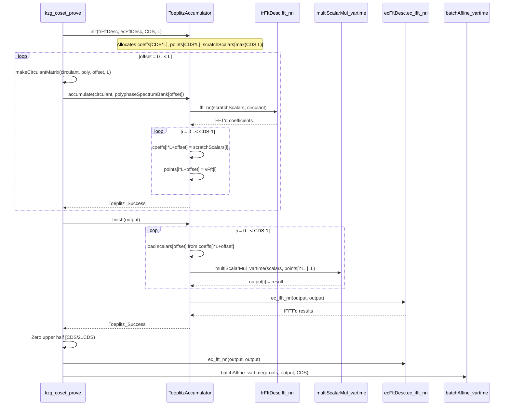
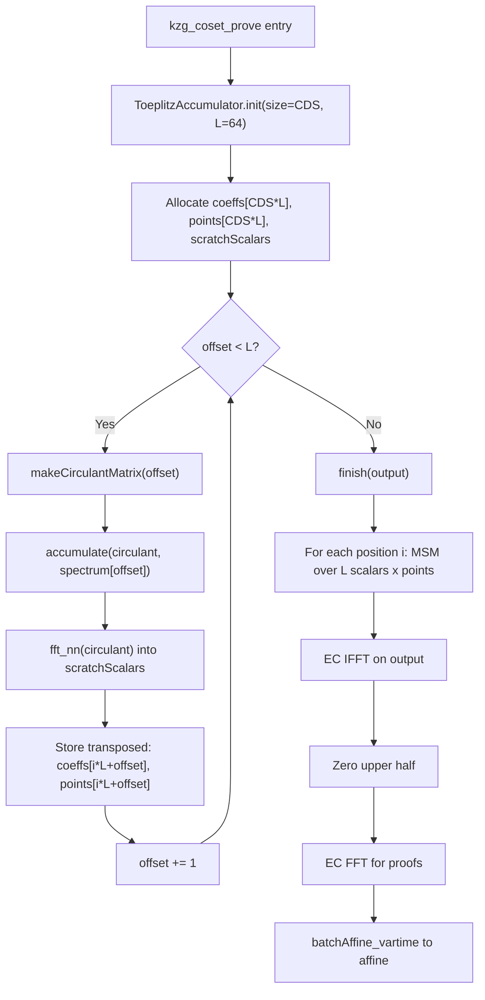
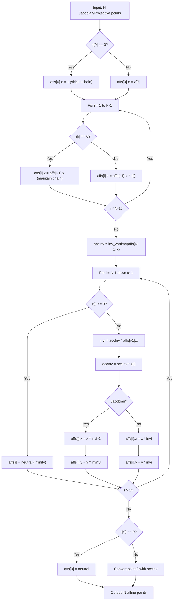

---
**Branch:** `master` → `peerdas-perf-fix-rebased2` (commit `74d1839c`)
**Diff file:** `.REVIEWS/RID-202605022039-peerdas-perf-fix-rebased2-74d1839c/RID-202605022039-changes_under_review.diff`
**Date:** 2026-05-02
**Reviewer:** Summary Specialist
**Scope:** PeerDAS FK20 multiproof performance fixes: ToeplitzAccumulator with MSM-based accumulation, batchAffine_vartime for points with infinity, polyphase spectrum bank in affine form, and Alloca-tag elimination
**Focus:** Per-file summaries, Mermaid diagrams for FK20 multiproof pipeline, batch affine operations, and Toeplitz accumulator architecture
---

# Review Summary Report

## Important Files Changed

| Filename | Overview |
|----------|----------|
| `constantine/math/matrix/toeplitz.nim` | Replaced `toeplitzMatVecMulPreFFT` with `ToeplitzAccumulator` — new accumulator pattern with MSM per position, stores FFT results transposed, then one batch IFFT |
| `constantine/math/elliptic/ec_shortweierstrass_batch_ops.nim` | Added `batchAffine_vartime` for Short Weierstrass curves (projective and Jacobian), with explicit infinity-point skipping for 3× savings on batches with many neutral elements |
| `constantine/math/elliptic/ec_twistededwards_batch_ops.nim` | Added `batchAffine_vartime` for Twisted Edwards curves; refactored existing `batchAffine` to use `SecretWord`-based zero tracking in-place |
| `constantine/commitments/kzg_multiproofs.nim` | `kzg_coset_prove` now uses `ToeplitzAccumulator`; polyphase spectrum bank stored as affine (not Jacobian); single batch conversion for all L×CDS points; in-place FFT |
| `constantine/commitments_setups/ethereum_kzg_srs.nim` | `polyphaseSpectrumBank` changed from Jacobian to affine form (8192 EC points × 48 bytes savings) |
| `constantine/math/polynomials/fft_common.nim` | Added `bit_reversal_permutation` with alias detection; renamed old function to `bit_reversal_permutation_noalias`; enables in-place FFT |
| `constantine/math/polynomials/fft_ec.nim` | Removed `Alloca` tag from all EC FFT functions — iterative implementations do not use stack allocation |
| `constantine/math/matrix/transpose.nim` | New file: 2D tiled matrix transpose optimized for large elements (2× speedup over naive) |
| `constantine/commitments/kzg.nim` | Switched `batchAffine` to `batchAffine_vartime` in `kzg_verify_batch` |
| `constantine/commitments/kzg_parallel.nim` | Switched `batchAffine` to `batchAffine_vartime` in parallel KZG verification |
| `constantine/commitments/eth_verkle_ipa.nim` | Switched `batchAffine` to `batchAffine_vartime` in IPA proof generation |
| `benchmarks/bench_matrix_toeplitz.nim` | Renamed from `bench_toeplitz_multiproofs.nim`; updated to benchmark `ToeplitzAccumulator` and `toeplitzMatVecMul` |
| `benchmarks/bench_matrix_transpose.nim` | New benchmark: compares 5 transpose strategies (naive, 1D blocked, 2D tiled, etc.) |
| `benchmarks/bench_kzg_multiproofs.nim` | Updated to use `ToeplitzAccumulator` API; polyphase spectrum bank as affine |
| `benchmarks/bench_elliptic_template.nim` | Added `batchAffine_vartime` benchmarks alongside existing `batchAffine` |
| `constantine/lowlevel_elliptic_curves.nim` | Exported `batchAffine_vartime` for Short Weierstrass and Twisted Edwards |
| `constantine/math/elliptic/ec_scalar_mul_vartime.nim` | Switched wNAF scalar mul to `batchAffine_vartime`; removed `Alloca` tag |

## Per-File Summaries

### constantine/math/matrix/toeplitz.nim

**What changed:**
Complete redesign of the FK20 Toeplitz multiplication core. Replaced the single-shot `toeplitzMatVecMulPreFFT` (FFT circulant + Hadamard + IFFT per offset, with accumulate flag) with a new `ToeplitzAccumulator` object that uses a three-phase pipeline:
1. `init(size, L)` — allocates transposed buffers `[size*L]` for coeffs and points, plus a shared scratch buffer
2. `accumulate(circulant, vFft)` — FFTs the circulant into the scratch buffer, stores results transposed (`coeffs[i*L+offset]`, `points[i*L+offset]`), increments offset
3. `finish(output)` — for each output position i, loads L scalars, performs MSM (`multiScalarMul_vartime`), then does one EC IFFT on the result

The high-level `toeplitzMatVecMul` now delegates to `ToeplitzAccumulator` internally. Return type changed from `FFTStatus` to `ToeplitzStatus` (new enum). Added `checkReturn`/`check` error-handling templates. Fixed `makeCirculantMatrix` zero-padding range comment.

**Why it matters:**
This is the core FK20 performance improvement. The old approach did 3 heap allocations + 1 scalar multiplication per point per offset (64 offsets × 128 points). The new approach does 3 heap allocations total, stores data transposed, then uses a single MSM (128 scalars × 128 affine points) per output position. This reduces the per-point scalar mul from 64 independent operations to one batched MSM, and amortizes the IFFT cost.

**Key symbols:**
- `ToeplitzStatus` — New enum: `Toeplitz_Success`, `Toeplitz_SizeNotPowerOfTwo`, `Toeplitz_TooManyValues`, `Toeplitz_MismatchedSizes`
- `ToeplitzAccumulator[EC, ECaff, F]` — Object with `coeffs`, `points`, `scratchScalars` buffers and `init`, `accumulate`, `finish` methods
- `checkReturn` — Template for early return on error
- `check` — Template for break-on-error with labeled blocks
- `toeplitzMatVecMul` — Rewrapped to use `ToeplitzAccumulator` internally

### constantine/math/elliptic/ec_shortweierstrass_batch_ops.nim

**What changed:**
Added `batchAffine_vartime` for both projective and Jacobian coordinate conversions. The vartime variant:
- Uses `SecretWord` to track whether each z-coordinate is zero (infinity point)
- Skips zero z-coordinates in the Montgomery product chain (multiply by 1 instead)
- Uses `inv_vartime` instead of constant-time `inv`
- For Jacobian: also applies the x/z² and y/z³ formulas
- Added `N <= 0` early-return guard to existing `batchAffine` functions

**Why it matters:**
In FK20 polyphase decomposition, half the points are infinity (z=0). The constant-time `batchAffine` processes all N points identically, wasting ~50% of the Montgomery chain multiplications. The vartime variant skips these, cutting computation by ~3× for batches with many neutral elements. This is safe in contexts where timing doesn't leak secrets (e.g., polynomial proofs where the data is public).

**Key symbols:**
- `batchAffine_vartime[F, G](affs, projs, N)` — Vartime batch affine for projective coords
- `batchAffine_vartime[F, G](affs, jacs, N)` — Vartime batch affine for Jacobian coords
- `zero(i)` template — Accesses `affs[i].y.mres.limbs[0]` as `SecretWord` for zero tracking

### constantine/math/elliptic/ec_twistededwards_batch_ops.nim

**What changed:**
Added `batchAffine_vartime` for Twisted Edwards curves (same pattern as Short Weierstrass projective). Also refactored the existing `batchAffine` to use the `SecretWord`-based zero tracking pattern (previously used `allocStackArray(SecretBool, N)` — now uses `affs[i].y.mres.limbs[0]` as inline storage). Changed tag from `{.noInline, tags:[Alloca].}` to `{.meter.}`.

**Why it matters:**
Eliminates the stack allocation of `SecretBool[N]` array, replacing it with in-place zero tracking. The `Alloca` tag was misleading since the function now uses heap-allocated `affs[i].y` for storage.

**Key symbols:**
- `batchAffine_vartime[F](affs, projs, N)` — Vartime batch affine for Twisted Edwards
- `zero(i)` template — Reuses `affs[i].y.mres.limbs[0]` for zero flag

### constantine/commitments/kzg_multiproofs.nim

**What changed:**
Major refactoring of `kzg_coset_prove` and polyphase decomposition:

1. **`computePolyphaseDecompositionFourierOffset`**: Now writes directly to output buffer (`polyphaseSpectrum`) instead of intermediate `polyphaseComponent`. Removed the temporary allocation. Does in-place FFT. Added assertion that extraction index goes negative (invariant: `CDS*L == 2*N`).

2. **`computePolyphaseDecompositionFourier`**: Now computes all phases in Jacobian form first (temporary `polyphaseSpectrumBankJac`), then does one `batchAffine_vartime` for all L×CDS points. Changed output type from Jacobian to affine. Removed `Alloca` tag.

3. **`kzg_coset_prove`**: Completely rewritten to use `ToeplitzAccumulator`:
   - Old: per-offset `toeplitzMatVecMulPreFFT` with `accumulate` flag
   - New: `accum.init()` → L× `accum.accumulate()` → `accum.finish()` → zero upper half → in-place FFT → `batchAffine_vartime`
   - Removed `proofsJac` temporary allocation
   - Changed `polyphaseSpectrumBank` parameter from Jacobian to affine
   - Return type changed to `void` (previously implicit FFT status)

4. **`computeAggRandScaledInterpoly`**: Changed from returning `bool` to void with `doAssert` guards. Does IFFT in-place (`agg_cols[c]` reused as output buffer instead of allocating `col_interpoly`).

**Why it matters:**
This is the production FK20 proving path. The combined changes:
- Eliminate ~64 intermediate FFT allocations (one per offset)
- Use MSM-based accumulation instead of 64 separate IFFTs
- Single batch affine for 8192 points instead of per-phase conversion
- In-place operations reduce peak memory

**Key symbols:**
- `kzg_coset_prove` — Rewritten to use `ToeplitzAccumulator`
- `computePolyphaseDecompositionFourier` — Outputs affine form with single batch conversion
- `computePolyphaseDecompositionFourierOffset` — In-place FFT into output buffer

### constantine/commitments_setups/ethereum_kzg_srs.nim

**What changed:**
`polyphaseSpectrumBank` field type changed from `array[FIELD_ELEMENTS_PER_CELL, array[CELLS_PER_EXT_BLOB, EC_ShortW_Jac[...]]]` to `array[FIELD_ELEMENTS_PER_CELL, array[CELLS_PER_EXT_BLOB, EC_ShortW_Aff[...]]]`. Comment updated to note affine form.

**Why it matters:**
Each EC point changes from 96 bytes (Jacobian: 3×32-byte field elements) to 64 bytes (Affine: 2×32-byte field elements). For 8192 points (64×128), this saves ~245 KB in the trusted setup context. More importantly, it eliminates the need for a batch affine conversion in every `kzg_coset_prove` call.

**Key symbols:**
- `polyphaseSpectrumBank` — Changed from Jacobian to affine form

### constantine/data_availability_sampling/eth_peerdas.nim

**What changed:**
In `recoverPolynomialCoeff`, the IFFT step now reuses `extended_times_zero` buffer in-place instead of allocating a separate `ext_times_zero_coeffs` buffer. The subsequent `coset_fft_nr` reads from the same reused buffer.

**Why it matters:**
Eliminates one aligned heap allocation (~128 KB for N2=4096 Fr elements). This is consistent with the broader pattern of in-place FFT operations throughout this PR.

**Key symbols:**
- `recoverPolynomialCoeff` — In-place IFFT + coset FFT

### constantine/math/polynomials/fft_common.nim

**What changed:**
Added alias detection to `bit_reversal_permutation`. The old `bit_reversal_permutation` (which assumed no aliasing between dst and src) was renamed to `bit_reversal_permutation_noalias`. The new `bit_reversal_permutation(dst, src)` checks if `dst[0].addr == src[0].addr`:
- If aliasing: allocates temp buffer, permutes to temp, copies back
- If no aliasing: delegates to `bit_reversal_permutation_noalias`

The in-place `bit_reversal_permutation(buf)` now calls `bit_reversal_permutation_noalias` instead of the generic (aliasing) version.

**Why it matters:**
This enables safe in-place FFT operations (`ec_fft_nn(dst, dst)`) which are now used throughout the refactored code. Previously, aliasing would cause undefined behavior in the COBRA/naive bit-reversal algorithms.

**Key symbols:**
- `bit_reversal_permutation_noalias` — Renamed from old `bit_reversal_permutation`
- `bit_reversal_permutation(dst, src)` — New version with alias detection

### constantine/math/polynomials/fft_ec.nim

**What changed:**
Removed `Alloca` tag from all EC FFT function declarations:
- `ec_fft_nn_impl_recursive`
- `ec_fft_nn_recursive`
- `ec_ifft_nn_recursive`
- `ec_fft_nr_impl_iterative_dif`
- `ec_fft_rn_impl_iterative_dit`
- `ec_fft_nr_iterative`
- `ec_fft_rn_iterative_dit`
- `ec_ifft_rn_impl_iterative`
- `ec_ifft_rn_iterative_dit`
- `ec_fft_nn_via_iterative_dif_and_bitrev`
- `ec_fft_nn_via_bitrev_and_iterative_dit`
- `ec_ifft_nn_via_bitrev_and_iterative_dit`
- `ec_fft_nr`, `ec_fft_nn`, `ec_ifft_nn`, `ec_ifft_rn`

**Why it matters:**
The iterative EC FFT implementations operate in-place on views/pointers and do not use stack allocation. The recursive versions use `allocStackArray` for the butterfly operation, but the `Alloca` tag was misleading for iterative variants. Removing it gives the compiler correct information about memory behavior.

**Key symbols:**
- All EC FFT functions — `Alloca` tag removed (replaced with appropriate tags)

### constantine/math/elliptic/ec_scalar_mul_vartime.nim

**What changed:**
1. `scalarMul_wNAF_vartime` and `scalarMulEndo_wNAF_vartime` switched from `batchAffine` to `batchAffine_vartime` for precomputed table conversion
2. Removed `Alloca` tag from both functions (the precomputed table arrays are stack-allocated but this is inherent to the algorithm, not a separate alloca call)

**Why it matters:**
These are variable-time operations already, so using `batchAffine_vartime` is consistent. The `inv_vartime` call is faster than constant-time `inv`, improving scalar multiplication performance.

**Key symbols:**
- `scalarMul_wNAF_vartime` — Now uses `batchAffine_vartime`
- `scalarMulEndo_wNAF_vartime` — Now uses `batchAffine_vartime`

### constantine/lowlevel_elliptic_curves.nim

**What changed:**
Added `export ec_shortweierstrass.batchAffine_vartime` and `export ec_twistededwards.batchAffine_vartime`.

**Why it matters:**
Makes `batchAffine_vartime` available through the standard import path `constantine.elliptic_curves`.

### constantine/commitments/kzg.nim

**What changed:**
In `kzg_verify_batch`, switched `commits_min_evals.batchAffine(commits_min_evals_jac, n)` to `batchAffine_vartime`.

**Why it matters:**
KZG batch verification is already variable-time (uses `multiScalarMul_vartime`). Using `batchAffine_vartime` provides consistent performance characteristics.

### constantine/commitments/kzg_parallel.nim

**What changed:**
Same as kzg.nim — switched to `batchAffine_vartime` in parallel verification.

### constantine/commitments/eth_verkle_ipa.nim

**What changed:**
Switched three `batchAffine` calls to `batchAffine_vartime` in:
1. `ipa_prove` (line 225) — lr points conversion
2. `ipa_prove` (line 260) — gL/gg points conversion
3. `sumCommitmentsAndEvalsByChallenge` (line 649) — tmp points conversion

**Why it matters:**
IPA proof generation is inherently variable-time; using `batchAffine_vartime` is consistent and faster.

### benchmarks/bench_matrix_toeplitz.nim (renamed from bench_toeplitz_multiproofs.nim)

**What changed:**
Complete rewrite to match new `ToeplitzAccumulator` API:
- `benchToeplitzMatVecMul_Size128` — benchmarks `toeplitzMatVecMul` (which internally uses the accumulator)
- `benchToeplitzAccumulator_64Accumulates` — new benchmark matching production FK20 pattern: init → 64 accumulates → finish
- Removed PreFFT benchmarks (no longer applicable)
- Updated `doAssert` from `FFT_Success` to `Toeplitz_Success`

**Key symbols:**
- `benchToeplitzAccumulator_64Accumulates` — 64 accumulate + finish benchmark

### benchmarks/bench_matrix_transpose.nim (new file)

**What changed:**
New benchmark comparing 5 matrix transpose strategies for 512×512 matrices of `Fr[BLS12_381]` elements (32 bytes each):
1. Naive sequential (row-to-column copy)
2. Naive with exchanged loop order
3. 1D blocked (various block sizes: 8, 16, 32, 64, 128)
4. 2D blocked/tiled (various block sizes: 4, 8, 16, 32)
5. Divide & conquer cache-oblivious (referenced, not implemented)

Reports throughput in GMEMOPs/s and GB/s. Recommended: 2D blocked with block size 16 or 32.

**Key symbols:**
- `naiveTranspose`, `naiveTransposeExchanged`, `blocked1DTranspose`, `blocked2DTranspose`

### benchmarks/bench_kzg_multiproofs.nim

**What changed:**
Updated to match new API:
- `benchPolyphasePrecomputation` — spectrum bank type changed to affine
- `benchFK20_Phase1_Full` — uses `ToeplitzAccumulator` with `init`/`accumulate`/`finish`
- Type aliases `BLS12_381_G1_aff` and `BLS12_381_G1_jac` added

### benchmarks/bench_elliptic_template.nim

**What changed:**
Added `batchAffine_vartime` benchmarks alongside existing `batchAffine` for both projective-to-affine and Jacobian-to-affine conversions.

### constantine/math/matrix/transpose.nim (new file)

**What changed:**
New file implementing 2D tiled matrix transposition. Default block size 16, optimized for 32-byte field elements. Also provides openArray convenience wrappers.

**Key symbols:**
- `transpose[T](dst, src, M, N, blockSize)` — 2D tiled transpose

### Tests

#### tests/math_elliptic_curves/t_ec_conversion.nim

**What changed:**
Added extensive vartime batch affine conversion tests:
- Short Weierstrass Jacobian & Projective for BN254 (G1, G2) and BLS12-381 (G1, G2) with `isVartime=true`
- Twisted Edwards Projective for Bandersnatch and Banderwagon (both constant-time and vartime)

#### tests/math_elliptic_curves/t_ec_template.nim

**What changed:**
`run_EC_affine_conversion` now accepts `isVartime` parameter. Dispatches to `batchAffine_vartime` or `batchAffine` accordingly. Added new test cases:
- Single element batch
- All neutral points
- Varied batch sizes (2, 16) with multiple generators

#### tests/math_matrix/t_toeplitz.nim

**What changed:**
- Added `testToeplitzAccumulatorInitErrors` — tests size=0, L=0, non-power-of-2, negative size
- Added `testToeplitzAccumulatorFinishErrors` — tests finish without accumulate
- Added `testCheckCirculantR1` — tests circulant validation for r=1 (length 2)
- Added `testToeplitz(16)` test case
- Changed status checks from `FFT_Success` to `Toeplitz_Success`
- Renamed `BLS12_381_G1` type alias to `BLS12_381_G1_Prj` for clarity

#### tests/commitments/t_kzg_multiproofs.nim

**What changed:**
- `FK20PolyphaseSpectrumBank` type alias changed from Jacobian to affine
- All test functions updated to use affine spectrum banks
- Added import of `constantine/math/matrix/toeplitz`

### constantine.nimble

**What changed:**
Added `bench_matrix_toeplitz` to `benchDesc` and defined the `bench_matrix_toeplitz` nimble task.

### .agents/skills/debugging/SKILL.md

**What changed:**
Minor: added quotes around the description field (YAML formatting fix).

### metering/m_kzg_multiproofs.nim

**What changed:**
Simplified to run `kzg_coset_prove` directly with metering, instead of separately instrumenting Phase 1 and Phase 2. Removed `fk20Phase1Meter` and `fk20Phase2Meter` functions. Removed imports of `toeplitz` and `monotimes`.

## Diagrams

### Sequence Diagram: FK20 Multiproof Pipeline (New ToeplitzAccumulator Flow)

### Flowchart: ToeplitzAccumulator Three-Phase Pipeline

### Flowchart: batchAffine_vartime Algorithm (Montgomery Batch Inversion with Infinity Skipping)

