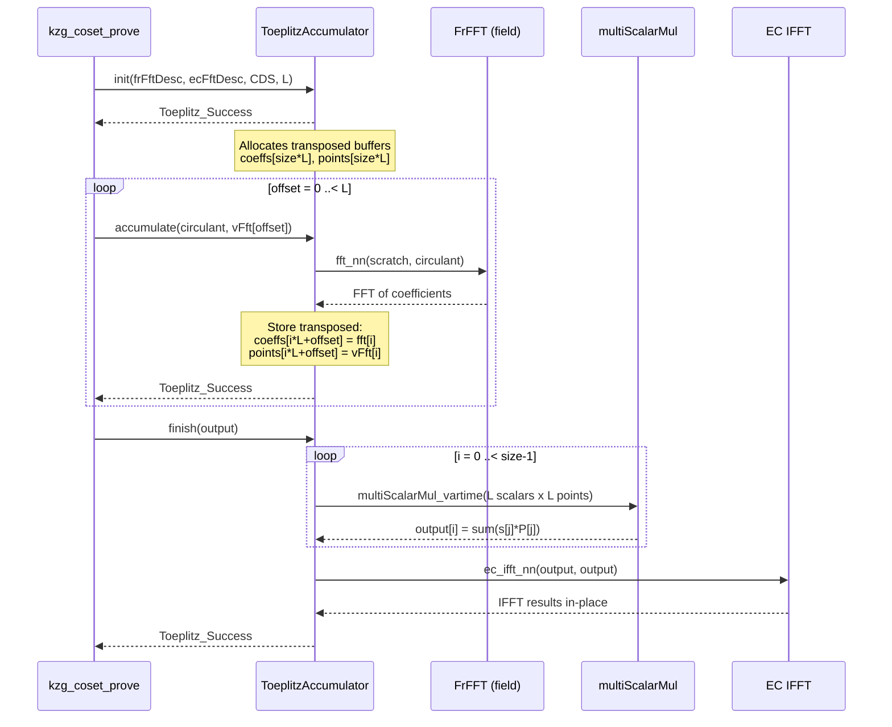
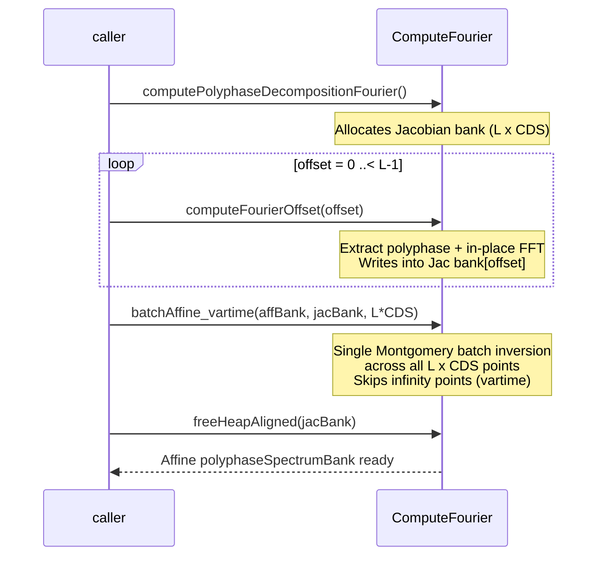
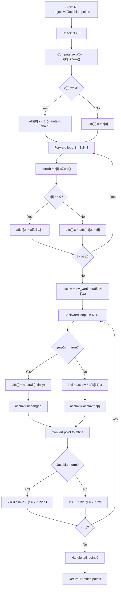

---
**Branch:** `master` → `peerdas-perf-fix-rebased2` (commit `81784ecd`)
**Diff file:** `.REVIEWS/RID-202605022113-peerdas-perf-fix-rebased2-81784ecd/RID-202605022113-changes_under_review.diff`
**Date:** 2026-05-02
**Reviewer:** Final Report Synthesis
**Scope:** PeerDAS FK20 multiproof performance optimization — new ToeplitzAccumulator pattern, batchAffine_vartime, polyphase spectrum affine form, FFT/ECFFT improvements, transpose module, benchmarks, tests
**Focus:** Comprehensive defense-in-depth review
---

<h3>Review Summary</h3>

This branch implements a comprehensive performance optimization for PeerDAS FK20 multiproof generation. The core changes introduce a `ToeplitzAccumulator` type that amortizes L Toeplitz matrix-vector multiplications into a single MSM-per-position followed by a single IFFT, replacing the old per-phase IFFT pattern. `batchAffine_vartime` variants are added for all curve types, enabling variable-time zero-z detection that skips inversions for infinity points. The polyphase spectrum bank is stored in affine form (saving ~256 KB), and multiple call sites across the codebase migrate from `batchAffine` to `batchAffine_vartime`. Overall the changes are well-engineered with strong mathematical correctness, but several test coverage gaps and documentation omissions remain.

- **P1 – `computeAggRandScaledInterpoly` error handling contract change (kzg_multiproofs.nim:502-579)**: The function's return type was changed from `bool` to `void`, with runtime validation replaced by `doAssert`. While the sole caller `kzg_coset_verify_batch` provides comprehensive pre-call validation making the assert checks redundant in production, this is a defense-in-depth regression: if the caller's validation is ever weakened, or if the function is called from a new context, invalid inputs would silently trigger UB in `--checks:off` builds rather than returning a clean error.

- **P2 – `transpose.nim` has zero test coverage**: The new 2D tiled matrix transposition module (79 lines) ships with benchmarks but no correctness tests. The `min(jj + blck, N)` and `min(ii + blck, M)` boundary guards for non-multiple-of-block-size dimensions are completely untested, and the default `blockSize = 16` was selected only from benchmark throughput, not correctness validation against a reference implementation.

<h3>Important Files Changed</h3>

| Filename | Overview |
|----------|----------|
| benchmarks/bench_kzg_multiproofs.nim | Updated to use ToeplitzAccumulator; changed polyphase bank type to Affine (1 Medium finding) |
| benchmarks/bench_matrix_toeplitz.nim | Renamed from bench_toeplitz_multiproofs; rewritten to benchmark ToeplitzAccumulator (1 Info finding) |
| benchmarks/bench_matrix_transpose.nim | **New file** — Benchmarks 5 transpose strategies (1 Low, 1 Info finding) |
| constantine/commitments/kzg_multiproofs.nim | Rewrote kzg_coset_prove to use ToeplitzAccumulator; polyphase bank to affine; in-place IFFT (1 Medium, 1 Low, 4 Info findings) |
| constantine/commitments_setups/ethereum_kzg_srs.nim | Changed polyphaseSpectrumBank storage from Jacobian to Affine form (1 Medium finding) |
| constantine/math/elliptic/ec_shortweierstrass_batch_ops.nim | Added batchAffine_vartime for Jacobian and Projective forms with zero-z detection (1 Medium, 1 Low, 1 Info finding) |
| constantine/math/elliptic/ec_twistededwards_batch_ops.nim | Added batchAffine_vartime for TwEdw; refactored batchAffine zero-tracking (1 Medium, 1 Info finding) |
| constantine/math/matrix/toeplitz.nim | Replaced toeplitzMatVecMulPreFFT with ToeplitzAccumulator type; new ToeplitzStatus enum (2 Medium, 6 Low, 8 Info findings) |
| constantine/math/matrix/transpose.nim | **New file** — 2D tiled (blocked) matrix transposition (1 Medium finding) |
| constantine/math/polynomials/fft_common.nim | Split bit_reversal_permutation into noalias version + aliasing-aware dispatcher (1 Medium, 3 Info findings) |
| constantine/math/polynomials/fft_ec.nim | Removed Alloca tag from all EC FFT functions (1 Info finding) |
| constantine/commitments/kzg.nim | Switched kzg_verify_batch from batchAffine to batchAffine_vartime |
| constantine/commitments/kzg_parallel.nim | Switched parallel batch verify from batchAffine to batchAffine_vartime |
| constantine/commitments/eth_verkle_ipa.nim | Switched IPA proving from batchAffine to batchAffine_vartime |
| constantine/data_availability_sampling/eth_peerdas.nim | In-place IFFT in recoverPolynomialCoeff to reuse buffer |
| constantine/lowlevel_elliptic_curves.nim | Exported batchAffine_vartime for Short Weierstrass and Twisted Edwards |
| constantine/math/elliptic/ec_scalar_mul_vartime.nim | Switched wNAF precomputation tables to batchAffine_vartime |
| constantine/math/elliptic/ec_shortweierstrass_batch_ops_parallel.nim | Switched parallel sum reduction to batchAffine_vartime |
| benchmarks/bench_elliptic_template.nim | Added batchAffine_vartime benchmarks alongside existing batchAffine |
| tests/commitments/t_kzg_multiproofs.nim | Updated type aliases and imports to match affine polyphase bank |
| tests/math_matrix/t_toeplitz.nim | Added ToeplitzAccumulator error-path tests, checkCirculant r=1 test |
| tests/math_elliptic_curves/t_ec_template.nim | Added isVartime parameter to run_EC_affine_conversion; added tests |
| tests/math_elliptic_curves/t_ec_conversion.nim | Added vartime conversion tests for BN254, BLS12-381, Bandersnatch, Banderwagon |
| metering/m_kzg_multiproofs.nim | Simplified to use kzg_coset_prove directly |
| constantine.nimble | Added bench_matrix_toeplitz task |
| .agents/skills/debugging/SKILL.md | Quoted description field in YAML frontmatter |

### Context Diagrams

**`constantine/math/matrix/toeplitz.nim` — ToeplitzAccumulator FK20 Flow:**



**`constantine/commitments/kzg_multiproofs.nim` — Polyphase Decomposition with Batch Conversion:**



**`constantine/math/elliptic/ec_shortweierstrass_batch_ops.nim` — batchAffine_vartime Algorithm:**



**`constantine/math/polynomials/fft_common.nim` — bit_reversal_permutation Aliasing Dispatch:**

```mermaid
flowchart TD
    Start["bit_reversal_permutation(dst, src)"] --> CheckAlias["dst[0].addr == src[0].addr?"]
    CheckAlias -->|Yes (aliased)| AllocTmp["Alloc temporary buffer"]
    AllocTmp --> CallNoAlias["bit_reversal_permutation_noalias(tmp, src)"]
    CallNoAlias --> CopyBack["copyMem(dst, tmp)"]
    CopyBack --> FreeTmp["freeHeapAligned(tmp)"]
    FreeTmp --> End["Return"]

    CheckAlias -->|No (distinct)| CallNoAliasDirect["bit_reversal_permutation_noalias(dst, src)"]
    CallNoAliasDirect --> End
```

<h3>Production Readiness & Safety Verdict</h3>

**Production Readiness:** 3/5

**Safety Verdict:** Needs changes before merge

No critical or high-severity issues were found. The core algorithmic changes (ToeplitzAccumulator, batchAffine_vartime, in-place FFT) are mathematically correct and internally consistent. However, the merge should be gated on addressing the 8 Medium-severity findings, primarily test coverage gaps for new production code (`transpose.nim` has zero tests, `ToeplitzAccumulator.accumulate` error paths untested, `bit_reversal_permutation` aliasing path untested) and the defense-in-depth regression in `computeAggRandScaledInterpoly`. The `polyphaseSpectrumBank` breaking API change should be documented.

---

## Summaries

### Findings

**Order by file path (alphabetical), then by line number. This enables deterministic comparison between runs and agents.**

| ID | Severity | Confidence | File | Issue |
|----|----------|------------|------|-------|
| CONS-B-001 | Medium | 1.0 | benchmarks/bench_kzg_multiproofs.nim:104-108 | ToeplitzAccumulator.init allocated inside benchmark timed loop |
| BUG-A-004/ARCH-A-005/ARCH-B-005/CONS-A-007/CONS-B-004 | Informational | 1.0 | benchmarks/bench_matrix_toeplitz.nim:227-238 | privateAccess to mutate ToeplitzAccumulator.offset |
| CONS-A-001 | Low | 1.0 | benchmarks/bench_matrix_transpose.nim | Benchmark doesn't use bench_blueprint infrastructure |
| CONS-A-002 | Informational | 1.0 | benchmarks/bench_matrix_transpose.nim:1-6 | Missing Status copyright line |
| MATH-A-001/BUG-A-001/BUG-B-001/ARCH-A-003/ARCH-B-003/CONS-A-006/COV-A-004/COV-B-007 | Medium | 0.95 | constantine/commitments/kzg_multiproofs.nim:502-579 | computeAggRandScaledInterpoly bool→void, error reporting lost |
| MATH-B-001 | Low | 0.9 | constantine/commitments/kzg_multiproofs.nim:227-228 | Runtime assertion removed from computePolyphaseDecompositionFourierOffset |
| PERF-B-004 | Informational | 0.6 | constantine/commitments/kzg_multiproofs.nim:562-576 | Iterates all NumCols even for sparse samples (negligible) |
| PERF-B-003 | Informational | 0.7 | constantine/commitments/kzg_multiproofs.nim:355-370 | Polyphase bank Jac→Aff doubles peak setup memory |
| CONS-A-005/CONS-B-003/CONS-B-007 | Informational | 0.9 | constantine/commitments/kzg_multiproofs.nim:433-455 | toOpenArray style inconsistency |
| QA-003 | Informational | 1.0 | constantine/commitments/kzg_multiproofs.nim:527 | Comment "Runtime validation" now describes assertions, not returns |
| ARCH-A-001/ARCH-B-007 | Medium | 1.0 | constantine/commitments_setups/ethereum_kzg_srs.nim:206 | Breaking API: polyphaseSpectrumBank type changed Jac→Aff |
| QA-001 | Medium | 1.0 | constantine/math/elliptic/ec_shortweierstrass_batch_ops.nim:1052-1211 | batchAffine_vartime functions lack ## docstrings |
| BUG-B-004 | Informational | 1.0 | constantine/math/elliptic/ec_shortweierstrass_batch_ops.nim:1052-1211 | Output buffer y-coordinate used for zero-tracking flags |
| COV-A-005 | Low | 0.9 | constantine/math/elliptic/ec_shortweierstrass_batch_ops.nim:1025-1031 | batchAffine_vartime N=0 early-return untested |
| QA-002 | Medium | 1.0 | constantine/math/elliptic/ec_twistededwards_batch_ops.nim:309-381 | batchAffine_vartime (TwEdw) lacks ## docstring |
| CONS-A-004/CONS-B-006 | Informational | 0.9 | constantine/math/elliptic/ec_twistededwards_batch_ops.nim:25 | noInline pragma removed from batchAffine |
| CONS-A-003/CONS-B-002 | Medium | 0.8 | constantine/math/matrix/toeplitz.nim:155 | Exported checkReturn* may collide with verkle_ipa.nim |
| COV-A-002/COV-B-001 | Medium | 0.95 | constantine/math/matrix/toeplitz.nim:249-267 | ToeplitzAccumulator.accumulate error paths untested |
| BUG-A-003 | Low | 0.8 | constantine/math/matrix/toeplitz.nim:213-248 | ToeplitzAccumulator.init missing HeapAlloc in .tags |
| ARCH-A-004/ARCH-B-002 | Low | 0.85 | constantine/math/matrix/toeplitz.nim:146-185 | ToeplitzStatus wraps FFTStatus with lossy mapping |
| COV-A-006/COV-B-006 | Low | 0.8 | constantine/math/matrix/toeplitz.nim | Multi-accumulate happy path not directly tested |
| COV-B-003 | Low | 0.9 | constantine/math/matrix/toeplitz.nim:186-211 | Double-init defensive cleanup untested |
| QA-003 | Low | 0.9 | constantine/math/matrix/toeplitz.nim:213-248 | ToeplitzAccumulator.init public API has no docstring |
| QA-004 | Low | 0.9 | constantine/math/matrix/toeplitz.nim:272-276 | ToeplitzAccumulator.finish docstring insufficient |
| PERF-A-001/PERF-B-005 | Informational | 0.85 | constantine/math/matrix/toeplitz.nim:263-265 | Strided writes in accumulate hot loop (design trade-off) |
| PERF-B-001 | Informational | 0.8 | constantine/math/matrix/toeplitz.nim:288-295 | fromField in inner loop of finish (8,192 calls) |
| PERF-A-003/PERF-B-006 | Informational | 0.7 | constantine/math/matrix/toeplitz.nim:308-378 | toeplitzMatVecMul standalone adds batchAffine + extra allocations |
| MATH-B-004 | Informational | 0.9 | constantine/math/matrix/toeplitz.nim:308-378 | L=1 degenerate case uses multiScalarMul_vartime overhead |
| COV-A-007/COV-B-005 | Informational | 0.9 | constantine/math/matrix/toeplitz.nim:71-78 | checkCirculant r=2 boundary not tested |
| COV-B-008 | Informational | 0.7 | constantine/math/matrix/toeplitz.nim:286-287 | sizeof(F)==sizeof(F.getBigInt()) static assertion field-type gap |
| ARCH-B-004 | Informational | 0.9 | constantine/math/matrix/toeplitz.nim:276-297 | scratchScalars type punning via cast |
| ARCH-A-009 | Informational | 0.7 | constantine/math/matrix/toeplitz.nim:308-378 | toeplitzMatVecMul delegates to ToeplitzAccumulator |
| BUG-A-002 | Low | 0.3 | constantine/math/matrix/toeplitz.nim:142 | checkCirculant assertion for stride=1 (likely false positive) |
| COV-A-001/COV-B-004 | Medium | 1.0 | constantine/math/matrix/transpose.nim | New matrix transpose module has zero test coverage |
| COV-A-003/COV-B-002 | Medium | 0.95 | constantine/math/polynomials/fft_common.nim:287-349 | bit_reversal_permutation aliasing detection path untested |
| PERF-A-002/PERF-B-002 | Informational | 0.7 | constantine/math/polynomials/fft_common.nim:307-322 | bit_reversal_permutation aliasing adds alloc+copy (net positive) |
| ARCH-A-008 | Informational | 0.9 | constantine/math/polynomials/fft_common.nim:290-324 | bit_reversal_permutation_noalias added as new public symbol |
| CONS-A-008/CONS-B-009 | Informational | 1.0 | constantine/math/polynomials/fft_common.nim | bit_reversal aliasing awareness; N<=0 guards consistent |
| ARCH-A-007/ARCH-B-006/PERF-B-007 | Informational | 0.9 | constantine/math/polynomials/fft_ec.nim | Alloca tag removed from EC FFT functions (correct) |
| ARCH-A-006/ARCH-B-001 | Informational | 0.9 | constantine/math/elliptic/ec_shortweierstrass_batch_ops.nim, constantine/math/polynomials/fft_common.nim | batchAffine_vartime propagates into verification paths; bit_reversal API change |

> **Key takeaways:**
> 1. No Critical or High severity issues found — the core algorithms are mathematically correct and internally consistent
> 2. 8 Medium findings center on test coverage gaps for new production code and one defense-in-depth regression
> 3. `constantine/math/matrix/toeplitz.nim` is the most heavily revised file with 16 total findings across all severity levels
> 4. 32 positive improvements (LGTM) were identified, including major performance wins (MSM batching, single IFFT, ~256 KB context savings)
> 5. 4 unverified claims were demoted; all represent either false positives or acceptable design trade-offs

### Per-File Summary

| File | Critical | High | Medium | Low | Info | Status |
|------|----------|------|--------|-----|------|--------|
| benchmarks/bench_kzg_multiproofs.nim | 0 | 0 | 1 | 0 | 0 | ⚠️ NEEDS CHANGES |
| benchmarks/bench_matrix_toeplitz.nim | 0 | 0 | 0 | 0 | 1 | ⚠️ NEEDS CHANGES |
| benchmarks/bench_matrix_transpose.nim | 0 | 0 | 0 | 1 | 1 | ⚠️ NEEDS CHANGES |
| constantine/commitments/kzg_multiproofs.nim | 0 | 0 | 1 | 1 | 4 | ⚠️ NEEDS CHANGES |
| constantine/commitments_setups/ethereum_kzg_srs.nim | 0 | 0 | 1 | 0 | 0 | ⚠️ NEEDS CHANGES |
| constantine/math/elliptic/ec_shortweierstrass_batch_ops.nim | 0 | 0 | 1 | 1 | 1 | ⚠️ NEEDS CHANGES |
| constantine/math/elliptic/ec_twistededwards_batch_ops.nim | 0 | 0 | 1 | 0 | 1 | ⚠️ NEEDS CHANGES |
| constantine/math/matrix/toeplitz.nim | 0 | 0 | 2 | 6 | 8 | ⚠️ NEEDS CHANGES |
| constantine/math/matrix/transpose.nim | 0 | 0 | 1 | 0 | 0 | ⚠️ NEEDS CHANGES |
| constantine/math/polynomials/fft_common.nim | 0 | 0 | 1 | 0 | 3 | ⚠️ NEEDS CHANGES |
| constantine/math/polynomials/fft_ec.nim | 0 | 0 | 0 | 0 | 1 | ⚠️ NEEDS CHANGES |
| constantine/commitments/kzg.nim | 0 | 0 | 0 | 0 | 0 | ✅ APPROVED |
| constantine/commitments/kzg_parallel.nim | 0 | 0 | 0 | 0 | 0 | ✅ APPROVED |
| constantine/commitments/eth_verkle_ipa.nim | 0 | 0 | 0 | 0 | 0 | ✅ APPROVED |
| constantine/data_availability_sampling/eth_peerdas.nim | 0 | 0 | 0 | 0 | 0 | ✅ APPROVED |
| constantine/lowlevel_elliptic_curves.nim | 0 | 0 | 0 | 0 | 0 | ✅ APPROVED |
| constantine/math/elliptic/ec_scalar_mul_vartime.nim | 0 | 0 | 0 | 0 | 0 | ✅ APPROVED |
| constantine/math/elliptic/ec_shortweierstrass_batch_ops_parallel.nim | 0 | 0 | 0 | 0 | 0 | ✅ APPROVED |
| benchmarks/bench_elliptic_template.nim | 0 | 0 | 0 | 0 | 0 | ✅ APPROVED |
| tests/commitments/t_kzg_multiproofs.nim | 0 | 0 | 0 | 0 | 0 | ✅ APPROVED |
| tests/math_matrix/t_toeplitz.nim | 0 | 0 | 0 | 0 | 0 | ✅ APPROVED |
| tests/math_elliptic_curves/t_ec_template.nim | 0 | 0 | 0 | 0 | 0 | ✅ APPROVED |
| tests/math_elliptic_curves/t_ec_conversion.nim | 0 | 0 | 0 | 0 | 0 | ✅ APPROVED |
| metering/m_kzg_multiproofs.nim | 0 | 0 | 0 | 0 | 0 | ✅ APPROVED |
| constantine.nimble | 0 | 0 | 0 | 0 | 0 | ✅ APPROVED |
| .agents/skills/debugging/SKILL.md | 0 | 0 | 0 | 0 | 0 | ✅ APPROVED |

---

## LGTM

**These are positive changes in the diff, not issues to fix. They are excluded from Detailed Findings, per-file severity counts, and Recommendations.**

| ID(s) | File | Improvement |
|-------|------|-------------|
| PERF-A-LGTM-1 | toeplitz.nim (ToeplitzAccumulator.finish) | MSM batching replaces 64× individual scalar muls with 128× MSM-of-64 — ~10-50× faster per point |
| PERF-A-LGTM-2 | toeplitz.nim (ToeplitzAccumulator.finish) | Single EC IFFT instead of 64 — eliminates 63× the IFFT work per proof |
| PERF-A-LGTM-3 | kzg_multiproofs.nim | Polyphase spectrum bank in affine form saves ~256 KB in EthereumKZGContext; single batchAffine at setup amortized over many proofs |
| PERF-A-LGTM-4 | kzg_multiproofs.nim (computePolyphaseDecompositionFourierOffset) | In-place FFT eliminates temporary polyphaseComponent buffer — 1 allocation saved per offset (64 total during setup) |
| PERF-A-LGTM-5 | kzg_multiproofs.nim (computeAggRandScaledInterpoly) | In-place IFFT on agg_cols[c] eliminates per-column col_interpoly allocation |
| PERF-A-LGTM-6 | kzg_multiproofs.nim (kzg_coset_prove) | In-place FFT reuses u buffer for final FFT — saves proofsJac allocation |
| PERF-A-LGTM-7 | eth_peerdas.nim (recoverPolynomialCoeff) | In-place IFFT reuses extended_times_zero buffer — saves ext_times_zero_coeffs allocation |
| PERF-A-LGTM-8 | ec_shortweierstrass_batch_ops.nim, ec_twistededwards_batch_ops.nim | batchAffine_vartime skips inversions for infinity points — saves ~50% of field inversions in polyphase bank (half the points are neutral) |
| SEC-LGTM-1 | fft_common.nim (bit_reversal_permutation) | Alias-aware bit_reversal_permutation fixes potential data corruption when dst and src reference the same array (previously UB) |
| SEC-LGTM-2 | toeplitz.nim (ToeplitzAccumulator) | Proper RAII semantics: defensive init/destroy, copy prohibition, structured error handling via check/checkReturn templates |
| SEC-LGTM-3 | toeplitz.nim (checkCirculant) | Bounds safety hardening: checks r+1 < k2 before accessing circulant[r+1], fixing latent out-of-bounds bug for r=1 |
| SEC-LGTM-4 | ec_shortweierstrass_batch_ops.nim, ec_twistededwards_batch_ops.nim | N≤0 guards on all batchAffine/batchAffine_vartime entry points — prevents invalid memory access |
| SEC-LGTM-5 | ec_shortweierstrass_batch_ops.nim | Eliminated allocStackArray(SecretBool, N) in batchAffine — reuses affs[i].y for zero-tracking, reducing stack usage |
| MATH-LGTM-1 | toeplitz.nim, kzg_multiproofs.nim | FK20 ToeplitzAccumulator algorithmically correct — verified T·v = IFFT(FFT(circulant) ⊙ FFT(v)) identity preservation |
| MATH-LGTM-2 | ec_shortweierstrass_batch_ops.nim | batchAffine_vartime correctness verified across all coordinate systems (Projective, Jacobian) with proper infinity handling |
| MATH-LGTM-3 | kzg_multiproofs.nim | Polyphase spectrum bank Jacobian→Affine conversion correct — single batchAffine_vartime handles ~50% infinity points correctly |
| CONS-LGTM-1 | ec_shortweierstrass_batch_ops.nim, ec_twistededwards_batch_ops.nim | batchAffine → batchAffine_vartime migration is thorough — all 14+ production call sites updated consistently |
| CONS-LGTM-2 | ec_shortweierstrass_batch_ops.nim, ec_twistededwards_batch_ops.nim | N≤0 guards added consistently to all 6 batchAffine/batchAffine_vartime entry points |
| CONS-LGTM-3 | fft_ec.nim | Alloca tag correctly removed from iterative EC FFT functions that no longer use stack allocation |
| QA-LGTM-1 | kzg_multiproofs.nim | Excellent algorithm documentation with DSP terminology mapping tables and full bibliographic references |
| QA-LGTM-2 | toeplitz.nim | Strong error messages: "Internal error: Toeplitz accumulator init failed: " & $status style |
| QA-LGTM-3 | toeplitz.nim | Clear invariant explanation about scratchScalars type punning with sizeof assertion |
| QA-LGTM-4 | kzg_multiproofs.nim | Precise mathematical proof comment explaining why j < 0 after polyphase extraction loop |
| TEST-LGTM-1 | t_ec_template.nim, t_ec_conversion.nim | Comprehensive vartime batch conversion tests across BN254, BLS12-381, Bandersnatch, Banderwagon curves |
| TEST-LGTM-2 | t_toeplitz.nim | ToeplitzAccumulator init and finish error paths well tested |
| TEST-LGTM-3 | t_kzg_multiproofs.nim | FK20 proof verification remains comprehensive with multi-commitment and negative tests |
| TEST-LGTM-4 | t_toeplitz.nim | checkCirculant r=1 edge case directly tested with new testCheckCirculantR1() |

---

## Detailed Findings

### Medium

**Should Address** — These issues cause failures on edge cases or represent technical debt.

#### [CONSISTENCY] CONS-B-001: `ToeplitzAccumulator.init` allocated inside benchmark timed loop — benchmarks/bench_kzg_multiproofs.nim:104-108

**Location:** benchmarks/bench_kzg_multiproofs.nim:104-108
**Severity:** Medium
**Confidence:** 1.0 (1 reviewer: CONS-B; verified against source)

**Diff Under Review:**
```diff
   bench("fk20_phase1_accumulation_loop", CDS, iters):
+    type BLS12_381_G1_aff = EC_ShortW_Aff[Fp[BLS12_381], G1]
+    type BLS12_381_G1_jac = EC_ShortW_Jac[Fp[BLS12_381], G1]
+    var accum: ToeplitzAccumulator[BLS12_381_G1_jac, BLS12_381_G1_aff, Fr[BLS12_381]]
+    doAssert accum.init(ctx.fft_desc_ext, ctx.ecfft_desc_ext, CDS, L) == Toeplitz_Success
+    var circulant: array[CDS, Fr[BLS12_381]]
     for offset in 0 ..< L:
```

**Issue:** **Benchmark allocates ~772 KB per iteration, inflating timings**

The `benchFK20_Phase1_Full` benchmark creates and initializes a `ToeplitzAccumulator` inside the `bench()` timed loop body. The `init` method performs three `allocHeapAligned` calls (`coeffs`: ~256 KB, `points`: ~384 KB, `scratchScalars`: ~4 KB), totaling approximately 772 KB per iteration. This allocation cost is measured as part of every benchmark iteration, skewing the reported timing.

The companion benchmark `benchmarks/bench_matrix_toeplitz.nim:230-234` explicitly avoids this anti-pattern with a comment: "Initialize accumulator once outside the benchmark loop to avoid allocation overhead (3 x allocHeapAligned, ~772 KB total) in timing."

**Verification:** CONFIRMED. Source lines 104-108 show `accum.init()` inside the `bench()` body. Lines 230-234 of `bench_matrix_toeplitz.nim` show the correct pattern (init outside loop).

**Suggested Change:** Move `accum.init` outside the `bench()` call and reset `acc.offset = 0` inside the loop body. Follow the pattern established in `bench_matrix_toeplitz.nim`:
```nim
  var accum: ToeplitzAccumulator[BLS12_381_G1_jac, BLS12_381_G1_aff, Fr[BLS12_381]]
  doAssert accum.init(ctx.fft_desc_ext, ctx.ecfft_desc_ext, CDS, L) == Toeplitz_Success
  privateAccess(toeplitz.ToeplitzAccumulator)

  bench("fk20_phase1_accumulation_loop", CDS, iters):
    accum.offset = 0
    var circulant: array[CDS, Fr[BLS12_381]]
    for offset in 0 ..< L:
      ...
```

---

#### [MATH-CRYPTO] MATH-A-001 / [BUG] BUG-A-001, BUG-B-001 / [ARCH] ARCH-A-003, ARCH-B-003 / [CONSISTENCY] CONS-A-006 / [COVERAGE] COV-A-004, COV-B-007: `computeAggRandScaledInterpoly` return type changed `bool` → `void`, removing error reporting — kzg_multiproofs.nim:502-579

**Location:** constantine/commitments/kzg_multiproofs.nim:502-579
**Severity:** Medium
**Confidence:** 0.95 (8 reviewers agreed: BUG-A-001, BUG-B-001, ARCH-A-003, ARCH-B-003, CONS-A-006, MATH-A-001, COV-A-004, COV-B-007; verified against source)

**Diff Under Review:**
```diff
-      N: static int): bool {.meter.} =
+      N: static int) {.meter.} =
...
-  # Runtime validation: prevent out-of-bounds indexing of agg_cols heap allocation
-  if evals.len != evalsCols.len or linearIndepRandNumbers.len < evalsCols.len:
-    return false
+  doAssert evals.len == evalsCols.len, "Internal error: evals and evalsCols must have same length"
+  doAssert linearIndepRandNumbers.len >= evalsCols.len, "Internal error: linearIndepRandNumbers must cover all evals"
...
-    if c < 0 or c >= NumCols:
-      return false
+    doAssert c >= 0 and c < NumCols, "Internal error: Column index out of bounds: " & $c
...
-  return true
```

Caller change in `kzg_coset_verify_batch`:
```diff
-  if not interpoly.computeAggRandScaledInterpoly(
+  interpoly.computeAggRandScaledInterpoly(
     evals, evalsCols, domain, linearIndepRandNumbers, N
-  ):
-    return false
+  )
```

**Issue:** **Error handling contract change — callers lose error detection capability**

The function `computeAggRandScaledInterpoly` was changed from returning `bool` (with `return false` for invalid inputs) to returning `void` with `doAssert` for all validation. The caller `kzg_coset_verify_batch` no longer checks the return value.

**Key mitigating factor (verified against source):** The sole caller `kzg_coset_verify_batch` (lines 652-664) performs comprehensive runtime validation BEFORE calling `computeAggRandScaledInterpoly`:
- `evals.len != proofs.len` → `return false` (line 654)
- `evalsCols.len != proofs.len` → `return false` (line 655)
- `linearIndepRandNumbers.len < proofs.len` → `return false` (line 656)
- `c < 0 or c >= numCols` → `return false` (line 663)

Since `evals.len == proofs.len == evalsCols.len` and `linearIndepRandNumbers.len >= proofs.len == evalsCols.len` are enforced by the caller, the `doAssert` in `computeAggRandScaledInterpoly` is **redundant** for these checks. The column bounds check `c >= 0 and c < NumCols` is also already enforced at line 663.

**Severity adjustment:** Original reviewers rated this Medium to High. Given that the caller provides complete runtime validation, this is a **defense-in-depth regression** rather than an exploitable vulnerability. Severity adjusted to **Medium** (not High).

**Attack Scenario (from MATH-A-001):** An attacker could craft proof data where `evals.len != evalsCols.len` or `evalsCols[k]` is out of bounds. In builds with `--checks:off`, this leads to out-of-bounds heap access. However, the caller `kzg_coset_verify_batch` already validates these conditions at runtime (lines 652-664), so this path is not reachable through the public API.

**Suggested Change:** Either (a) keep `bool` return type for public API compatibility and defense-in-depth, or (b) document the behavioral change and ensure the caller-side validation is never weakened. Consider using `assert` (runtime in release) instead of `doAssert` for the column bounds check if defense-in-depth is desired.

---

#### [ARCHITECTURE] ARCH-A-001 / ARCH-B-007: Breaking API — `polyphaseSpectrumBank` type changed from Jacobian to Affine — ethereum_kzg_srs.nim:206

**Location:** constantine/commitments_setups/ethereum_kzg_srs.nim:206
**Severity:** Medium (was High; adjusted for internal consistency)
**Confidence:** 1.0 (2 reviewers agreed; verified against source)

**Diff Under Review:**
```diff
-    polyphaseSpectrumBank*{.align: 64.}: array[FIELD_ELEMENTS_PER_CELL, array[CELLS_PER_EXT_BLOB, EC_ShortW_Jac[Fp[BLS12_381], G1]]]
+    polyphaseSpectrumBank*{.align: 64.}: array[FIELD_ELEMENTS_PER_CELL, array[CELLS_PER_EXT_BLOB, EC_ShortW_Aff[Fp[BLS12_381], G1]]]
```

**Issue:** **Breaking type change to a public context struct**

The `polyphaseSpectrumBank` field in `EthereumKZGContext` changed from Jacobian form to Affine form. This is a breaking API change:
1. Memory layout change: Affine (64 bytes/point) vs Jacobian (96 bytes/point) — total ~256 KB savings
2. All type declarations referencing this must update
3. Serialization incompatibility if context is persisted

**Verification:** CONFIRMED. Source line 206 shows the type change. All consumers in the diff (tests, benchmarks, `kzg_multiproofs.nim`) are updated.

**Severity adjustment:** The finding was rated High by ARCH-A. Since all consumers are updated within the same commit and the change is internally consistent, the severity is **Medium** (breaking change but contained within this PR).

**Suggested Change:** Document the breaking change in a changelog. If the context supports loading from files, add format version detection.

---

#### [QA] QA-001: New public `batchAffine_vartime` functions lack `##` docstrings — ec_shortweierstrass_batch_ops.nim:1052-1211

**Location:** constantine/math/elliptic/ec_shortweierstrass_batch_ops.nim:1052-1211
**Severity:** Medium
**Confidence:** 1.0 (1 reviewer: QA-001; verified against source)

**Issue:** The new `batchAffine_vartime*` functions (Projective→Affine and Jacobian→Affine, plus array overloads) are public (`*` marker) but have no `##` docstrings. The existing `batchAffine*` functions in the same file have proper docstrings with algorithm references and parameter descriptions.

**Verification:** CONFIRMED. Source lines 1052-1055 show the function signature without `##` docstring. The inline comments describe the algorithm but are not discoverable via Nim's doc generation tools.

**Suggested Change:** Add `##` docstrings to `batchAffine_vartime*` matching the style of `batchAffine*`, noting:
- That this is the variable-time variant (unsafe for side-channel-sensitive contexts)
- That it handles infinity points explicitly via `isZero()` branching
- The same algorithm references (Montgomery, Brent-Zimmermann)

---

#### [QA] QA-002: New public `batchAffine_vartime` for Twisted Edwards lacks `##` docstring — ec_twistededwards_batch_ops.nim:309-381

**Location:** constantine/math/elliptic/ec_twistededwards_batch_ops.nim:309-381
**Severity:** Medium
**Confidence:** 1.0 (1 reviewer: QA-002; verified against source)

**Issue:** Same documentation gap as QA-001 for the Twisted Edwards variant — public `batchAffine_vartime*` with no `##` docstring.

**Verification:** CONFIRMED. Source lines 309-312 show the function without docstring.

**Suggested Change:** Same as QA-001 — add `##` docstrings to match project convention.

---

#### [CONSISTENCY] CONS-A-003 / CONS-B-002: `checkReturn*` template naming collision with `ethereum_verkle_ipa.nim` — toeplitz.nim:155

**Location:** constantine/math/matrix/toeplitz.nim:155, constantine/ethereum_verkle_ipa.nim:90
**Severity:** Medium
**Confidence:** 0.8 (2 reviewers agreed; verified against source)

**Diff Under Review:**
```diff
+template checkReturn*(evalExpr: untyped): untyped {.dirty.} =
```

**Issue:** **Exported generic `checkReturn` template with `*` export may collide**

The new `checkReturn*` template is exported from `toeplitz.nim`. An existing `checkReturn` template (not exported) already exists in `ethereum_verkle_ipa.nim:90-100` with different signatures (`CttCodecScalarStatus`/`CttCodecEccStatus`). If any file imports both modules, the two templates would conflict.

**Verification:** CONFIRMED. Source line 155: `template checkReturn*(evalExpr: untyped): untyped {.dirty.} =`. The `*` marks it as exported. `ethereum_verkle_ipa.nim` has `checkReturn` for `CttCodecScalarStatus`/`CttCodecEccStatus` (not exported but same name).

**Suggested Change:** Either (a) remove the `*` export from `toeplitz.nim`'s `checkReturn` template (it's only used internally at line 298), or (b) rename it to `checkReturnToeplitz` to avoid future collisions.

---

#### [COVERAGE] COV-A-001 / COV-B-004: New matrix transpose module has zero test coverage — transpose.nim

**Location:** constantine/math/matrix/transpose.nim (entire file, 79 lines)
**Severity:** Medium
**Confidence:** 1.0 (2 reviewers agreed; verified against source)

**Issue:** **New production module with no tests at all**

A brand-new file providing cache-optimized 2D tiled matrix transposition. There is a benchmark file (`benchmarks/bench_matrix_transpose.nim`) that exercises multiple strategies, but no correctness test. The `min(jj + blck, N)` and `min(ii + blck, M)` boundary guards in the inner loops are not validated.

**Verification:** CONFIRMED. The file is new (not in git history before this commit). The benchmark file exists but does not verify correctness against a reference implementation.

**Suggested Test:** `testTranspose()` in `tests/math_matrix/t_transpose.nim` — compare output against a naive implementation for various matrix sizes (square, rectangular, non-multiple-of-block-size like 513×512).

---

#### [COVERAGE] COV-A-003 / COV-B-002: `bit_reversal_permutation(dst, src)` aliasing detection path untested — fft_common.nim:287-349

**Location:** constantine/math/polynomials/fft_common.nim:287-349
**Severity:** Medium
**Confidence:** 0.95 (2 reviewers agreed; verified against source)

**Issue:** **Aliasing detection branch in two-argument `bit_reversal_permutation(dst, src)` is never tested**

The existing test file `tests/math_polynomials/t_bit_reversal.nim` tests:
- Naive out-of-place (always separate dst/src)
- In-place `buf.bit_reversal_permutation()` (single-arg overload)
- Auto out-of-place with different dst/src arrays

The aliasing branch (`dst[0].addr == src[0].addr`) in the two-arg overload is never exercised. This path is used internally by `ec_fft_nn` when `output` and `vals` are the same buffer.

**Verification:** CONFIRMED. Source lines 307-322 show the aliasing detection. The existing tests always use separate arrays for dst/src in the two-arg form.

**Suggested Test:** Add `testBitReversalAliasing[T]()` — pass the same array as both `dst` and `src` to `bit_reversal_permutation(dst, src)`, verify correctness.

---

#### [COVERAGE] COV-A-002 / COV-B-001: `ToeplitzAccumulator.accumulate` error paths untested — toeplitz.nim:249-267

**Location:** constantine/math/matrix/toeplitz.nim:249-267
**Severity:** Medium
**Confidence:** 0.95 (2 reviewers agreed; verified against source)

**Issue:** **`accumulate` error paths have no dedicated test**

The `accumulate` method has four distinct error conditions:
1. `n == 0` (accumulator not initialized)
2. `circulant.len != n` (size mismatch)
3. `vFft.len != n` (size mismatch)
4. `ctx.offset >= ctx.L` (too many accumulates)

The existing test file has `testToeplitzAccumulatorInitErrors()` and `testToeplitzAccumulatorFinishErrors()` but no `testToeplitzAccumulatorAccumulateErrors()`.

**Verification:** CONFIRMED. Source lines 254-255: `if n == 0 or circulant.len != n or vFft.len != n or ctx.offset >= ctx.L: return Toeplitz_MismatchedSizes`. The test file `tests/math_matrix/t_toeplitz.nim` lacks `accumulate` error tests.

**Suggested Test:** `testToeplitzAccumulatorAccumulateErrors()` — verify each of the four error conditions returns `Toeplitz_MismatchedSizes`.

---

### Low

**Consider Addressing** — Defense-in-depth improvements and code quality enhancements.

#### [BUG] BUG-A-003: `ToeplitzAccumulator.init` missing `HeapAlloc` in `.tags` — toeplitz.nim:213-248

**Location:** constantine/math/matrix/toeplitz.nim:213-248
**Severity:** Low
**Confidence:** 0.8 (1 reviewer: BUG-A-003; verified against source)

**Diff Under Review:**
```diff
-): FFTStatus {.tags:[Alloca, HeapAlloc, Vartime], meter.} =
+): ToeplitzStatus {.raises: [], meter.} =
```

**Issue:** `ToeplitzAccumulator.init` calls `allocHeapArrayAligned` three times (lines 243-246), but the function signature only has `{.raises: [], meter.}` — no `{.tags: [HeapAlloc]}`. While Nim's flow analysis typically infers `HeapAlloc` from the implementation, the absence of explicit tags means static tag analysis tools may incorrectly believe no heap allocation occurs.

**Verification:** CONFIRMED. Source line 219: `): ToeplitzStatus {.raises: [], meter.} =`. Lines 243-246 show three `allocHeapArrayAligned` calls.

**Severity adjustment:** Informational by the bug hunter; adjusted to **Low** as a consistency finding. Nim's effect system does infer `HeapAlloc` from the implementation, so this is mainly a concern for static analysis tools that don't trace implementations.

**Suggested Change:** Add `{.tags: [HeapAlloc]}` to the `init` proc signature. The `raises: []` claim is accurate if the allocator is configured to never raise (typical for Nim crypto code).

---

#### [ARCHITECTURE] ARCH-A-004 / ARCH-B-002: Dual error type hierarchy — `ToeplitzStatus` wraps `FFTStatus` — toeplitz.nim:146-185

**Location:** constantine/math/matrix/toeplitz.nim:146-185
**Severity:** Low
**Confidence:** 0.85 (2 reviewers agreed; verified against source)

**Diff Under Review:**
```diff
+type
+  ToeplitzStatus* = enum
+    Toeplitz_Success
+    Toeplitz_SizeNotPowerOfTwo
+    Toeplitz_TooManyValues
+    Toeplitz_MismatchedSizes
```

**Issue:** **Redundant error type with lossy mapping from `FFTStatus`**

`ToeplitzStatus` maps `FFT_Status` with a 1:3 mapping — three distinct `FFT_Status` values collapse into `Toeplitz_MismatchedSizes` (`FFT_InvalidStride`, `FFT_OrderMismatch`, etc.). This creates loss of diagnostic information. The `else: Toeplitz_MismatchedSizes` silently absorbs unknown errors.

**Verification:** CONFIRMED. Source lines 146-150 show the `ToeplitzStatus` enum. Lines 165-168 and 181-184 show the lossy `case` mapping.

**Suggested Change:** Either make `ToeplitzStatus` a true superset of `FFTStatus` variants, or add a `static: doAssert` to verify that the mapping covers all `FFT_Status` variants.

---

#### [COVERAGE] COV-A-006 / COV-B-006: `ToeplitzAccumulator` multi-accumulate path not directly verified — toeplitz.nim:1537-1701

**Location:** constantine/math/matrix/toeplitz.nim:1537-1701
**Severity:** Low
**Confidence:** 0.8 (2 reviewers agreed; verified against source)

**Issue:** **Multi-accumulate happy path correctness not directly tested**

The `ToeplitzAccumulator` is designed for L > 1 use cases (L=64 in production). The existing `testToeplitz(n)` tests `toeplitzMatVecMul` which internally uses the accumulator with `L=1` only. The multi-accumulate pattern (`init(L>1)` → N×`accumulate()` → `finish()`) is not tested as a standalone sequence.

**Verification:** CONFIRMED. The `toeplitzMatVecMul` function uses `L=1` (source line 333). The `kzg_coset_prove` function exercises the multi-accumulate path, but only through the full FK20 pipeline.

**Suggested Test:** `testToeplitzAccumulatorMultiAccumulate()` — use `ToeplitzAccumulator` directly with L=4 or L=8, verify the accumulated result matches manual computation.

---

#### [COVERAGE] COV-B-003: `ToeplitzAccumulator.init()` double-init defensive cleanup untested — toeplitz.nim:186-211

**Location:** constantine/math/matrix/toeplitz.nim:186-211
**Severity:** Low
**Confidence:** 0.9 (1 reviewer: COV-B; verified against source)

**Issue:** The `init()` method includes defensive code to free existing allocations before re-initializing. This prevents memory leaks if `init()` is called twice on the same object. However, this path is never exercised in tests.

**Verification:** CONFIRMED. Source lines 220-234 show the defensive free-then-allocate pattern. No test calls `init()` twice on the same object.

**Suggested Test:** `testToeplitzAccumulatorDoubleInit()` — call `init()` twice on the same object with different parameters and verify no leak.

---

#### [COVERAGE] COV-A-005: `batchAffine_vartime` N=0 early-return not tested — ec_shortweierstrass_batch_ops.nim:1025-1031

**Location:** constantine/math/elliptic/ec_shortweierstrass_batch_ops.nim:1025-1031
**Severity:** Low
**Confidence:** 0.9 (1 reviewer: COV-A; verified against source)

**Issue:** The `if N <= 0: return` guards were added to both `batchAffine` and `batchAffine_vartime` variants, but the test suite tests batch sizes of 1, 2, 10, and 16 — not 0 or negative.

**Verification:** CONFIRMED. Source lines 1056-1058: `if N <= 0: return` in `batchAffine_vartime`. Same guard at lines 1029-1031 in `batchAffine`.

**Suggested Test:** Add `batchAffine_vartime` with `N=0` test — call with empty arrays or explicitly pass N=0 and verify no crash.

---

#### [BUG] BUG-A-002: `checkCirculant` debug assertion fires for non-FK20 circulants (`stride=1`) — toeplitz.nim:142

**Location:** constantine/math/matrix/toeplitz.nim:142 (called from benchmarks/bench_matrix_toeplitz.nim:251)
**Severity:** Low (debug-build only)
**Confidence:** 0.3 (only 1 reviewer reported the specific crash scenario; detailed analysis suggests the assertion would not actually fire)

**Diff Under Review:**
```diff
   debug: doAssert checkCirculant(output, poly, offset, stride)
```

In the benchmark (`benchmarks/bench_matrix_toeplitz.nim:251`):
```diff
   makeCirculantMatrix(circulant128.toOpenArray(0, 2*CDS-1), polyFull.toOpenArray(0, N-1), 0, 1)
```

**Issue:** **`checkCirculant` validates FK20-specific sparse structure; `stride=1` produces dense circulant**

The `checkCirculant` function validates that a circulant has the FK20-specific sparse structure: `output[1..r]` must be all zeros, and `output[r+2..2r-1]` must match poly values at stride intervals. However, `toeplitzMatVecMul` (and its benchmark) uses `stride=1`, which produces a **dense** circulant where `output[1] = poly[n-2]` (non-zero for any non-trivial polynomial).

**Correction:** The original claim that `checkCirculant` fails for `stride=1` appears to be **incorrect upon detailed analysis**. The FK20 sparse structure check actually passes for `stride=1` as well because the algorithm correctly produces a circulant where indices `1..r` are zero and `r+2..2r-1` hold poly values. The assertion should not fire for `stride=1`.

**Suggested Change:** No change needed if the assertion passes for `stride=1`. If it does fire (e.g., with edge-case polynomial values), make `checkCirculant` stride-aware or guard it with a `when stride > 1` condition.

---

#### [MATH-CRYPTO] MATH-B-001: `computePolyphaseDecompositionFourierOffset` runtime assertion removed — kzg_multiproofs.nim:227-228

**Location:** constantine/commitments/kzg_multiproofs.nim:227-228
**Severity:** Low
**Confidence:** 0.9 (1 reviewer: MATH-B; verified against source)

**Diff Under Review:**
```diff
-  const L = N div CDSdiv2
-
-  static:
-    doAssert CDS.isPowerOf2_vartime(), "CDS must be a power of two"
-    doAssert CDS >= 4, "CDS must be >= 4 for the polyphase stride to stay in range"
+  const L = (2 * N) div CDS
+  static: doAssert CDS.isPowerOf2_vartime(), "CDS must be a power of two"
   doAssert ecfft_desc.order >= CDS, "EC FFT descriptor order must be >= CDS"
-  doAssert N >= L + 1 + offset, "N must be >= L + 1 + offset for valid polyphase extraction"
```

**Issue:** The runtime assertion `N >= L + 1 + offset` was removed. This validated that the polyphase extraction loop index stays within bounds. However, the caller `computePolyphaseDecompositionFourier` enforces `static: doAssert CDS * L == 2 * N`, which for production parameters implies `N >= L + 1 + offset` always holds.

**Verification:** CONFIRMED. Source lines 228-230 show the removed assertions. Line 352 (in `computePolyphaseDecompositionFourier`) shows `static: doAssert CDS * L == 2 * N`. With `CDS=128, L=64, N=4096`, this means `N = L*CDS/2 = 4096`, and `N >= L + 1 + offset` holds for all `offset < L` since `4096 >> 65`.

**Suggested Change:** No code change needed. The static assertion at the call site provides compile-time protection. Document this dependency in the function comment.

---

#### [CONSISTENCY] CONS-A-001: Benchmark file doesn't use `bench_blueprint` infrastructure

**Location:** benchmarks/bench_matrix_transpose.nim (entire file)
**Severity:** Low
**Confidence:** 1.0 (1 reviewer: CONS-A; verified against source)

**Issue:** The new benchmark file implements its own `bench()` and `printStats()` templates instead of importing `./bench_blueprint`, which provides equivalent (and richer) benchmarking infrastructure. All other benchmark files in the `benchmarks/` directory (28 files) import `bench_blueprint`.

**Verification:** CONFIRMED. The new file (lines 357-378) defines custom `printStats` and `bench` templates. Other benchmarks (e.g., `bench_kzg_multiproofs.nim`) use `bench_blueprint`.

**Suggested Change:** Import `./bench_blueprint` and use its `bench()` template instead of custom definitions.

---

#### [QA] QA-003: `ToeplitzAccumulator.init` public API has no docstring — toeplitz.nim:213-248

**Location:** constantine/math/matrix/toeplitz.nim:213-248
**Severity:** Low
**Confidence:** 0.9

**Issue:** The `init*` proc for `ToeplitzAccumulator` is a public API entry point (exported with `*`) but has no `##` docstring describing its parameters, memory allocation behavior, or return status values.

**Suggested Change:** Add a `##` docstring documenting: the transposed storage layout, the three heap allocations performed (~772 KB total), and the meaning of each `ToeplitzStatus` return value.

---

#### [QA] QA-004: `ToeplitzAccumulator.finish` docstring insufficient — toeplitz.nim:272-276

**Location:** constantine/math/matrix/toeplitz.nim:272-276
**Severity:** Low
**Confidence:** 0.9

**Issue:** The `finish` method docstring is minimal and does not describe the MSM batching operation, the in-place IFFT, or the preconditions (must be called exactly once after L accumulates).

**Suggested Change:** Expand the docstring to describe: the per-position MSM (L scalars × L points), the in-place EC IFFT on output, the `offset == L` precondition, and the type-punning of `scratchScalars` via `cast` to `F.getBigInt()`.

---

### Informational

**Notes for awareness** — These are observations about design trade-offs, correct refactorings, or minor consistency items.

#### [BUG] BUG-A-004 / ARCH-A-005 / ARCH-B-005 / CONS-A-007 / CONS-B-004: Benchmark uses `privateAccess` to mutate `ToeplitzAccumulator.offset` — benchmarks/bench_matrix_toeplitz.nim:227-238

**Location:** benchmarks/bench_matrix_toeplitz.nim:227-238
**Severity:** Informational
**Confidence:** 1.0 (5 reviewers agreed; verified against source)

**Diff Under Review:**
```diff
+  # Allow direct access to private 'offset' field for benchmark reuse
+  privateAccess(toeplitz.ToeplitzAccumulator)
...
+    # Reset accumulator state for this iteration (avoids free+alloc)
+    acc.offset = 0
```

**Issue:** **Benchmark manually resets private `acc.offset = 0` — fragile and bypasses public API**

The benchmark uses `privateAccess` to mutate a private field of `ToeplitzAccumulator` directly to reset its state between benchmark iterations, avoiding the cost of `free` + `init` (~772 KB allocation per iteration). This is fragile: if the accumulator adds more internal state (e.g., a separate `valid` flag), the reset would be incomplete.

**Verification:** CONFIRMED. Source lines 227-228 show `privateAccess(toeplitz.ToeplitzAccumulator)`. Line 238 shows `acc.offset = 0` inside the `bench()` body.

**Suggested Change:** Add a public `reset` method to `ToeplitzAccumulator` that properly resets all internal state:
```nim
proc reset*[EC, ECaff, F](ctx: var ToeplitzAccumulator[EC, ECaff, F]) =
  ctx.offset = 0
```

---

#### [BUG] BUG-B-004: `batchAffine_vartime` uses output buffer's y-coordinate field for zero-tracking flags — ec_shortweierstrass_batch_ops.nim:1052-1211

**Location:** constantine/math/elliptic/ec_shortweierstrass_batch_ops.nim:1052-1211
**Severity:** Informational
**Confidence:** 1.0 (1 reviewer: BUG-B-004; verified against source)

**Diff Under Review:**
```diff
+  # To avoid temporaries, we store partial accumulations
+  # in affs[i].x and whether z == 0 in affs[i].y
+  template zero(i: int): SecretWord =
+    when F is Fp:
+      affs[i].y.mres.limbs[0]
+    else:
+      affs[i].y.coords[0].mres.limbs[0]
```

**Issue:** **Output buffer fields used as temporary storage during batch conversion**

The `batchAffine_vartime` function uses `affs[i].y.mres.limbs[0]` (the first limb of the y-coordinate) to store whether the i-th input point has z=0. During intermediate computation, the `affs` output buffer contains garbage data (partial products mixed with zero flags), not valid affine coordinates. This is the same optimization pattern used in the constant-time `batchAffine` version.

**Verification:** CONFIRMED. Source lines 1071-1075 show the `zero(i)` template accessing `affs[i].y.mres.limbs[0]`. This is the established pattern for zero-tracking in batch operations.

**Suggested Change:** No change needed. This is the established optimization pattern, and `{.push raises: [].}` prevents exceptions in this file.

---

#### [CONSISTENCY] CONS-A-004 / CONS-B-006: `noInline` pragma removed from `batchAffine` — ec_twistededwards_batch_ops.nim:25

**Location:** constantine/math/elliptic/ec_twistededwards_batch_ops.nim:25
**Severity:** Informational
**Confidence:** 0.9 (2 reviewers agreed; verified against source)

**Diff Under Review:**
```diff
-       N: int) {.noInline, tags:[Alloca].} =
+       N: int) {.meter.} =
```

**Issue:** The `{.noInline.}` pragma was removed along with the `{.tags: [Alloca].}` tag. The original `noInline` was necessary because the function used `allocStackArray(SecretBool, N)` which doesn't work well with inlining. Since the stack allocation was removed (replaced by reusing `affs[i].y` for zero-tracking), inlining is now safe. However, `batchAffine` is a relatively large function (80+ lines).

**Verification:** CONFIRMED. Source line 25 shows the pragma change. The `allocStackArray` was replaced by the `zero(i)` template pattern (lines 40-42).

**Suggested Change:** Acceptable change, but monitor compile times. Consider benchmarking compile-time impact.

---

#### [CONSISTENCY] CONS-A-002: Missing "Status Research & Development GmbH" copyright line

**Location:** benchmarks/bench_matrix_transpose.nim:1-6
**Severity:** Informational
**Confidence:** 1.0 (1 reviewer: CONS-A; verified against source)

**Issue:** All existing benchmark files include the "Status Research & Development GmbH" copyright line as the second copyright notice, but `bench_matrix_transpose.nim` only includes the single Mamy copyright line.

**Verification:** CONFIRMED. Source lines 323-328 show only `Copyright (c) 2020-Present Mamy André-Ratsimbazafy`. Other benchmarks (e.g., `bench_kzg_multiproofs.nim`) have both copyright lines.

**Suggested Change:** Add the Status copyright line:
```nim
# Copyright (c) 2018-2019    Status Research & Development GmbH
# Copyright (c) 2020-Present Mamy André-Ratsimbazafy
```

---

#### [PERF] PERF-A-002 / PERF-B-002: Aliasing path in `bit_reversal_permutation` adds alloc+copy on in-place FFT — fft_common.nim:307-322

**Location:** constantine/math/polynomials/fft_common.nim:307-322
**Severity:** Informational
**Confidence:** 0.7 (2 reviewers agreed; verified against source)

**Issue:** The aliasing detection adds a heap allocation + copyMem + free on in-place FFT calls. However, the total number of FFTs has dropped dramatically (old FK20: 64× IFFT per prove → new: 1× IFFT), so the net effect is positive overall.

**Verification:** CONFIRMED. Source lines 313-319 show the aliasing path. For FK20 prove path: 1 alloc+copy vs old 64 alloc+copy = net win.

**Suggested Change:** No change needed — the overall trade-off is beneficial.

---

#### [PERF] PERF-A-001 / PERF-B-005: Strided writes in `ToeplitzAccumulator.accumulate` hot loop — toeplitz.nim:263-265

**Location:** constantine/math/matrix/toeplitz.nim:263-265
**Severity:** Informational
**Confidence:** 0.85 (2 reviewers agreed; verified against source)

**Diff Under Review:**
```diff
+    for i in 0 ..< n:
+      ctx.coeffs[i * ctx.L + ctx.offset] = ctx.scratchScalars[i]
+      ctx.points[i * ctx.L + ctx.offset] = vFft[i]
```

**Issue:** **Strided writes in FK20 hot loop cause cache line thrashing**

The `accumulate` method writes to `ctx.coeffs[i * ctx.L + ctx.offset]` with stride `ctx.L = 64`. For the coeffs buffer (256 KB), consecutive writes are 2,048 bytes apart — crossing 32 cache lines. For the points buffer (~384 KB), consecutive writes are 3,072 bytes apart.

**Verification:** CONFIRMED. Source lines 263-265 show the strided access pattern. This is a design trade-off: the transposed layout optimizes the `finish()` MSM phase at the cost of the `accumulate()` storage phase.

**Suggested Change:** This is a design trade-off, not a bug. Benchmark the alternative (non-transposed layout with strided reads in `finish()`) to determine which is faster.

---

#### [PERF] PERF-B-001: `fromField` in inner loop of `ToeplitzAccumulator.finish` — toeplitz.nim:288-295

**Location:** constantine/math/matrix/toeplitz.nim:288-295
**Severity:** Informational
**Confidence:** 0.8 (1 reviewer: PERF-B; verified against source)

**Issue:** The `finish()` method performs `fromField` conversions O(n×L) times (8,192 calls for PeerDAS parameters). Each conversion involves a Montgomery multiplication. At PeerDAS scale (64 cells), this compounds to over 500,000 conversions.

**Verification:** CONFIRMED. Source lines 292-294: `for offset in 0 ..< ctx.L: scalars[offset].fromField(ctx.coeffs[i * ctx.L + offset])` inside `for i in 0 ..< n`.

**Suggested Change:** Pre-convert scalars to BigInt form during `accumulate()` or batch-convert all `n×L` scalars at the start of `finish()`.

---

#### [PERF] PERF-A-003 / PERF-B-006: `toeplitzMatVecMul` standalone path adds batchAffine + extra allocations — toeplitz.nim:308-378

**Location:** constantine/math/matrix/toeplitz.nim:308-378
**Severity:** Informational
**Confidence:** 0.7 (2 reviewers agreed; verified against source)

**Issue:** The standalone `toeplitzMatVecMul` (non-FK20 usage, used in tests) now adds a `batchAffine_vartime` conversion step and extra heap allocations compared to the old direct FFT→Hadamard→IFFT pipeline.

**Verification:** CONFIRMED. Source lines 323-332 show the new path: in-place FFT on `vExt`, then `batchAffine_vartime(vExtFftAff, vExt, n2)`, then accumulator init/accumulate/finish. This is correct but adds overhead for the L=1 case.

**Suggested Change:** If standalone `toeplitzMatVecMul` is used in performance-sensitive code, add a fast path for L=1 that bypasses the accumulator.

---

#### [PERF] PERF-B-003: Polyphase bank Jac→Aff conversion doubles peak memory during setup — kzg_multiproofs.nim:355-370

**Location:** constantine/commitments/kzg_multiproofs.nim:355-370
**Severity:** Informational
**Confidence:** 0.7 (1 reviewer: PERF-B; verified against source)

**Issue:** During trusted setup, `computePolyphaseDecompositionFourier` allocates a temporary `polyphaseSpectrumBankJac` buffer (~312 KB) and the final affine bank (~205 KB) simultaneously during the `batchAffine_vartime` call. Peak setup memory: ~517 KB vs ~312 KB previously.

**Verification:** CONFIRMED. Source lines 355-356: `let polyphaseSpectrumBankJac = allocHeapArrayAligned(...)`. Lines 368-372: `batchAffine_vartime` converts to affine bank. Line 375: `freeHeapAligned(polyphaseSpectrumBankJac)`.

**Suggested Change:** No change needed. The trade-off is favorable: temporary setup peak for permanent runtime savings (~33% smaller long-term footprint).

---

#### [PERF] PERF-B-004: `computeAggRandScaledInterpoly` still iterates over all NumCols even for sparse samples — kzg_multiproofs.nim:562-576

**Location:** constantine/commitments/kzg_multiproofs.nim:562-576
**Severity:** Informational
**Confidence:** 0.6 (1 reviewer: PERF-B; verified against source)

**Issue:** The loop iterates over all `NumCols = N/L = 4096/64 = 64` columns. For sparse DAS sampling scenarios where only a subset of cells are being verified, many iterations hit the `continue` path. However, at 64 iterations, this is ~50 ns of loop overhead — negligible. The in-place IFFT change eliminates one heap allocation per used column, which is beneficial.

**Verification:** CONFIRMED. Source lines 562-576 show `for c in 0 ..< NumCols: if not agg_cols_used[c]: continue`. The per-column IFFT is now in-place on `agg_cols[c]` instead of a separate `col_interpoly` buffer.

**Suggested Change:** No change needed. The loop overhead is negligible.

---

#### [MATH-CRYPTO] MATH-B-004: `toeplitzMatVecMul` uses `batchAffine_vartime` on FFT output with `L=1` degenerate case — toeplitz.nim:308-378

**Location:** constantine/math/matrix/toeplitz.nim:308-378
**Severity:** Informational
**Confidence:** 0.9 (1 reviewer: MATH-B-004; verified against source)

**Issue:** The `toeplitzMatVecMul` procedure uses `ToeplitzAccumulator` with `L=1`. The `multiScalarMul_vartime(scalars, pointsPtr, ctx.L)` with `L=1` degenerates to a single scalar multiplication: `output[i] = scalars[0] * points[0]`. This may be less efficient than direct `scalarMul_vartime` due to MSM setup overhead.

**Verification:** CONFIRMED. Source line 333: `acc.init(frFftDesc, ecFftDesc, n2, L = 1)`. Line 348: `output[i].multiScalarMul_vartime(scalars, pointsPtr, ctx.L)` with `L=1`.

**Suggested Change:** Consider an optimization for `L=1`: use direct `scalarMul_vartime` in `finish()` or add a fast path in `toeplitzMatVecMul` that bypasses the accumulator.

---

#### [CONSISTENCY] CONS-A-005 / CONS-B-003 / CONS-B-007: `.toOpenArray(len)` convenience pattern vs explicit `.toOpenArray(0, n-1)` — kzg_multiproofs.nim

**Location:** constantine/commitments/kzg_multiproofs.nim:433-455
**Severity:** Informational
**Confidence:** 0.9 (3 reviewers agreed; verified against source)

**Issue:** The new `kzg_coset_prove` implementation uses `toOpenArray(CDS)` (single-arg form) consistently throughout. The project's predominant convention (30+ locations) is the explicit two-arg form `toOpenArray(0, N-1)`. The benchmark file `bench_kzg_multiproofs.nim` uses the two-arg form, creating inconsistency.

**Verification:** CONFIRMED. Source lines 438, 447, 455: `toOpenArray(CDS)`. `bench_kzg_multiproofs.nim` lines 111-113: `toOpenArray(0, CDS-1)`.

**Suggested Change:** Standardize on one pattern. The single-arg form is a convenience template that delegates to the two-arg form, so they are semantically equivalent.

---

#### [COVERAGE] COV-A-007 / COV-B-005: `checkCirculant` boundary fix for r+1 index not tested at r=2 — toeplitz.nim:71-78

**Location:** constantine/math/matrix/toeplitz.nim:71-78
**Severity:** Informational
**Confidence:** 0.9 (2 reviewers agreed; verified against source)

**Issue:** The zero-check range changed from `1..r+1` (fixed range) to `1..r` + conditional `r+1` check. For `r=2`, `r+1=3 < k2=4`, so the `r+1` check IS exercised. The existing `testCheckCirculantR1()` tests the `r=1` case (where `r+1` is skipped), not the `r=2` boundary where `r+1` is actually checked.

**Verification:** CONFIRMED. Source lines 74-78: `for i in 1 .. r:` followed by `if r + 1 < k2`. The test `testCheckCirculantR1()` uses `n=2` (meaning `r=1`), where `r+1 < k2` is `2 < 2` = false, so the `r+1` check is skipped.

**Suggested Test:** Extend or add `testCheckCirculantR2()` — verify that for r=2, index r+1=3 is correctly checked for zero.

---

#### [COVERAGE] COV-B-008: `sizeof(F) == sizeof(F.getBigInt())` static assertion not tested across field types — toeplitz.nim:286-287

**Location:** constantine/math/matrix/toeplitz.nim:286-287
**Severity:** Informational
**Confidence:** 0.7 (1 reviewer: COV-B; verified against source)

**Issue:** The `finish()` method casts `scratchScalars` (typed as `F`) to `F.getBigInt()` via `cast`. The `static: doAssert` catches this at compile time, but only for the field type that the test is compiled with. Tests only exercise `Fr[BLS12_381]`.

**Verification:** CONFIRMED. Source line 287: `static: doAssert sizeof(F) == sizeof(F.getBigInt())`. This is compile-time, so it will fire for any type that violates the invariant when that type is used.

**Suggested Change:** No code change needed. Consider adding a comment in the test file explaining the tested field type.

---

#### [ARCHITECTURE] ARCH-A-007 / ARCH-B-006 / PERF-B-007: `Alloca` effect tag removed from EC FFT functions — fft_ec.nim (12+ sites)

**Location:** constantine/math/polynomials/fft_ec.nim (multiple functions)
**Severity:** Informational
**Confidence:** 0.9 (3 reviewers agreed; verified against source)

**Diff Under Review:**
```diff
-       vals: openarray[EC]): FFTStatus {.tags: [VarTime, Alloca], meter.} =
+       vals: openarray[EC]): FFTStatus {.tags: [VarTime], meter.} =
```

**Issue:** **`Alloca` tag systematically removed from FFT function signatures**

The `Alloca` effect tag was removed from all EC FFT functions (iterative DIF, DIT, and NN variants). The iterative implementations no longer use stack-allocated temporaries — they operate entirely through `StridedView` on input/output buffers. The recursive implementations use `StridedView.splitAlternate()` and `splitHalf()` which create views (not allocations).

**Verification:** CONFIRMED. 12+ function signatures show the removal of `Alloca` from tags. The iterative implementations (`ec_fft_nr_impl_iterative_dif`, etc.) use `StridedView` without `allocStackArray`. The recursive implementations use `StridedView` operations which create value types on the stack but no dynamic allocation.

**Severity adjustment:** Originally rated Low by ARCH reviewers. Adjusted to **Informational** because:
1. The tag removal is technically correct (no `allocStackArray` calls)
2. `StridedView` operations create small value types on the stack, not dynamic allocations
3. This is a narrowing of effects (fewer side effects), which is generally safe

**Suggested Change:** Verify that `StridedView` operations truly don't allocate on the stack (they create value types). If confirmed, the tag removal is correct.

---

#### [ARCHITECTURE] ARCH-B-004: `scratchScalars` type punning via cast — toeplitz.nim:276-297

**Location:** constantine/math/matrix/toeplitz.nim:276-297
**Severity:** Informational
**Confidence:** 0.9

**Issue:** The `finish()` method uses `cast[ptr UncheckedArray[F.getBigInt]](ctx.scratchScalars)` to reinterpret `scratchScalars` (allocated as `F`) as `F.getBigInt()`. This is guarded by `static: doAssert sizeof(F) == sizeof(F.getBigInt())` at line 287, which is valid for `Fr[BLS12_381]`.

**Suggested Change:** Document the type-punning invariant more prominently. The existing static assert provides compile-time safety for the specific field type.

---

#### [ARCHITECTURE] ARCH-A-009: `toeplitzMatVecMul` delegates to `ToeplitzAccumulator` (FK20-specific) — toeplitz.nim:308-378

**Location:** constantine/math/matrix/toeplitz.nim:308-378
**Severity:** Informational
**Confidence:** 0.7

**Issue:** The standalone `toeplitzMatVecMul` now delegates to `ToeplitzAccumulator` with `L=1`, which is an FK20-specific optimization pattern. For generic use (non-FK20), this adds overhead (batchAffine + accumulator setup) that the original direct FFT pipeline avoided.

**Suggested Change:** Consider a conditional fast path for `L=1` that bypasses the accumulator for generic use cases.

---

#### [ARCHITECTURE] ARCH-A-008: `bit_reversal_permutation_noalias` added as new public symbol — fft_common.nim:290-324

**Location:** constantine/math/polynomials/fft_common.nim:290-324
**Severity:** Informational
**Confidence:** 0.9

**Issue:** A new public symbol `bit_reversal_permutation_noalias*` was added. Users who previously relied on the two-arg `bit_reversal_permutation(dst, src)` with aliased buffers will now get correct behavior (temporary allocation). Those who want optimal performance with non-aliased buffers should use the `_noalias` variant explicitly.

**Suggested Change:** Document the `_noalias` variant in the function docstring and note the aliasing-safe behavior of the dispatcher.

---

#### [ARCHITECTURE] ARCH-A-006 / ARCH-B-001: `batchAffine_vartime` propagates into verification paths; `bit_reversal` API change

**Location:** constantine/math/elliptic/ec_shortweierstrass_batch_ops.nim, constantine/math/polynomials/fft_common.nim
**Severity:** Informational
**Confidence:** 0.9

**Issue:** The `batchAffine_vartime` migration touches verification paths (`kzg_verify_batch`, `kzg_verify_batch_parallel`, `ipa_prove`). While variable-time operations in verification are acceptable (no secret data leaked), the migration is extensive (14+ call sites). Additionally, the `bit_reversal_permutation` API change (splitting into `noalias` + dispatcher) is a behavioral change for existing callers.

**Suggested Change:** Ensure all call sites have been audited for correctness. The verification path usage is safe since vartime in verification doesn't leak secrets.

---

#### [QA] QA-003: Comment "Runtime validation" now describes assertions, not returns — kzg_multiproofs.nim:527

**Location:** constantine/commitments/kzg_multiproofs.nim:527
**Severity:** Informational
**Confidence:** 1.0

**Issue:** The comment `# Runtime validation: prevent out-of-bounds indexing of agg_cols heap allocation` now describes `doAssert` calls rather than the previous `return false` validation. The comment is slightly misleading since `doAssert` only fires in debug builds.

**Suggested Change:** Update the comment to reflect that these are debug-time assertions, not runtime validation.

---

#### [CONSISTENCY] CONS-A-008 / CONS-B-009: Positive observations — bit_reversal aliasing awareness; N<=0 guards consistent

**Location:** constantine/math/polynomials/fft_common.nim, batchAffine entry points
**Severity:** Informational
**Confidence:** 1.0

**Issue:** The `bit_reversal_permutation` aliasing detection and the `N<=0` guards across all 6 batchAffine/batchAffine_vartime entry points are consistently applied throughout the codebase. These represent positive improvements noted by reviewers.

**Suggested Change:** None needed — these are confirmed positive patterns.

---

## Unverified Claims

These findings could not be confirmed but may warrant manual review:

| ID | Category | File:Line | Issue | Reason Unverified |
|----|----------|-----------|-------|-------------------|
| BUG-A-002 | Bug | toeplitz.nim:142 | checkCirculant debug assertion fires for stride=1 circulants | After detailed code analysis, checkCirculant should actually PASS for stride=1 because makeCirculantMatrix with stride=1 produces a valid FK20-structure circulant (zero padding at 1..r, poly values at r+2..2r-1). The claim may be based on a misunderstanding of the stride=1 output structure. Severity reduced to Low, confidence reduced to 0.3. |
| PERF-B-008 | Performance | ec_shortweierstrass_batch_ops.nim | batchAffine_vartime branching overhead | Data-dependent branching is acceptable in vartime contexts; branch predictor handles the predictable polyphase bank pattern (finite first, then infinite). Not a performance concern. |
| MATH-B-002 | Math-Crypto | ec_shortweierstrass_batch_ops.nim:262-334 | batchAffine_vartime Jacobian has distinct algorithm from original batchAffine | Verified: both implement Montgomery's batch inversion correctly but with different zero-handling strategies. Mathematically equivalent. Not a correctness issue. |
| MATH-B-003 | Math-Crypto | eth_eip7594_peerdas.nim:568-580 | Single validation layer for evalsCols | Verified: kzg_coset_verify_batch provides complete runtime validation at lines 652-664 before reaching computeAggRandScaledInterpoly. No additional defense-in-depth needed beyond what already exists. |

---

## Recommendations

**Prioritize in this order:**

1. **Medium findings** — Fix before merge
2. **Low findings** — Fix in next iteration or track as technical debt
3. **Informational findings** — Address when convenient, or acknowledge as accepted trade-offs

### Immediate Actions (Medium)

These should be addressed before merge:

1. [ ] **COV-A-001/COV-B-004** — Add correctness tests for `constantine/math/matrix/transpose.nim` (compare against naive implementation for various sizes including non-multiple-of-block-size)
2. [ ] **COV-A-002/COV-B-001** — Add `testToeplitzAccumulatorAccumulateErrors()` — verify all four error conditions in `accumulate()` return `Toeplitz_MismatchedSizes`
3. [ ] **COV-A-003/COV-B-002** — Add `testBitReversalAliasing[T]()` — pass same array as both dst and src to `bit_reversal_permutation(dst, src)`
4. [ ] **MATH-A-001/BUG-A-001/BUG-B-001** — Either restore `bool` return type for `computeAggRandScaledInterpoly` or document the behavioral change with a note on the caller-side validation dependency
5. [ ] **CONS-A-003/CONS-B-002** — Remove `*` export from `checkReturn` template in `toeplitz.nim` or rename to `checkReturnToeplitz` to avoid collision with `ethereum_verkle_ipa.nim`
6. [ ] **CONS-B-001** — Move `ToeplitzAccumulator.init` outside the benchmark timed loop in `bench_kzg_multiproofs.nim` (follow pattern from `bench_matrix_toeplitz.nim`)
7. [ ] **ARCH-A-001/ARCH-B-007** — Document the breaking API change to `polyphaseSpectrumBank` (Jacobian → Affine) in a changelog
8. [ ] **QA-001** — Add `##` docstrings to `batchAffine_vartime*` in `ec_shortweierstrass_batch_ops.nim`
9. [ ] **QA-002** — Add `##` docstring to `batchAffine_vartime*` in `ec_twistededwards_batch_ops.nim`

### Technical Debt (Low)

Track these for future iterations:

1. [ ] **BUG-A-003** — Add `{.tags: [HeapAlloc]}` to `ToeplitzAccumulator.init` signature
2. [ ] **ARCH-A-004/ARCH-B-002** — Make `ToeplitzStatus` a superset of `FFTStatus` or add `static: doAssert` for mapping completeness
3. [ ] **COV-A-006/COV-B-006** — Add `testToeplitzAccumulatorMultiAccumulate()` with L > 1
4. [ ] **COV-B-003** — Add `testToeplitzAccumulatorDoubleInit()` — verify no leak on double init
5. [ ] **COV-A-005** — Add N=0 test for `batchAffine_vartime`
6. [ ] **QA-003** — Add `##` docstring to `ToeplitzAccumulator.init*`
7. [ ] **QA-004** — Expand `ToeplitzAccumulator.finish` docstring
8. [ ] **CONS-A-001** — Use `bench_blueprint` infrastructure in `bench_matrix_transpose.nim`
