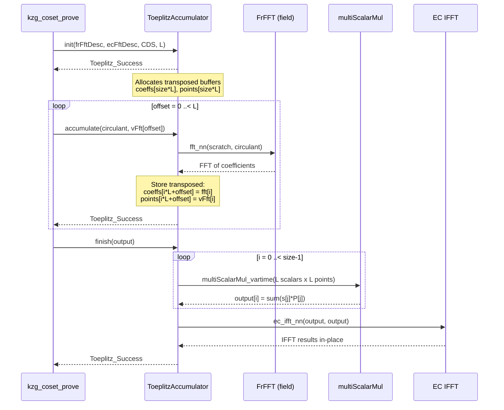
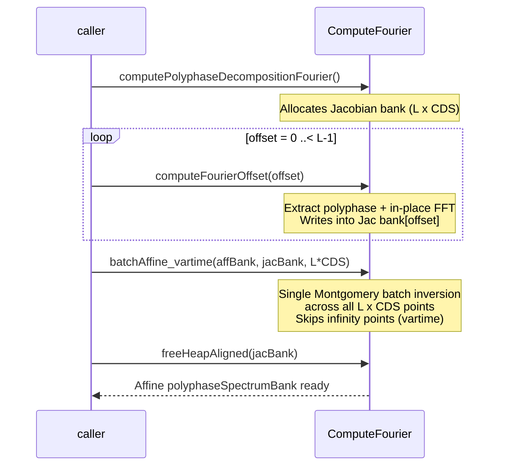

---
**Branch:** `master` → `peerdas-perf-fix-rebased2` (commit `81784ecd`)
**Diff file:** `.REVIEWS/RID-202605022113-peerdas-perf-fix-rebased2-81784ecd/RID-202605022113-changes_under_review.diff`
**Date:** 2026-05-02
**Reviewer:** Summary Specialist
**Scope:** PeerDAS FK20 multiproof performance fixes — new ToeplitzAccumulator pattern, batchAffine_vartime, polyphase spectrum in affine form, Alloca tag removal from FFT paths
**Focus:** Per-file summaries, Mermaid diagrams for complex flows
---

# Review Summary Report

## Important Files Changed

| Filename | Overview |
|----------|----------|
| `constantine/math/matrix/toeplitz.nim` | Replaced `toeplitzMatVecMulPreFFT` with new `ToeplitzAccumulator` type (init/accumulate/finish pattern using MSM + transposed storage) |
| `constantine/commitments/kzg_multiproofs.nim` | Rewrote `kzg_coset_prove` to use `ToeplitzAccumulator`; changed polyphase spectrum bank to affine form with single batch conversion |
| `constantine/math/elliptic/ec_shortweierstrass_batch_ops.nim` | Added `batchAffine_vartime` for Jacobian and Projective forms with zero-z coordinate detection (saves inversions on infinity points) |
| `constantine/math/elliptic/ec_twistededwards_batch_ops.nim` | Added `batchAffine_vartime` for Twisted Edwards; refactored `batchAffine` to store zero-flags in `affs[i].y` instead of stack array |
| `constantine/math/polynomials/fft_common.nim` | Split `bit_reversal_permutation` into `noalias` version + aliasing-aware dispatcher; added debug assertions |
| `constantine/math/polynomials/fft_ec.nim` | Removed `Alloca` tag from all EC FFT functions (no longer uses stack-allocated temporaries) |
| `constantine/commitments_setups/ethereum_kzg_srs.nim` | Changed `polyphaseSpectrumBank` storage from Jacobian to Affine form (saves 3×L×CDS field elements) |
| `constantine/commitments/kzg.nim` | Switched `kzg_verify_batch` from `batchAffine` to `batchAffine_vartime` |
| `constantine/commitments/kzg_parallel.nim` | Switched parallel batch verify from `batchAffine` to `batchAffine_vartime` |
| `constantine/commitments/eth_verkle_ipa.nim` | Switched IPA proving from `batchAffine` to `batchAffine_vartime` |
| `constantine/data_availability_sampling/eth_peerdas.nim` | In-place IFFT in `recoverPolynomialCoeff` to reuse buffer |
| `constantine/lowlevel_elliptic_curves.nim` | Exported `batchAffine_vartime` for Short Weierstrass and Twisted Edwards |
| `constantine/math/elliptic/ec_scalar_mul_vartime.nim` | Switched wNAF precomputation tables from `batchAffine` to `batchAffine_vartime`; removed `Alloca` tag |
| `constantine/math/elliptic/ec_shortweierstrass_batch_ops_parallel.nim` | Switched parallel sum reduction from `batchAffine` to `batchAffine_vartime` |
| `benchmarks/bench_matrix_toeplitz.nim` | Renamed from `bench_toeplitz_multiproofs`; rewritten to benchmark `ToeplitzAccumulator` (64 accumulates + finish) |
| `benchmarks/bench_elliptic_template.nim` | Added `batchAffine_vartime` benchmarks alongside existing `batchAffine` |
| `benchmarks/bench_kzg_multiproofs.nim` | Updated to use `ToeplitzAccumulator`; changed polyphase bank type to Affine |
| `benchmarks/bench_matrix_transpose.nim` | **New file** — Benchmarks 5 transpose strategies (naive, exchanged, 1D blocked, 2D blocked) |
| `constantine/math/matrix/transpose.nim` | **New file** — 2D tiled (blocked) matrix transposition with default block=16 |
| `tests/commitments/t_kzg_multiproofs.nim` | Updated type aliases and imports to match affine polyphase bank |
| `tests/math_matrix/t_toeplitz.nim` | Added `ToeplitzAccumulator` error-path tests, `checkCirculant` r=1 test |
| `tests/math_elliptic_curves/t_ec_template.nim` | Added `isVartime` parameter to `run_EC_affine_conversion`; added tests for all-neutral and varied batch sizes |
| `tests/math_elliptic_curves/t_ec_conversion.nim` | Added vartime conversion tests for BN254, BLS12-381, Bandersnatch, Banderwagon |
| `metering/m_kzg_multiproofs.nim` | Simplified to use `kzg_coset_prove` directly instead of hand-split Phase1/Phase2 metering |
| `constantine.nimble` | Added `bench_matrix_toeplitz` task |
| `.agents/skills/debugging/SKILL.md` | Quoted description field in YAML frontmatter |

## Per-File Summaries

### constantine/math/matrix/toeplitz.nim

**What changed:**
Major refactoring of the Toeplitz matrix-vector multiplication module. The old `toeplitzMatVecMulPreFFT` (per-call FFT + Hadamard + IFFT with optional accumulate) is replaced by a new `ToeplitzAccumulator[EC, ECaff, F]` type with a three-phase API:

1. **`init(frFftDesc, ecFftDesc, size, L)`** — Allocates transposed buffers: `coeffs[size*L]`, `points[size*L]`, and a shared `scratchScalars` buffer
2. **`accumulate(circulant, vFft)`** — FFTs the circulant into `scratchScalars`, stores results transposed at position `offset`
3. **`finish(output)`** — Performs MSM (multiScalarMul_vartime) at each output position, then IFFT in-place

The high-level `toeplitzMatVecMul` is rewritten to use `ToeplitzAccumulator` internally (with `L=1`). New `ToeplitzStatus` enum replaces `FFTStatus` for return types. `checkReturn` and `check` templates provide structured error handling with label-based cleanup.

**Why it matters:**
This is the core performance optimization. The transposed storage layout enables a single MSM per output position (L scalars × L affine points) instead of per-phase IFFT + accumulation. This reduces per-phase heap allocations from 3 (coeffsFft, coeffsFftBig, product) to 0 (reusing scratchScalars), and replaces L separate IFFTs with a single amortized IFFT after all MSMs.

**Key symbols:**
- `ToeplitzStatus*` — Success, SizeNotPowerOfTwo, TooManyValues, MismatchedSizes
- `ToeplitzAccumulator*[EC, ECaff, F]` — Accumulator with transposed storage
- `init*()` — Allocates buffers, validates size/L
- `accumulate*()` — FFT circulant, store transposed at offset
- `finish*()` — MSM per position + single IFFT
- `checkReturn*` — Early-return on error
- `check*` — Label-break on error for cleanup
- `toeplitzMatVecMul*()` — High-level wrapper using accumulator

---

### constantine/commitments/kzg_multiproofs.nim

**What changed:**
`kzg_coset_prove` is completely rewritten to use `ToeplitzAccumulator`. The loop over L phases now calls `accum.accumulate(circulant, polyphaseSpectrumBank[offset])` instead of `toeplitzMatVecMulPreFFT(..., accumulate=true)`. After all accumulates, `accum.finish(u)` performs MSM + IFFT in one step.

`computePolyphaseDecompositionFourier` now computes all L phases in Jacobian form first (into a temporary `polyphaseSpectrumBankJac`), then does a **single** `batchAffine_vartime` across all L×CDS points at the end, converting the entire bank to affine in one batch inversion. The output `polyphaseSpectrumBank` type changed from `EC_ShortW_Jac` to `EC_ShortW_Aff`.

`computePolyphaseDecompositionFourierOffset` writes directly into the output buffer (pre-allocated Jacobian) instead of a temporary, then does an in-place FFT. The `Alloca` tag is removed from both functions.

`computeAggRandScaledInterpoly` changed return type from `bool` to `void`, with runtime checks replaced by `doAssert`. The per-column IFFT now operates in-place on `agg_cols[c]` instead of copying to a temporary `col_interpoly`.

**Why it matters:**
This is the main FK20 proof generation path for PeerDAS. The polyphase spectrum bank being stored in affine form saves ~3×8192 = 24,576 field elements (~786 KB) in the `EthereumKZGContext`. The single batch conversion (instead of implicit per-phase conversion during Toeplitz) reduces the number of field inversions. The `ToeplitzAccumulator` pattern eliminates L-1 unnecessary IFFTs.

**Key symbols:**
- `computePolyphaseDecompositionFourier` — Now returns affine form, single batch conversion
- `computePolyphaseDecompositionFourierOffset` — In-place FFT, writes directly to output
- `kzg_coset_prove` — Uses `ToeplitzAccumulator` instead of loop of `toeplitzMatVecMulPreFFT`
- `computeAggRandScaledInterpoly` — Returns void, in-place IFFT

---

### constantine/math/elliptic/ec_shortweierstrass_batch_ops.nim

**What changed:**
Added `batchAffine_vartime*` for both Projective and Jacobian coordinate systems. The algorithm is based on Montgomery's batch inversion but with **variable-time zero-z detection**:

- Uses `affs[i].x` to store partial products (same as `batchAffine`)
- Uses `affs[i].y.mres.limbs[0]` to store a `SecretWord` zero flag for each input point
- During forward pass: if `z == 0`, stores `1` as the partial product multiplier (maintaining the chain)
- During backward pass: if `z == 0`, skips the inversion and sets the output to neutral (point at infinity)

This saves `inv_vartime` calls for points at infinity. Added `N <= 0` early return guards to all `batchAffine` overloads.

**Why it matters:**
In FK20 polyphase decomposition, half the CDS points are always at infinity (the second half is zero-padded). The constant-time `batchAffine` would still process all these inversions. The vartime version detects and skips them, saving ~50% of field inversions in polyphase setup. For PeerDAS (64×128 = 8192 points), this is ~4096 saved inversions.

**Key symbols:**
- `batchAffine_vartime*[F, G](affs: ptr UncheckedArray[EC_ShortW_Aff], projs: ptr UncheckedArray[EC_ShortW_Prj], N)` — Vartime Projective→Affine
- `batchAffine_vartime*[F, G](affs: ptr UncheckedArray[EC_ShortW_Aff], jacs: ptr UncheckedArray[EC_ShortW_Jac], N)` — Vartime Jacobian→Affine
- Array and 2D array inline overloads for both forms

---

### constantine/math/elliptic/ec_twistededwards_batch_ops.nim

**What changed:**
Added `batchAffine_vartime*` for Twisted Edwards projective coordinates (same algorithm as Short Weierstrass Projective). Also refactored the existing `batchAffine` to use the same `zero(i)` template pattern (storing zero flags in `affs[i].y.mres.limbs[0]` instead of a separate `allocStackArray(SecretBool, N)`).

**Why it matters:**
Consistent API across curve types. The refactored `batchAffine` eliminates the stack allocation of `SecretBool[N]` and uses the same storage strategy as `batchAffine_vartime`, reducing code duplication.

**Key symbols:**
- `batchAffine_vartime*[F](affs, projs, N)` — Vartime TwEdw Projective→Affine
- `batchAffine*[F](affs, projs, N)` — Refactored to use `zero(i)` template

---

### constantine/math/polynomials/fft_common.nim

**What changed:**
Split `bit_reversal_permutation*` into:
- `bit_reversal_permutation_noalias*(dst, src)` — The actual permutation (requires no aliasing between dst and src)
- `bit_reversal_permutation*(dst, src)` — Dispatcher that checks for aliasing (`dst[0].addr == src[0].addr`) and uses a temporary buffer if needed
- `bit_reversal_permutation*(buf)` — In-place version (allocates temp, calls noalias, copies back)

Added `debug: doAssert` checks for power-of-2 length and non-zero length.

**Why it matters:**
This enables safe in-place FFT operations where the same buffer is used for both input and output. The `ToeplitzAccumulator.finish` method calls `ec_ifft_nn(output, output)` directly, which now correctly handles the aliasing case via `bit_reversal_permutation`.

**Key symbols:**
- `bit_reversal_permutation_noalias*` — Non-aliasing bit reversal
- `bit_reversal_permutation*(dst, src)` — Aliasing-aware dispatcher
- `bit_reversal_permutation*(buf)` — In-place version

---

### constantine/math/polynomials/fft_ec.nim

**What changed:**
Removed the `Alloca` effect tag from all EC FFT public and internal functions. The iterative implementations (`ec_fft_nr_impl_iterative_dif`, `ec_fft_rn_impl_iterative_dit`, `ec_ifft_rn_impl_iterative`) no longer use stack-allocated temporaries — they operate entirely through `StridedView` on the input/output buffers.

**Why it matters:**
The `Alloca` tag was inaccurate for the iterative implementations, which avoid VLA usage. Removing it gives the Nim compiler more accurate effect information, potentially enabling better optimization and avoiding unnecessary stack size concerns.

**Key symbols:**
- All `ec_fft_*` and `ec_ifft_*` functions — `Alloca` tag removed from `tags` pragma

---

### constantine/commitments_setups/ethereum_kzg_srs.nim

**What changed:**
The `polyphaseSpectrumBank` field in `EthereumKZGContext` changed from `EC_ShortW_Jac[Fp[BLS12_381], G1]` to `EC_ShortW_Aff[Fp[BLS12_381], G1]`.

**Why it matters:**
Affine points (x, y) are 64 bytes each vs Jacobian points (x, y, z) at 96 bytes. For the PeerDAS bank (64 × 128 = 8192 points), this saves 8192 × 32 = 262,144 bytes (~256 KB) in the context struct. The affine form also means fewer field multiplications during Toeplitz accumulation since the vFft input is already affine.

**Key symbols:**
- `polyphaseSpectrumBank*` — Changed to affine form

---

### constantine/commitments/kzg.nim

**What changed:**
In `kzg_verify_batch`, `batchAffine` replaced with `batchAffine_vartime` for the `commits_min_evals_jac → commits_min_evals` conversion.

**Why it matters:**
In batch verification, some commitments-minus-evals may be the point at infinity (when the random linear combination happens to cancel). The vartime version detects and skips these, saving inversions in those cases.

**Key symbols:**
- `kzg_verify_batch*` — Uses `batchAffine_vartime`

---

### constantine/commitments/kzg_parallel.nim

**What changed:**
In `kzg_verify_batch_parallel`, `batchAffine` replaced with `batchAffine_vartime` for the per-thread affine conversion.

**Key symbols:**
- `kzg_verify_batch_parallel*` — Uses `batchAffine_vartime`

---

### constantine/commitments/eth_verkle_ipa.nim

**What changed:**
Three call sites changed from `batchAffine` to `batchAffine_vartime`:
1. In `ipa_prove*`: `lrAff.batchAffine(lr)` → `lrAff.batchAffine_vartime(lr)`
2. In `ipa_prove*`: `batchAffine(gL.asUnchecked(), ...)` → `batchAffine_vartime(...)`
3. In `sumCommitmentsAndEvalsByChallenge`: `tmpAff.batchAffine(tmp, ...)` → `tmpAff.batchAffine_vartime(tmp, ...)`

**Key symbols:**
- `ipa_prove*` — Uses `batchAffine_vartime`
- `sumCommitmentsAndEvalsByChallenge` — Uses `batchAffine_vartime`

---

### constantine/data_availability_sampling/eth_peerdas.nim

**What changed:**
In `recoverPolynomialCoeff`, the IFFT step now operates in-place on `extended_times_zero` buffer instead of allocating a separate `ext_times_zero_coeffs` buffer. The subsequent `coset_fft_nr` reads directly from the IFFT'd buffer.

**Why it matters:**
Saves one heap allocation of size 2*N (~262 KB for N=4096). The `bit_reversal_permutation` aliasing support makes this safe.

**Key symbols:**
- `recoverPolynomialCoeff*` — In-place IFFT

---

### constantine/lowlevel_elliptic_curves.nim

**What changed:**
Added exports for `batchAffine_vartime` from both `ec_shortweierstrass` and `ec_twistededwards` modules.

**Key symbols:**
- Exported `batchAffine_vartime` (Short Weierstrass & Twisted Edwards)

---

### constantine/math/elliptic/ec_scalar_mul_vartime.nim

**What changed:**
In `scalarMul_wNAF_vartime` and `scalarMulEndo_wNAF_vartime`:
- `tab.batchAffine(tabEC)` → `tab.batchAffine_vartime(tabEC)` for precomputed table conversion
- Removed `Alloca` effect tag from both functions

**Why it matters:**
The wNAF precomputed tables can contain the point at infinity for edge cases. The vartime version detects and handles these correctly, and the `Alloca` tag was not needed since the tables are fixed-size arrays.

**Key symbols:**
- `scalarMul_wNAF_vartime*` — Uses `batchAffine_vartime`, `Alloca` tag removed
- `scalarMulEndo_wNAF_vartime*` — Uses `batchAffine_vartime`, `Alloca` tag removed

---

### constantine/math/elliptic/ec_shortweierstrass_batch_ops_parallel.nim

**What changed:**
In `sum_reduce_vartime_parallelChunks`, `partialResultsAffine.batchAffine(partialResults, ...)` → `partialResultsAffine.batchAffine_vartime(partialResults, ...)`.

**Key symbols:**
- `sum_reduce_vartime_parallelChunks` — Uses `batchAffine_vartime`

---

### benchmarks/bench_matrix_toeplitz.nim (renamed from bench_toeplitz_multiproofs.nim)

**What changed:**
Complete rewrite of the Toeplitz benchmarks. Old benchmarks (individual `toeplitzMatVecMulPreFFT` calls with accumulate/no-accumulate) replaced by:
- `benchToeplitzMatVecMul_Size128` — Benchmarks `toeplitzMatVecMul` (single call, size 128)
- `benchToeplitzAccumulator_64Accumulates` — Benchmarks the full `ToeplitzAccumulator` pattern: init, 64 accumulate calls, finish (MSM + IFFT)

Uses `privateAccess(toeplitz.ToeplitzAccumulator)` to directly reset `acc.offset` between benchmark iterations.

**Why it matters:**
Provides accurate benchmarks for the new `ToeplitzAccumulator` API that matches the production `kzg_coset_prove` code path.

**Key symbols:**
- `benchToeplitzMatVecMul_Size128` — Single multiplication benchmark
- `benchToeplitzAccumulator_64Accumulates` — Full FK20 accumulation pattern benchmark

---

### benchmarks/bench_elliptic_template.nim

**What changed:**
Added `batchAffine_vartime` benchmarks alongside existing `batchAffine` benchmarks for both projective-to-affine and Jacobian-to-affine conversions.

**Key symbols:**
- `affFromProjBatchBench` — Added `batched_vt` benchmark
- `affFromJacBatchBench` — Added `batched_vt` benchmark

---

### benchmarks/bench_kzg_multiproofs.nim

**What changed:**
- `polyphaseSpectrumBank` type changed from Jacobian to Affine
- `benchFK20_Phase1_Full` rewritten to use `ToeplitzAccumulator` instead of manual accumulation loop

**Key symbols:**
- `benchPolyphasePrecomputation` — Affine bank type
- `benchFK20_Phase1_Full` — Uses `ToeplitzAccumulator`

---

### benchmarks/bench_matrix_transpose.nim (new file)

**What changed:**
**New benchmark file** comparing 5 matrix transposition strategies for 512×512 matrices of `Fr[BLS12_381]` (32-byte elements):
1. Naive sequential
2. Naive with exchanged loop order
3. 1D blocked (block sizes 8, 16, 32, 64, 128)
4. 2D blocked/tiled (block sizes 4, 8, 16, 32)
5. (D&C cache-oblivious mentioned but not implemented)

Reports GMEMOPs/s and GB/s throughput.

**Why it matters:**
Validates the optimal block size for 2D tiled transposition of 32-byte field elements, supporting the `transpose.nim` implementation.

**Key symbols:**
- `naiveTranspose`, `naiveTransposeExchanged`, `blocked1DTranspose`, `blocked2DTranspose`
- `benchNaive`, `benchNaiveExchanged`, `benchBlocked1D`, `benchBlocked2D`

---

### constantine/math/matrix/transpose.nim (new file)

**What changed:**
**New implementation file** providing 2D tiled (blocked) matrix transposition:
- `transpose*[T](dst, src: ptr UncheckedArray[T], M, N: int, blockSize: static int = 16)` — Core implementation
- `transpose*[T](dst: var openArray[T], src: openArray[T], M, N: int, blockSize: static int = 16)` — openArray wrapper

Default block size 16 is optimized for 32-byte elements (8KB per tile fits in L1 cache).

**Why it matters:**
Provides a cache-efficient transpose routine for cryptographic workloads with large field elements. Documented as achieving ~20 GB/s vs ~10 GB/s for naive sequential (2× speedup).

**Key symbols:**
- `transpose*[T](ptr UncheckedArray, M, N, blockSize)` — 2D tiled transposition
- `transpose*[T](openArray, M, N, blockSize)` — Convenience wrapper

---

### tests/commitments/t_kzg_multiproofs.nim

**What changed:**
- `FK20PolyphaseSpectrumBank` type changed from `EC_ShortW_Jac` to `EC_ShortW_Aff`
- All `polyphaseSpectrumBank` variables changed to affine type
- Added import of `constantine/math/matrix/toeplitz`

**Key symbols:**
- `FK20PolyphaseSpectrumBank` — Now affine

---

### tests/math_matrix/t_toeplitz.nim

**What changed:**
- Renamed `BLS12_381_G1` type alias to `BLS12_381_G1_Prj` for clarity
- Added `testToeplitzAccumulatorInitErrors()` — Tests invalid init parameters (zero size, non-power-of-2, negative)
- Added `testToeplitzAccumulatorFinishErrors()` — Tests finish without accumulate
- Added `testCheckCirculantR1()` — Tests circulant validation with r=1
- Added `testToeplitz(16)` test case
- Changed `doAssert` to check `Toeplitz_Success` instead of `FFT_Success`

**Key symbols:**
- `testToeplitzAccumulatorInitErrors`, `testToeplitzAccumulatorFinishErrors`, `testCheckCirculantR1`

---

### tests/math_elliptic_curves/t_ec_template.nim

**What changed:**
`run_EC_affine_conversion` now accepts `isVartime: bool = false` parameter. When `true`, calls `batchAffine_vartime` instead of `batchAffine`. Added new test cases:
- `testName & " with single element"` — Tests N=1 batch
- `testName & " with all neutral points"` — Tests all-infinity batch
- `testName & " with varied batch sizes"` — Tests batch sizes 2 and 16

**Key symbols:**
- `run_EC_affine_conversion` — Now supports vartime testing

---

### tests/math_elliptic_curves/t_ec_conversion.nim

**What changed:**
Added 12 new `run_EC_affine_conversion` calls testing `batchAffine_vartime` for:
- BN254 G1 Jacobian, G1 Projective, G2 Jacobian, G2 Projective (all vartime)
- BLS12-381 G1 Jacobian, G1 Projective, G2 Jacobian, G2 Projective (all vartime)
- Bandersnatch TwEdw Projective (constant-time + vartime)
- Banderwagon TwEdw Projective (constant-time + vartime)

**Key symbols:**
- Added vartime conversion test cases for all supported curves

---

### metering/m_kzg_multiproofs.nim

**What changed:**
Simplified from hand-split Phase1/Phase2 metering to a single `kzg_coset_prove` call. Removed the `fk20Phase1Meter` and `fk20Phase2Meter` helper procedures. The metering system now captures the complete FK20 pipeline in one shot.

**Key symbols:**
- `main()` — Single `kzg_coset_prove` call

---

### constantine.nimble

**What changed:**
Added `"bench_matrix_toeplitz"` to `benchDesc` list and created `bench_matrix_toeplitz` nimble task.

---

### .agents/skills/debugging/SKILL.md

**What changed:**
Quoted the `description` field in the YAML frontmatter to fix YAML parsing (the original unquoted string contained special characters).

---

## Diagrams

### Sequence Diagram: ToeplitzAccumulator FK20 Flow

Shows how `kzg_coset_prove` uses the new `ToeplitzAccumulator` to amortize L Toeplitz multiplications into a single MSM-per-position + single IFFT.



### Sequence Diagram: Polyphase Decomposition with Batch Conversion

Shows how `computePolyphaseDecompositionFourier` computes all L phases in Jacobian form, then does a single batch affine conversion.



### Flowchart: batchAffine_vartime Algorithm

Shows the Montgomery batch inversion algorithm with variable-time zero-z coordinate detection for Jacobian→Affine conversion.

```mermaid
flowchart TD
    Start[Start: N projective/Jacobian points] --> CheckN["\"Check N > 0\""]
    CheckN --> Init["\"Compute zero(0) = z[0].isZero()\""]
    Init --> Branch0{"\"z[0] == 0?\""}
    Branch0 -->|Yes| Set1["\"affs[0].x = 1 (maintain chain)\""]
    Branch0 -->|No| StoreZ0["\"affs[0].x = z[0]\""]

    Set1 --> ForwardLoop["\"Forward loop: i = 1..N-1\""]
    StoreZ0 --> ForwardLoop

    ForwardLoop --> CheckZero["\"zero(i) = z[i].isZero()\""]
    CheckZero --> IsZero{"\"z[i] == 0?\""}
    IsZero -->|Yes| CopyChain["\"affs[i].x = affs[i-1].x\""]
    IsZero -->|No| MultiplyChain["\"affs[i].x = affs[i-1].x * z[i]\""]

    CopyChain --> NextI1{"\"i < N-1?\""}
    MultiplyChain --> NextI1
    NextI1 -->|Yes| ForwardLoop
    NextI1 -->|No| ComputeInv["\"accInv = inv_vartime(affs[N-1].x)\""]

    ComputeInv --> BackwardLoop["\"Backward loop: i = N-1..1\""]
    BackwardLoop --> CheckZeroB{"\"zero(i) == true?\""}
    CheckZeroB -->|Yes| SetNeutral["\"affs[i] = neutral (infinity)\""]
    CheckZeroB -->|No| ComputeInvi["\"invi = accInv * affs[i-1].x\""]

    SetNeutral --> UpdateAccB1["\"accInv unchanged\""]
    ComputeInvi --> UpdateAccB["\"accInv = accInv * z[i]\""]
    UpdateAccB1 --> ConvertPt

    UpdateAccB --> ConvertPt["\"Convert point to affine\""]
    ConvertPt --> IsJacobian{"\"Jacobian form?\""}
    IsJacobian -->|Yes| JacConvert["\"x = X * invi^2, y = Y * invi^3\""]
    IsJacobian -->|No| PrjConvert["\"x = X * invi, y = Y * invi\""]

    JacConvert --> NextI2{"\"i > 1?\""}
    PrjConvert --> NextI2
    NextI2 -->|Yes| BackwardLoop
    NextI2 -->|No| Tail["\"Handle tail: point 0\""]
    Tail --> Done["\"Return: N affine points\""]
```

### Flowchart: bit_reversal_permutation Aliasing Dispatch

Shows how the new `bit_reversal_permutation` detects and handles buffer aliasing.

```mermaid
flowchart TD
    Start["\"bit_reversal_permutation(dst, src)\""] --> CheckAlias["\"dst[0].addr == src[0].addr?\""]
    CheckAlias -->|Yes (aliased)| AllocTmp["\"Alloc temporary buffer\""]
    AllocTmp --> CallNoAlias["\"bit_reversal_permutation_noalias(tmp, src)\""]
    CallNoAlias --> CopyBack["\"copyMem(dst, tmp)\""]
    CopyBack --> FreeTmp["\"freeHeapAligned(tmp)\""]
    FreeTmp --> End["\"Return\""]

    CheckAlias -->|No (distinct)| CallNoAliasDirect["\"bit_reversal_permutation_noalias(dst, src)\""]
    CallNoAliasDirect --> End
```
