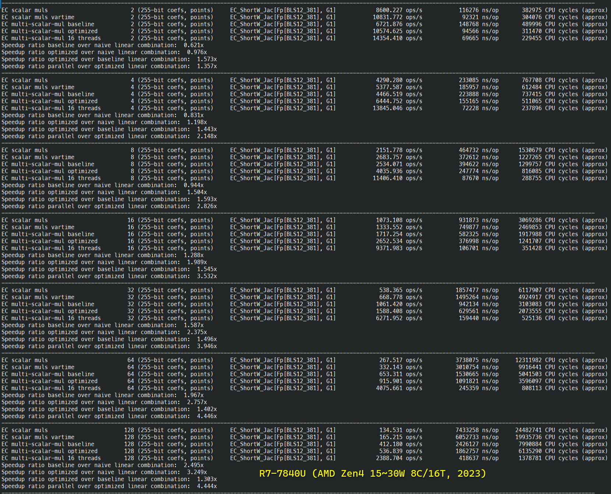
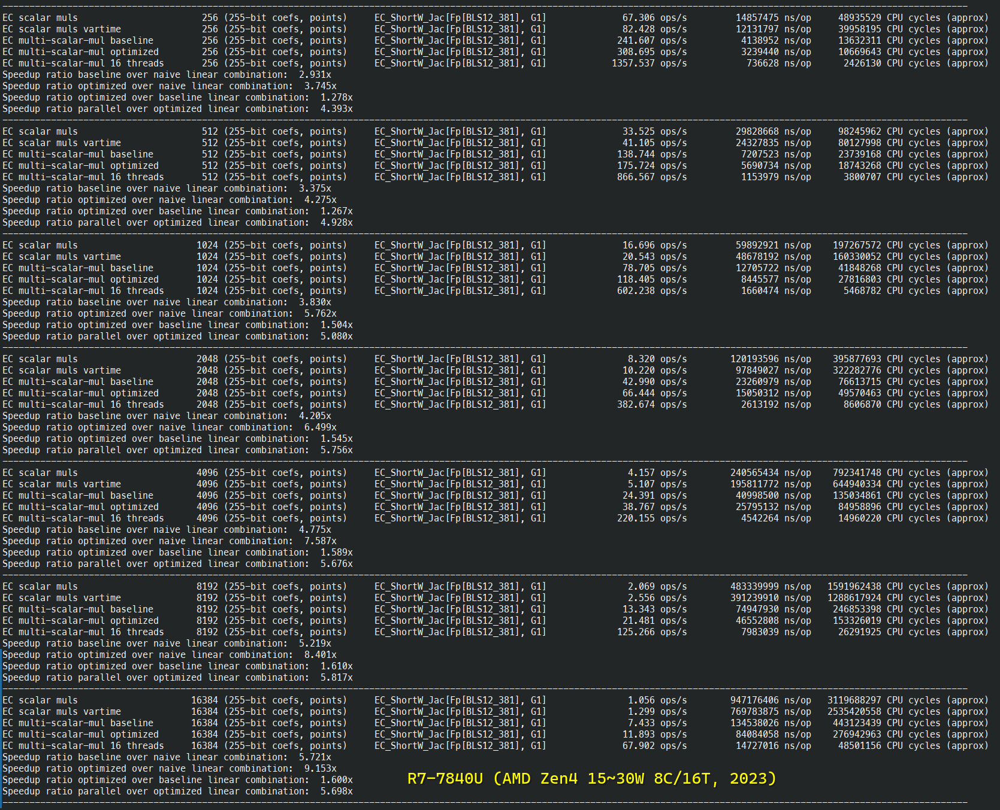
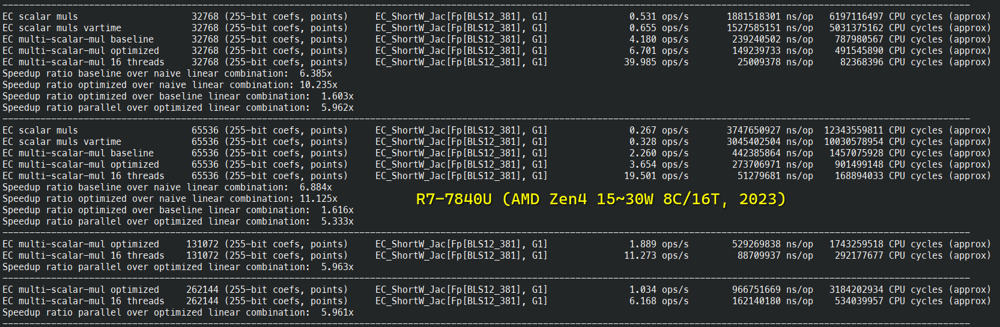

# Performance

High-performance is a sought out property.
Note that security and side-channel resistance takes priority over performance.

New applications of elliptic curve cryptography like zero-knowledge proofs or
proof-of-stake based blockchain protocols are bottlenecked by cryptography.

## In blockchain

Ethereum 2 clients spent or use to spend anywhere between 30% to 99% of their processing time verifying the signatures of block validators on R&D testnets
Assuming we want nodes to handle a thousand peers, if a cryptographic pairing takes 1ms, that represents 1s of cryptography per block to sign with a target
block frequency of 1 every 6 seconds.

## In zero-knowledge proofs

According to https://medium.com/loopring-protocol/zksnark-prover-optimizations-3e9a3e5578c0
a 16-core CPU can prove 20 transfers/second or 10 transactions/second.
The previous implementation was 15x slower and one of the key optimizations
was changing the elliptic curve cryptography backend.
It had a direct implication on hardware cost and/or cloud computing resources required.

## Measuring performance

To measure the performance of Constantine

```bash
git clone https://github.com/mratsim/constantine

# Default compiler. We recommand enforcing CC=clang for best performance.
nimble bench_fp

# Arithmetic
CC=clang nimble bench_fp  # Using Clang + Assembly (recommended)
CC=clang nimble bench_fp2
CC=clang nimble bench_fp12

# Scalar multiplication and pairings
CC=clang nimble bench_ec_g1_scalar_mul
CC=clang nimble bench_ec_g2_scalar_mul
CC=clang nimble bench_pairing_bls12_381

# And per-curve summaries
CC=clang nimble bench_summary_bn254_nogami
CC=clang nimble bench_summary_bn254_snarks
CC=clang nimble bench_summary_bls12_377
CC=clang nimble bench_summary_bls12_381

# Ethereum BLS signature protocol
CC=clang nimble bench_eth_bls_signatures

# Ethereum KZG commitments
CC=clang nimble bench_eth_eip4844_kzg

# Ethereum Virtual Machine (EVM) precompiles
CC=clang nimble bench_eth_evm_precompiles

# Multi-scalar multiplication
CC=clang nimble bench_ec_g1_msm_bls12_381
CC=clang nimble bench_ec_g1_msm_bn254_snarks
```

The full list of benchmarks is available in the [`benchmarks`](./benchmarks) folder.
And the exact commands are listed as part of `nimble tasks`


As mentioned in the [Compiler caveats](#compiler-caveats) section, GCC is up to 2x slower than Clang due to mishandling of carries and register usage.

## Ethereum benchmarks

### Ethereum Virtual Machine (EVM) precompiles


### Ethereum KZG commitments (EIP-4844)


### Ethereum BLS signatures (over BLS12-381 𝔾₂)


## Cryptographic primitives benchmarks

### BLS12-381 detailed benchmarks






### BN254-Snarks Multi-Scalar-Multiplication benchmarks

On a i9-9980XE (18 cores, watercooled, overclocked, 4.1GHz all core turbo)


### Parallelism

Constantine multithreaded primitives are powered by a highly tuned threadpool and stress-tested for:
- scheduler overhead
- load balancing with extreme imbalance
- nested data parallelism
- contention
- speculative/conditional parallelism

and provides the following paradigms:
- Future-based task-parallelism
- Data parallelism (nestable and awaitable for loops)
  - including arbitrary parallel reductions
- Dataflow parallelism / Stream parallelism / Graph Parallelism / Pipeline parallelism
- Structured Parallelism

The threadpool parallel-for loops use lazy loop splitting and are fully adaptative to the workload being scheduled, the threads in-flight load and the hardware speed unlike most (all?) runtime, see:
- OpenMP woes depending on hardware and workload: https://github.com/zy97140/omp-benchmark-for-pytorch
- Raytracing ideal runtime, adapt to pixel compute load: \
  Most (all?) production runtime use scheduling A (split on number of threads like GCC OpenMP) or B (eager splitting, unable to adapt to actual work like LLVM/Intel OpenMP or Intel TBB) while Constantine uses C.

The threadpool provides efficient backoff strategy to conserve power based on:
- eventcounts / futexes, for low overhead backoff
- log-log iterated backoff, a provably optimal backoff strategy used for wireless communication to minimize communication in parallel for-loops

The research papers on high performance multithreading available in Weave repo: https://github.com/mratsim/weave/tree/7682784/research.\
_Note: The threadpool is not backed by Weave but by an inspired runtime that has been significantly simplified for ease of auditing. In particular it uses shared-memory based work-stealing instead of channel-based work-requesting for load balancing as distributed computing is not a target, ..., yet._

## Compiler caveats

Unfortunately compilers and in particular GCC are not very good at optimizing big integers and/or cryptographic code even when using intrinsics like `addcarry_u64`.

Compilers with proper support of `addcarry_u64` like Clang, MSVC and ICC
may generate code up to 20~25% faster than GCC.

This is explained by the GMP team: https://gmplib.org/manual/Assembly-Carry-Propagation.html
and can be reproduced with the following C code.

See https://gcc.godbolt.org/z/2h768y
```C
#include <stdint.h>
#include <x86intrin.h>

void add256(uint64_t a[4], uint64_t b[4]){
  uint8_t carry = 0;
  for (int i = 0; i < 4; ++i)
    carry = _addcarry_u64(carry, a[i], b[i], &a[i]);
}
```

GCC
```asm
add256:
        movq    (%rsi), %rax
        addq    (%rdi), %rax
        setc    %dl
        movq    %rax, (%rdi)
        movq    8(%rdi), %rax
        addb    $-1, %dl
        adcq    8(%rsi), %rax
        setc    %dl
        movq    %rax, 8(%rdi)
        movq    16(%rdi), %rax
        addb    $-1, %dl
        adcq    16(%rsi), %rax
        setc    %dl
        movq    %rax, 16(%rdi)
        movq    24(%rsi), %rax
        addb    $-1, %dl
        adcq    %rax, 24(%rdi)
        ret
```

Clang
```asm
add256:
        movq    (%rsi), %rax
        addq    %rax, (%rdi)
        movq    8(%rsi), %rax
        adcq    %rax, 8(%rdi)
        movq    16(%rsi), %rax
        adcq    %rax, 16(%rdi)
        movq    24(%rsi), %rax
        adcq    %rax, 24(%rdi)
        retq
```
### Inline assembly

While using intrinsics significantly improve code readability, portability, auditability and maintainability,
Constantine use inline assembly on x86-64 to ensure performance portability despite poor optimization (for GCC)
and also to use dedicated large integer instructions MULX, ADCX, ADOX that compilers cannot generate.

The speed improvement on finite field arithmetic is up 60% with MULX, ADCX, ADOX on BLS12-381 (6 limbs).

Finally assembly is a requirement to ensure constant-time property and to avoid compilers turning careful
branchless code into branches, see [Fighting the compiler (wiki)](https://github.com/mratsim/constantine/wiki/Constant-time-arithmetics#fighting-the-compiler)

In summary, pure C/C++/Nim implies:
- a smart compiler might unravel the constant time bit manipulation and reintroduce branches.
- a significant performance cost with GCC (~50% slower than Clang).
- missed opportunities on recent CPUs that support MULX/ADCX/ADOX instructions (~60% faster than Clang).
- 2.4x perf ratio between using plain GCC vs GCC with inline assembly.

## Sizes: code size, stack usage

Thanks to 10x smaller key sizes for the same security level as RSA, elliptic curve cryptography
is widely used on resource-constrained devices.

Constantine is actively optimize for code-size and stack usage.
Constantine does not use heap allocation.

At the moment Constantine is optimized for 32-bit and 64-bit CPUs.

When performance and code size conflicts, a careful and informed default is chosen.
In the future, a compile-time flag that goes beyond the compiler `-Os` might be provided.
