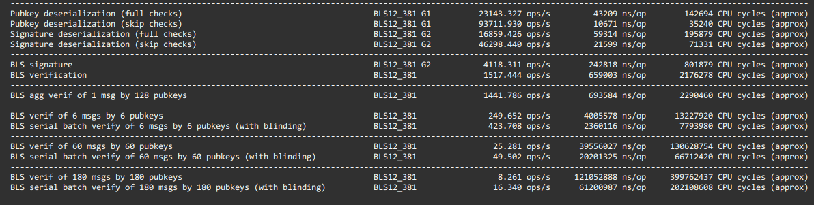
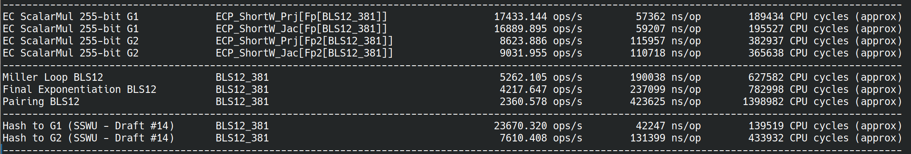
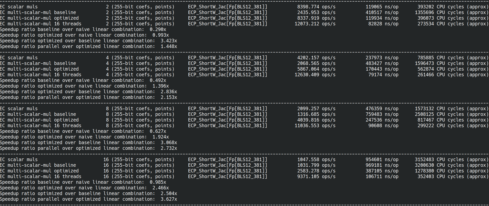
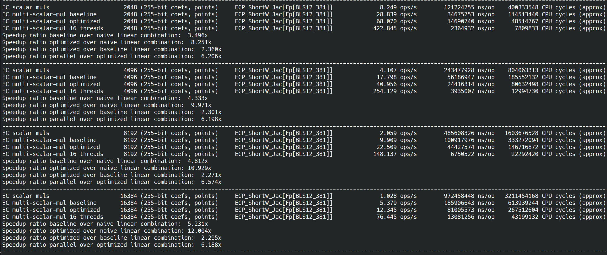
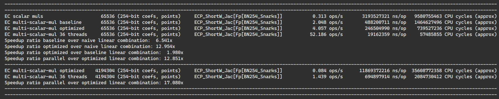

# Constantine - Fast, compact, hardened Pairing-Based Cryptography

[](https://opensource.org/licenses/Apache-2.0)
[](https://opensource.org/licenses/MIT)
\
[](https://github.com/mratsim/constantine/actions?query=workflow%3A%22Constantine+CI%22+branch%3Amaster)

> “A cryptographic system should be secure even if everything about the system, except the key, is public knowledge.”\
>   — Auguste Kerckhoffs

This library provides [constant-time](https://en.wikipedia.org/wiki/Timing_attack) implementation of cryptographic protocols
with a particular focus on pairing-based cryptography as used in blockchains and zero-knowledge protocols.

The implementations are accompanied with SAGE code used as reference implementation and test vectors generators before writing highly optimized routines implemented in the [Nim language](https://nim-lang.org/)

> The library is in development state and high-level wrappers or example protocols are work-in-progress.

## Table of Contents

<!-- TOC -->

- [Constantine - Fast, compact, hardened Pairing-Based Cryptography](#constantine---fast-compact-hardened-pairing-based-cryptography)
    - [Table of Contents](#table-of-contents)
    - [Target audience](#target-audience)
    - [Protocols](#protocols)
    - [Installation](#installation)
        - [From C](#from-c)
        - [From Nim](#from-nim)
    - [Dependencies & Requirements](#dependencies--requirements)
    - [Curves supported in the backend](#curves-supported-in-the-backend)
    - [Security](#security)
        - [Disclaimer](#disclaimer)
        - [Security disclosure](#security-disclosure)
    - [Performance](#performance)
        - [In blockchain](#in-blockchain)
        - [In zero-knowledge proofs](#in-zero-knowledge-proofs)
        - [Measuring performance](#measuring-performance)
            - [Ethereum BLS signatures over BLS12-381 G2](#ethereum-bls-signatures-over-bls12-381-g2)
            - [BLS12-381 detailed benchmarks](#bls12-381-detailed-benchmarks)
            - [BN254-Snarks Multi-Scalar-Multiplication benchmarks](#bn254-snarks-multi-scalar-multiplication-benchmarks)
            - [Parallelism](#parallelism)
    - [Why Nim](#why-nim)
    - [Compiler caveats](#compiler-caveats)
        - [Inline assembly](#inline-assembly)
    - [Sizes: code size, stack usage](#sizes-code-size-stack-usage)
    - [License](#license)

<!-- /TOC -->
## Target audience

The library aims to be a fast, compact and hardened library for elliptic curve cryptography needs, in particular for blockchain protocols and zero-knowledge proofs system.

The library focuses on following properties:
- constant-time (not leaking secret data via [side-channels](https://en.wikipedia.org/wiki/Side-channel_attack))
- performance
- generated code size, datatype size and stack usage

in this order.

## Protocols

Protocols are a set of routines, designed for specific goals or a combination thereof:
- confidentiality: only the intended receiver of a message can read it
- authentication: the other party in the communication is the expected part
- integrity: the received message has not been tampered with
- non-repudiation: the sender of a message cannot repudiated it

Protocols to address these goals, (authenticated) encryption, signature, traitor-tracing, etc
are designed.\
Note: some goals might be mutually exclusive, for example "plausible deniability" and "non-repudiation".

## Installation

### From C

1. Install a C compiler, for example:
    - Debian/Ubuntu `sudo apt update && sudo apt install build-essential`
    - Archlinux `pacman -S base-devel`

2. Install nim, it is available in most distros package manager for Linux and Homebrew for MacOS
   Windows binaries are on the official website: https://nim-lang.org/install_unix.html
    - Debian/Ubuntu `sudo apt install nim`
    - Archlinux `pacman -S nim`

3. Compile the bindings.
    - Recommended: \
      `CC:clang nimble bindings`
    - or `nimble bindings_no_asm`\
     to compile without assembly (otherwise it autodetects support)
    - or with default compiler\
      `nimble bindings`

4. Ensure bindings work
    - `nimble test_bindings`

5. Bindings location
    - The bindings are put in `constantine/lib`
    - The headers are in [constantine/include](./include) for example [Ethereum BLS signatures](./include/constantine_ethereum_bls_signatures.h)

6. Read the examples in [examples-c](./examples-c):
   - Using the [Ethereum BLS signatures bindings from C](./examples-c/ethereum_bls_signatures.c)
   - Testing Constantine BLS12-381 vs GMP [./examples-c/t_libctt_bls12_381.c](./examples-c/t_libctt_bls12_381.c)

The bindings currently provided are:

- Ethereum BLS signatures on BLS12-381 G2
  Cryptographic suite: `BLS_SIG_BLS12381G2_XMD:SHA-256_SSWU_RO_POP_`

  This scheme is also used in the following blockchains:
  Algorand, Chia, Dfinity, Filecoin, Tezos, Zcash.
  They may have their pubkeys on G1 and signatures on G2 like Ethereum or the other way around.

- BLS12-381 arithmetic:
  - field arithmetic
    - on Fr (i.e. modulo the 255-bit curve order)
    - on Fp (i.e. modulo the 381-bit prime modulus)
    - on Fp2
  - elliptic curve arithmetic:
    - on elliptic curve over Fp (EC G1) with affine, jacobian and homogenous projective coordinates
    - on elliptic curve over Fp2 (EC G2) with affine, jacobian and homogenous projective coordinates
  - currently not exposed: \
    scalar multiplication, multi-scalar multiplications \
    pairings and multi-pairings \
    are implemented but not exposed
  - _All operations are constant-time unless explicitly mentioned_ vartime

- The Pasta curves: Pallas and Vesta
  - field arithmetic
    - on Fr (i.e. modulo the 255-bit curve order)
    - on Fp (i.e. modulo the 255-bit prime modulus)
  - elliptic curve arithmetic:
    - on elliptic curve over Fp (EC G1) with affine, jacobian and homogenous projective coordinates
  - currently not exposed: \
    scalar multiplication, multi-scalar multiplications \
    are implemented but not exposed
  - _All operations are constant-time unless explicitly mentioned_ vartime

### From Nim

You can install the developement version of the library through nimble with the following command
```
nimble install https://github.com/mratsim/constantine@#master
```

## Dependencies & Requirements

For speed it is recommended to use Clang (see [Compiler-caveats](#Compiler-caveats)).
In particular GCC generates inefficient add-with-carry code.

Constantine requires at least:
- GCC 7 \
  Previous versions generated incorrect add-with-carry code.
- Clang 14 \
  On x86-64, inline assembly is used to workaround compilers having issues optimizing large integer arithmetic,
  and also ensure constant-time code. \
  Constantine uses the intel assembly syntax to address issues with the default AT&T syntax and constants propagated in Clang. \
  Clang 14 added support for `-masm=intel`. \
  \
  On MacOS, Apple Clang does not support Intel assembly syntax, use Homebrew Clang instead or compile without assembly.\
  _Note that Apple is discontinuing Intel CPU throughough their product line so this will impact only older model and Mac Pro_

On Windows, Constantine is tested with MinGW. The Microsoft Visual C++ Compiler is not configured.

Constantine has no dependencies, even on Nim standard library except:
- for testing
  - jsony for parsing json test vectors
  - the Nim standard library for unittesting, formatting and datetime.
  - GMP for testing against GMP
- for benchmarking
  - The Nim standard libreary for timing and formatting
- for Nvidia GPU backend:
  - the LLVM runtime ("dev" version with headers is not needed)
  - the CUDA runtime ("dev" version with headers is not needed)
- at compile-time
  - we need the std/macros library to generate Nim code.

## Curves supported in the backend

_The backend, unlike protocols, is not public. Here be dragons._

At the moment the following curves are implemented, adding a new curve only requires adding the prime modulus
and its bitsize in [constantine/config/curves.nim](constantine/math/config/curves_declaration.nim).

The following curves are configured:

- Pairing-Friendly curves
  - BN254_Nogami
  - BN254_Snarks (Zero-Knowledge Proofs, Snarks, Starks, Zcash, Ethereum 1)
  - BLS12-377 (Zexe)
  - BLS12-381 (Algorand, Chia Networks, Dfinity, Ethereum 2, Filecoin, Zcash Sapling)
  - BW6-671 (Celo, EY Blockchain) (Pairings are WIP)\
  BLS12-377 is embedded in BW6-761 for one layer proof composition in zk-SNARKS.
- Embedded curves
  - Jubjub, a curve embedded in BLS12-381 scalar field to be used in zk-SNARKS circuits.
  - Bandersnatch, a more efficient curve embedded in BLS12-381 scalar field to be used in zk-SNARKS circuits.
- Other curves
  - Edwards25519, used in ed25519 and X25519 from TLS 1.3 protocol and the Signal protocol. \
    With Ristretto, it can be used in bulletproofs.
  - The Pasta curves (Pallas and Vesta) for the Halo 2 proof system (Zcash).

## Security

Hardening an implementation against all existing and upcoming attack vectors is an extremely complex task.
The library is provided as is, without any guarantees at least until:
- it gets audited
- formal proofs of correctness are produced
- formal verification of constant-time implementation is possible

Defense against common attack vectors are provided on a best effort basis.
Do note that Constantine has no external package dependencies hence it is not vulnerable to
supply chain attacks (unless they affect a compiler or the OS).

Attackers may go to great lengths to retrieve secret data including:
- Timing the time taken to multiply on an elliptic curve
- Analysing the power usage of embedded devices
- Detecting cache misses when using lookup tables
- Memory attacks like page-faults, allocators, memory retention attacks

This is would be incomplete without mentioning that the hardware, OS and compiler
actively hinder you by:
- Hardware: sometimes not implementing multiplication in constant-time.
- OS: not providing a way to prevent memory paging to disk, core dumps, a debugger attaching to your process or a context switch (coroutines) leaking register data.
- Compiler: optimizing away your carefully crafted branchless code and leaking server secrets or optimizing away your secure erasure routine which is deemed "useless" because at the end of the function the data is not used anymore.

A growing number of attack vectors is being collected for your viewing pleasure
at https://github.com/mratsim/constantine/wiki/Constant-time-arithmetics

### Disclaimer

Constantine's authors do their utmost to implement a secure cryptographic library
in particular against remote attack vectors like timing attacks.

Please note that Constantine is provided as-is without guarantees.
Use at your own risks.

Thorough evaluation of your threat model, the security of any cryptographic library you are considering,
and the secrets you put in jeopardy is strongly advised before putting data at risk.
The author would like to remind users that the best code can only mitigate
but not protect against human failures which are the weakest link and largest
backdoors to secrets exploited today.

### Security disclosure

TODO

## Performance

High-performance is a sought out property.
Note that security and side-channel resistance takes priority over performance.

New applications of elliptic curve cryptography like zero-knowledge proofs or
proof-of-stake based blockchain protocols are bottlenecked by cryptography.

### In blockchain

Ethereum 2 clients spent or use to spend anywhere between 30% to 99% of their processing time verifying the signatures of block validators on R&D testnets
Assuming we want nodes to handle a thousand peers, if a cryptographic pairing takes 1ms, that represents 1s of cryptography per block to sign with a target
block frequency of 1 every 6 seconds.

### In zero-knowledge proofs

According to https://medium.com/loopring-protocol/zksnark-prover-optimizations-3e9a3e5578c0
a 16-core CPU can prove 20 transfers/second or 10 transactions/second.
The previous implementation was 15x slower and one of the key optimizations
was changing the elliptic curve cryptography backend.
It had a direct implication on hardware cost and/or cloud computing resources required.

### Measuring performance

To measure the performance of Constantine

```bash
git clone https://github.com/mratsim/constantine

# Default compiler
nimble bench_fp

# Arithmetic
CC=clang nimble bench_fp  # Using Clang + Assembly (recommended)
CC=clang nimble bench_fp2
CC=clang nimble bench_fp12

# Scalar multiplication and pairings
CC=clang nimble bench_ec_g1_scalar_mul
CC=clang nimble bench_ec_g2_scalar_mul
CC=clang nimble bench_pairing_bls12_381

# And per-curve summaries
CC=clang nimble bench_summary_bn254_nogami
CC=clang nimble bench_summary_bn254_snarks
CC=clang nimble bench_summary_bls12_377
CC=clang nimble bench_summary_bls12_381

# The Ethereum BLS signature protocol
CC=clang nimble bench_ethereum_bls_signatures

# Multi-scalar multiplication
CC=clang nimble bench_ec_g1_msm_bls12_381
CC=clang nimble bench_ec_g1_msm_bn256_snarks
```

The full list of benchmarks is available in the [`benchmarks`](./benchmarks) folder.

As mentioned in the [Compiler caveats](#compiler-caveats) section, GCC is up to 2x slower than Clang due to mishandling of carries and register usage.

#### Ethereum BLS signatures (over BLS12-381 G2)



#### BLS12-381 detailed benchmarks

On my machine i9-11980HK (8 cores 2.6GHz, turbo 5GHz), for Clang + Assembly, **all being constant-time** (including scalar multiplication, square root and inversion).







#### BN254-Snarks Multi-Scalar-Multiplication benchmarks

On a i9-9980XE (18 cores,watercooled, overclocked, 4.1GHz all core turbo)



#### Parallelism

Constantine multithreaded primitives are powered by a highly tuned threadpool and stress-tested for:
- scheduler overhead
- load balancing with extreme imbalance
- nested data parallelism
- contention
- speculative/conditional parallelism

and provides the following paradigms:
- Future-based task-parallelism
- Data parallelism (nestable and awaitable for loops)
  - including arbitrary parallel reductions
- Dataflow parallelism / Stream parallelism / Graph Parallelism / Pipeline parallelism
- Structured Parallelism

The threadpool parallel-for loops use lazy loop splitting and are fully adaptative to the workload being scheduled, the threads in-flight load and the hardware speed unlike most (all?) runtime, see:
- OpenMP woes depending on hardware and workload: https://github.com/zy97140/omp-benchmark-for-pytorch
- Raytracing ideal runtime, adapt to pixel compute load: \
  Most (all?) production runtime use scheduling A (split on number of threads like GCC OpenMP) or B (eager splitting, unable to adapt to actual work like LLVM/Intel OpenMP or Intel TBB) while Constantine uses C.

The threadpool provides efficient backoff strategy to conserve power based on:
- eventcounts / futexes, for low overhead backoff
- log-log iterated backoff, a provably optimal backoff strategy used for wireless communication to minimize communication in parallel for-loops

The research papers on high performance multithreading available in Weave repo: https://github.com/mratsim/weave/tree/7682784/research.\
_Note: The threadpool is not backed by Weave but by an inspired runtime that has been significantly simplified for ease of auditing. In particular it uses shared-memory based work-stealing instead of channel-based work-requesting for load balancing as distributed computing is not a target, ..., yet._

## Why Nim

The Nim language offers the following benefits for cryptography:
- Compilation to machine code via C or C++ or alternatively compilation to Javascript. Easy FFI to those languages.
  - Obscure embedded devices with proprietary C compilers can be targeted.
  - WASM can be targeted.
- Performance reachable in C is reachable in Nim, easily.
- Rich type system: generics, dependent types, mutability-tracking and side-effect analysis, borrow-checking, compiler enforced distinct types (Miles != Meters, SecretBool != bool and SecretWord != uint64).
- Compile-time evaluation, including parsing hex string, converting them to BigInt or Finite Field elements and doing bigint operations.
- Assembly support either inline or ``__attribute__((naked))`` or a simple `{.compile: "myasm.S".}` away
- No GC if no GC-ed types are used (automatic memory management is set at the type level and optimized for latency/soft-realtime by default and can be totally deactivated).
- Procedural macros working directly on AST to
  - create generic curve configuration,
  - derive constants
  - write a size-independent inline assembly code generator
- Upcoming proof system for formal verification via Z3 ([DrNim](https://nim-lang.org/docs/drnim.html), [Correct-by-Construction RFC](https://github.com/nim-lang/RFCs/issues/222))
## Compiler caveats

Unfortunately compilers and in particular GCC are not very good at optimizing big integers and/or cryptographic code even when using intrinsics like `addcarry_u64`.

Compilers with proper support of `addcarry_u64` like Clang, MSVC and ICC
may generate code up to 20~25% faster than GCC.

This is explained by the GMP team: https://gmplib.org/manual/Assembly-Carry-Propagation.html
and can be reproduced with the following C code.

See https://gcc.godbolt.org/z/2h768y
```C
#include <stdint.h>
#include <x86intrin.h>

void add256(uint64_t a[4], uint64_t b[4]){
  uint8_t carry = 0;
  for (int i = 0; i < 4; ++i)
    carry = _addcarry_u64(carry, a[i], b[i], &a[i]);
}
```

GCC
```asm
add256:
        movq    (%rsi), %rax
        addq    (%rdi), %rax
        setc    %dl
        movq    %rax, (%rdi)
        movq    8(%rdi), %rax
        addb    $-1, %dl
        adcq    8(%rsi), %rax
        setc    %dl
        movq    %rax, 8(%rdi)
        movq    16(%rdi), %rax
        addb    $-1, %dl
        adcq    16(%rsi), %rax
        setc    %dl
        movq    %rax, 16(%rdi)
        movq    24(%rsi), %rax
        addb    $-1, %dl
        adcq    %rax, 24(%rdi)
        ret
```

Clang
```asm
add256:
        movq    (%rsi), %rax
        addq    %rax, (%rdi)
        movq    8(%rsi), %rax
        adcq    %rax, 8(%rdi)
        movq    16(%rsi), %rax
        adcq    %rax, 16(%rdi)
        movq    24(%rsi), %rax
        adcq    %rax, 24(%rdi)
        retq
```
### Inline assembly

While using intrinsics significantly improve code readability, portability, auditability and maintainability,
Constantine use inline assembly on x86-64 to ensure performance portability despite poor optimization (for GCC)
and also to use dedicated large integer instructions MULX, ADCX, ADOX that compilers cannot generate.

The speed improvement on finite field arithmetic is up 60% with MULX, ADCX, ADOX on BLS12-381 (6 limbs).

Finally assembly is a requirement to ensure constant-time property and to avoid compilers turning careful
branchless code into branches, see [Fighting the compiler (wiki)](https://github.com/mratsim/constantine/wiki/Constant-time-arithmetics#fighting-the-compiler)

In summary, pure C/C++/Nim implies:
- a smart compiler might unravel the constant time bit manipulation and reintroduce branches.
- a significant performance cost with GCC (~50% slower than Clang).
- missed opportunities on recent CPUs that support MULX/ADCX/ADOX instructions (~60% faster than Clang).
- 2.4x perf ratio between using plain GCC vs GCC with inline assembly.

## Sizes: code size, stack usage

Thanks to 10x smaller key sizes for the same security level as RSA, elliptic curve cryptography
is widely used on resource-constrained devices.

Constantine is actively optimize for code-size and stack usage.
Constantine does not use heap allocation.

At the moment Constantine is optimized for 32-bit and 64-bit CPUs.

When performance and code size conflicts, a careful and informed default is chosen.
In the future, a compile-time flag that goes beyond the compiler `-Os` might be provided.
## License

Licensed and distributed under either of

* MIT license: [LICENSE-MIT](LICENSE-MIT) or http://opensource.org/licenses/MIT

or

* Apache License, Version 2.0, ([LICENSE-APACHEv2](LICENSE-APACHEv2) or http://www.apache.org/licenses/LICENSE-2.0)

at your option. This file may not be copied, modified, or distributed except according to those terms.

This library has **no external dependencies**.
In particular GMP is used only for testing and differential fuzzing
and is not linked in the library.
