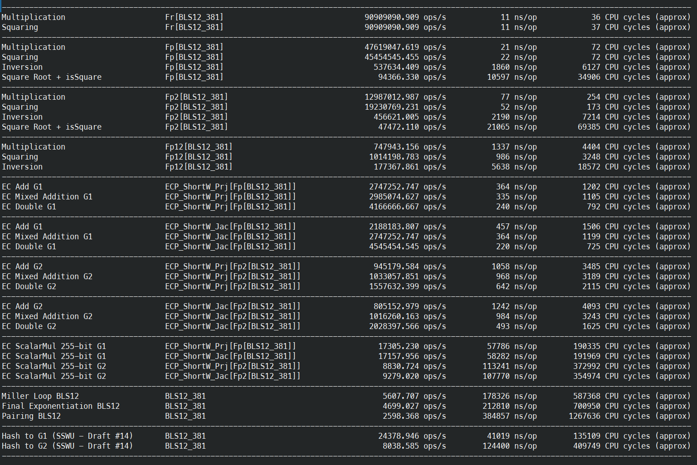

# Benchmarking

> CC=clang nimble bench_summary_bls12_381

|                                      |                                          |                                 |                        |                                |
| ------------------------------------ | ---------------------------------------- | ------------------------------- | ---------------------- | ------------------------------ |
| Multiplication                       | Fr[BLS12_381]                            | 90909090.909 ops/s              | 11 ns/op               | 37 CPU cycles (approx)         |
| Squaring                             | Fr[BLS12_381]                            | 100000000.000 ops/s             | 10 ns/op               | 35 CPU cycles (approx)         |
| ------------------------------------ | ---------------------------------------- | ------------------------------- | ---------------------- | ------------------------------ |
| Multiplication                       | Fp[BLS12_381]                            | 47619047.619 ops/s              | 21 ns/op               | 72 CPU cycles (approx)         |
| Squaring                             | Fp[BLS12_381]                            | 47619047.619 ops/s              | 21 ns/op               | 72 CPU cycles (approx)         |
| Inversion                            | Fp[BLS12_381]                            | 524658.972 ops/s                | 1906 ns/op             | 6281 CPU cycles (approx)       |
| Square Root + isSquare               | Fp[BLS12_381]                            | 94482.237 ops/s                 | 10584 ns/op            | 34872 CPU cycles (approx)      |
| -----------------------------------  | --------------------------------------   | -----------------------------   | --------------------   | -----------------------------  |
| Multiplication                       | Fp2[BLS12_381]                           | 13157894.737 ops/s              | 76 ns/op               | 252 CPU cycles (approx)        |
| Squaring                             | Fp2[BLS12_381]                           | 19230769.231 ops/s              | 52 ns/op               | 171 CPU cycles (approx)        |
| Inversion                            | Fp2[BLS12_381]                           | 465549.348 ops/s                | 2148 ns/op             | 7080 CPU cycles (approx)       |
| Square Root + isSquare               | Fp2[BLS12_381]                           | 47762.335 ops/s                 | 20937 ns/op            | 68983 CPU cycles (approx)      |
| -----------------------------------  | --------------------------------------   | -----------------------------   | --------------------   | -----------------------------  |
| Multiplication                       | Fp12[BLS12_381]                          | 746825.990 ops/s                | 1339 ns/op             | 4412 CPU cycles (approx)       |
| Squaring                             | Fp12[BLS12_381]                          | 1017293.998 ops/s               | 983 ns/op              | 3239 CPU cycles (approx)       |
| Inversion                            | Fp12[BLS12_381]                          | 180635.838 ops/s                | 5536 ns/op             | 18240 CPU cycles (approx)      |
| -----------------------------------  | --------------------------------------   | -----------------------------   | --------------------   | -----------------------------  |
| EC Add G1                            | ECP_ShortW_Prj[Fp[BLS12_381]]            | 2724795.640 ops/s               | 367 ns/op              | 1209 CPU cycles (approx)       |
| EC Add vartime G1                    | ECP_ShortW_Prj[Fp[BLS12_381]]            | 5000000.000 ops/s               | 200 ns/op              | 659 CPU cycles (approx)        |
| EC Mixed Addition G1                 | ECP_ShortW_Prj[Fp[BLS12_381]]            | 2985074.627 ops/s               | 335 ns/op              | 1104 CPU cycles (approx)       |
| EC Mixed Addition vartime G1         | ECP_ShortW_Prj[Fp[BLS12_381]]            | 5102040.816 ops/s               | 196 ns/op              | 647 CPU cycles (approx)        |
| EC Double G1                         | ECP_ShortW_Prj[Fp[BLS12_381]]            | 4149377.593 ops/s               | 241 ns/op              | 795 CPU cycles (approx)        |
| -----------------------------------  | --------------------------------------   | -----------------------------   | --------------------   | -----------------------------  |
| EC Add G1                            | ECP_ShortW_Jac[Fp[BLS12_381]]            | 2183406.114 ops/s               | 458 ns/op              | 1511 CPU cycles (approx)       |
| EC Add vartime G1                    | ECP_ShortW_Jac[Fp[BLS12_381]]            | 5747126.437 ops/s               | 174 ns/op              | 575 CPU cycles (approx)        |
| EC Mixed Addition G1                 | ECP_ShortW_Jac[Fp[BLS12_381]]            | 2739726.027 ops/s               | 365 ns/op              | 1203 CPU cycles (approx)       |
| EC Mixed Addition vartime G1         | ECP_ShortW_Jac[Fp[BLS12_381]]            | 5747126.437 ops/s               | 174 ns/op              | 575 CPU cycles (approx)        |
| EC Double G1                         | ECP_ShortW_Jac[Fp[BLS12_381]]            | 4524886.878 ops/s               | 221 ns/op              | 730 CPU cycles (approx)        |
| -----------------------------------  | --------------------------------------   | -----------------------------   | --------------------   | -----------------------------  |
| EC Add G2                            | ECP_ShortW_Prj[Fp2[BLS12_381]]           | 951474.786 ops/s                | 1051 ns/op             | 3463 CPU cycles (approx)       |
| EC Add vartime G2                    | ECP_ShortW_Prj[Fp2[BLS12_381]]           | 1862197.393 ops/s               | 537 ns/op              | 1771 CPU cycles (approx)       |
| EC Mixed Addition G2                 | ECP_ShortW_Prj[Fp2[BLS12_381]]           | 1038421.599 ops/s               | 963 ns/op              | 3175 CPU cycles (approx)       |
| EC Mixed Addition vartime G2         | ECP_ShortW_Prj[Fp2[BLS12_381]]           | 1897533.207 ops/s               | 527 ns/op              | 1736 CPU cycles (approx)       |
| EC Double G2                         | ECP_ShortW_Prj[Fp2[BLS12_381]]           | 1567398.119 ops/s               | 638 ns/op              | 2102 CPU cycles (approx)       |
| -----------------------------------  | --------------------------------------   | -----------------------------   | --------------------   | -----------------------------  |
| EC Add G2                            | ECP_ShortW_Jac[Fp2[BLS12_381]]           | 800640.512 ops/s                | 1249 ns/op             | 4117 CPU cycles (approx)       |
| EC Add vartime G2                    | ECP_ShortW_Jac[Fp2[BLS12_381]]           | 2202643.172 ops/s               | 454 ns/op              | 1497 CPU cycles (approx)       |
| EC Mixed Addition G2                 | ECP_ShortW_Jac[Fp2[BLS12_381]]           | 1034126.163 ops/s               | 967 ns/op              | 3186 CPU cycles (approx)       |
| EC Mixed Addition vartime G2         | ECP_ShortW_Jac[Fp2[BLS12_381]]           | 2188183.807 ops/s               | 457 ns/op              | 1508 CPU cycles (approx)       |
| EC Double G2                         | ECP_ShortW_Jac[Fp2[BLS12_381]]           | 2032520.325 ops/s               | 492 ns/op              | 1621 CPU cycles (approx)       |
| -----------------------------------  | --------------------------------------   | -----------------------------   | --------------------   | -----------------------------  |
| EC ScalarMul 255-bit G1              | ECP_ShortW_Prj[Fp[BLS12_381]]            | 17217.631 ops/s                 | 58080 ns/op            | 191355 CPU cycles (approx)     |
| EC ScalarMul vartime 255-bit G1      | ECP_ShortW_Prj[Fp[BLS12_381]]            | 21199.466 ops/s                 | 47171 ns/op            | 155412 CPU cycles (approx)     |
| EC ScalarMul 255-bit G1              | ECP_ShortW_Jac[Fp[BLS12_381]]            | 17144.425 ops/s                 | 58328 ns/op            | 192173 CPU cycles (approx)     |
| EC ScalarMul vartime 255-bit G1      | ECP_ShortW_Jac[Fp[BLS12_381]]            | 21395.866 ops/s                 | 46738 ns/op            | 153985 CPU cycles (approx)     |
| -----------------------------------  | --------------------------------------   | -----------------------------   | --------------------   | -----------------------------  |
| EC ScalarMul 255-bit G2              | ECP_ShortW_Prj[Fp2[BLS12_381]]           | 8795.616 ops/s                  | 113693 ns/op           | 374578 CPU cycles (approx)     |
| EC ScalarMul vartime 255-bit G2      | ECP_ShortW_Prj[Fp2[BLS12_381]]           | 10192.225 ops/s                 | 98114 ns/op            | 323250 CPU cycles (approx)     |
| EC ScalarMul 255-bit G2              | ECP_ShortW_Jac[Fp2[BLS12_381]]           | 9268.012 ops/s                  | 107898 ns/op           | 355482 CPU cycles (approx)     |
| EC ScalarMul vartime 255-bit G2      | ECP_ShortW_Jac[Fp2[BLS12_381]]           | 10907.028 ops/s                 | 91684 ns/op            | 302065 CPU cycles (approx)     |
| -----------------------------------  | --------------------------------------   | -----------------------------   | --------------------   | -----------------------------  |
| Miller Loop BLS12                    | BLS12_381                                | 5621.199 ops/s                  | 177898 ns/op           | 586105 CPU cycles (approx)     |
| Final Exponentiation BLS12           | BLS12_381                                | 4708.785 ops/s                  | 212369 ns/op           | 699666 CPU cycles (approx)     |
| Pairing BLS12                        | BLS12_381                                | 2600.151 ops/s                  | 384593 ns/op           | 1267066 CPU cycles (approx)    |
| -----------------------------------  | --------------------------------------   | -----------------------------   | --------------------   | -----------------------------  |
| Hash to G1 (SSWU - Draft #14)        | BLS12_381                                | 24397.385 ops/s                 | 40988 ns/op            | 135039 CPU cycles (approx)     |
| Hash to G2 (SSWU - Draft #14)        | BLS12_381                                | 8033.806 ops/s                  | 124474 ns/op           | 410085 CPU cycles (approx)     |

# Metering

Note: Metering does not use hardware perf counters and only run compute once, hence it is useful for relative time measurements and breakdown of function dependencies. Use benchmarks for more accurate timings

> nim c --cc:clang -r --hints:off --warnings:off --verbosity:0 -d:danger -d:CTT_METER --outdir:build metering/m_eip2537.nim

bench xoshiro512** seed: 1711986237

## G1 add jacobian - constant-time

CPU: AMD Ryzen 7 PRO 7840U w/ Radeon 780M Graphics
The CPU Cycle Count is indicative only. It cannot be used to compare across systems, works at your CPU nominal frequency and is sensitive to overclocking, throttling and frequency scaling (powersaving and Turbo Boost).

| Procedures                                                   | # of Calls | Throughput (ops/s) | Time (10⁻⁶s) | Avg Time (10⁻⁶s) | CPU 10³cycles | Avg 10³cycles |
|--------------------------------------------------------------|------------|--------------------|--------------|------------------|---------------|---------------|
| ccopy*(a: var FF; b: FF; ctl: SecretBool)                    | 16         | 23494860.499       | 0.681        | 0.043            | 0.627         | 0.039         |
| `+=`*(a: var FF; b: FF)                                      | 1          | 20000000.000       | 0.050        | 0.050            | 0.033         | 0.033         |
| `-=`*(a: var FF; b: FF)                                      | 4          | 20000000.000       | 0.200        | 0.050            | 0.132         | 0.033         |
| diff*(r: var FF; a, b: FF)                                   | 2          | 25000000.000       | 0.080        | 0.040            | 0.099         | 0.050         |
| double*(r: var FF; a: FF)                                    | 1          | 24390243.902       | 0.041        | 0.041            | 0.033         | 0.033         |
| prod*(r: var FF; a, b: FF; skipFinalReduction: static bool = f ... | 12         | 16597510.373       | 0.723        | 0.060            | 1.155         | 0.096         |
| square*(r: var FF; a: FF; skipFinalReduction: static bool = false) | 4          | 16666666.667       | 0.240        | 0.060            | 0.363         | 0.091         |
| csub*(a: var FF; b: FF; ctl: SecretBool)                     | 1          | 5555555.556        | 0.180        | 0.180            | 0.495         | 0.495         |
| div2*(a: var FF)                                             | 1          | 25000000.000       | 0.040        | 0.040            | 0.066         | 0.066         |
| `*=`*(a: var FF; b: FF)                                      | 4          | 7797270.955        | 0.513        | 0.128            | 1.287         | 0.322         |
| sum*(r: var ECP_ShortW_Jac[F, G]; P, Q: ECP_ShortW_Jac[F ... | 1          | 291800.409         | 3.427        | 3.427            | 11.187        | 11.187        |

## G1 add projective - constant-time

CPU: AMD Ryzen 7 PRO 7840U w/ Radeon 780M Graphics
The CPU Cycle Count is indicative only. It cannot be used to compare across systems, works at your CPU nominal frequency and is sensitive to overclocking, throttling and frequency scaling (powersaving and Turbo Boost).

| Procedures                                                   | # of Calls | Throughput (ops/s) | Time (10⁻⁶s) | Avg Time (10⁻⁶s) | CPU 10³cycles | Avg 10³cycles |
|--------------------------------------------------------------|------------|--------------------|--------------|------------------|---------------|---------------|
| `+=`*(a: var FF; b: FF)                                      | 3          | 23076923.077       | 0.130        | 0.043            | 0.132         | 0.044         |
| `-=`*(a: var FF; b: FF)                                      | 3          | 21428571.429       | 0.140        | 0.047            | 0.132         | 0.044         |
| double*(a: var FF)                                           | 2          | 25000000.000       | 0.080        | 0.040            | 0.132         | 0.066         |
| sum*(r: var FF; a, b: FF)                                    | 12         | 23483365.949       | 0.511        | 0.043            | 0.528         | 0.044         |
| diff*(r: var FF; a, b: FF)                                   | 2          | 22222222.222       | 0.090        | 0.045            | 0.099         | 0.050         |
| double*(r: var FF; a: FF)                                    | 5          | 25000000.000       | 0.200        | 0.040            | 0.198         | 0.040         |
| prod*(r: var FF; a, b: FF; skipFinalReduction: static bool = f ... | 12         | 16853932.584       | 0.712        | 0.059            | 1.188         | 0.099         |
| `*=`*(a: var FF; b: FF)                                      | 7          | 7856341.190        | 0.891        | 0.127            | 2.277         | 0.325         |
| sum*(r: var ECP_ShortW_Prj[F, G]; P, Q: ECP_ShortW_Prj[F ... | 1          | 296208.531         | 3.376        | 3.376            | 11.022        | 11.022        |

## G1 mul jacobian - constant-time

CPU: AMD Ryzen 7 PRO 7840U w/ Radeon 780M Graphics
The CPU Cycle Count is indicative only. It cannot be used to compare across systems, works at your CPU nominal frequency and is sensitive to overclocking, throttling and frequency scaling (powersaving and Turbo Boost).

| Procedures                                                   | # of Calls | Throughput (ops/s) | Time (10⁻⁶s) | Avg Time (10⁻⁶s) | CPU 10³cycles | Avg 10³cycles |
|--------------------------------------------------------------|------------|--------------------|--------------|------------------|---------------|---------------|
| ccopy*(a: var FF; b: FF; ctl: SecretBool)                    | 2197       | 23784521.116       | 92.371       | 0.042            | 91.179        | 0.042         |
| neg*(r: var FF; a: FF)                                       | 68         | 23472557.818       | 2.897        | 0.043            | 2.838         | 0.042         |
| `+=`*(a: var FF; b: FF)                                      | 330        | 23397617.697       | 14.104       | 0.043            | 14.421        | 0.044         |
| `-=`*(a: var FF; b: FF)                                      | 933        | 23328499.275       | 39.994       | 0.043            | 40.986        | 0.044         |
| double*(a: var FF)                                           | 645        | 23402634.157       | 27.561       | 0.043            | 28.512        | 0.044         |
| diff*(r: var FF; a, b: FF)                                   | 273        | 23522316.043       | 11.606       | 0.043            | 11.913        | 0.044         |
| double*(r: var FF; a: FF)                                    | 201        | 23547328.960       | 8.536        | 0.042            | 8.745         | 0.044         |
| prod*(r: var FF; a, b: FF; skipFinalReduction: static bool = f ... | 976        | 16877345.277       | 57.829       | 0.059            | 96.096        | 0.098         |
| square*(r: var FF; a: FF; skipFinalReduction: static bool = false) | 877        | 16773453.189       | 52.285       | 0.060            | 86.790        | 0.099         |
| cneg*(r: var FF; a: FF; ctl: SecretBool)                     | 66         | 5299927.728        | 12.453       | 0.189            | 34.386        | 0.521         |
| cneg*(a: var FF; ctl: SecretBool)                            | 66         | 3931145.393        | 16.789       | 0.254            | 48.906        | 0.741         |
| csub*(a: var FF; b: FF; ctl: SecretBool)                     | 72         | 5666168.254        | 12.707       | 0.176            | 35.046        | 0.487         |
| div2*(a: var FF)                                             | 72         | 22893481.717       | 3.145        | 0.044            | 3.201         | 0.044         |
| `*=`*(a: var FF; b: FF)                                      | 354        | 7933839.844        | 44.619       | 0.126            | 113.256       | 0.320         |
| square*(a: var FF; skipFinalReduction: static bool = false)        | 129        | 7914110.429        | 16.300       | 0.126            | 41.481        | 0.322         |
| sum*(r: var ECP_ShortW_Jac[F, G]; P, Q: ECP_ShortW_Jac[F ... | 8          | 291194.991         | 27.473       | 3.434            | 89.826        | 11.228        |
| mixedSum*(r: var ECP_ShortW_Jac[F, G]; P: ECP_ShortW_Jac[F,  ... | 64         | 337156.193         | 189.823      | 2.966            | 619.014       | 9.672         |
| double*(r: var ECP_ShortW_Jac[F, G]; P: ECP_ShortW_Jac[F ... | 129        | 578076.127         | 223.154      | 1.730            | 722.271       | 5.599         |
| batchAffine*(affs: ptr UncheckedArray[ECP_ShortW_Aff[F,  ... | 1          | 112397.437         | 8.897        | 8.897            | 29.205        | 29.205        |
| scalarMulGLV_m2w2*(P0: var EC; scalar: BigInt[scalBits])     | 1          | 1831.267           | 546.070      | 546.070          | 1798.533      | 1798.533      |
| scalarMul*(P: var EC; scalar: BigInt)                        | 1          | 1821.344           | 549.045      | 549.045          | 1808.301      | 1808.301      |

## G1 mul projective - constant-time

CPU: AMD Ryzen 7 PRO 7840U w/ Radeon 780M Graphics
The CPU Cycle Count is indicative only. It cannot be used to compare across systems, works at your CPU nominal frequency and is sensitive to overclocking, throttling and frequency scaling (powersaving and Turbo Boost).

| Procedures                                                   | # of Calls | Throughput (ops/s) | Time (10⁻⁶s) | Avg Time (10⁻⁶s) | CPU 10³cycles | Avg 10³cycles |
|--------------------------------------------------------------|------------|--------------------|--------------|------------------|---------------|---------------|
| ccopy*(a: var FF; b: FF; ctl: SecretBool)                    | 1301       | 23726155.305       | 54.834       | 0.042            | 54.153        | 0.042         |
| neg*(r: var FF; a: FF)                                       | 68         | 23562023.562       | 2.886        | 0.042            | 2.871         | 0.042         |
| `+=`*(a: var FF; b: FF)                                      | 730        | 23350286.281       | 31.263       | 0.043            | 32.373        | 0.044         |
| `-=`*(a: var FF; b: FF)                                      | 281        | 23319502.075       | 12.050       | 0.043            | 12.045        | 0.043         |
| double*(a: var FF)                                           | 531        | 23347843.292       | 22.743       | 0.043            | 23.628        | 0.044         |
| sum*(r: var FF; a, b: FF)                                    | 610        | 23521246.240       | 25.934       | 0.043            | 26.466        | 0.043         |
| diff*(r: var FF; a, b: FF)                                   | 80         | 23289665.211       | 3.435        | 0.043            | 3.300         | 0.041         |
| double*(r: var FF; a: FF)                                    | 1005       | 23298945.172       | 43.135       | 0.043            | 44.187        | 0.044         |
| prod*(r: var FF; a, b: FF; skipFinalReduction: static bool = f ... | 1612       | 16807774.117       | 95.908       | 0.059            | 160.479       | 0.100         |
| square*(r: var FF; a: FF; skipFinalReduction: static bool = false) | 258        | 16701191.093       | 15.448       | 0.060            | 25.674        | 0.100         |
| cneg*(r: var FF; a: FF; ctl: SecretBool)                     | 66         | 5659406.620        | 11.662       | 0.177            | 31.977        | 0.484         |
| cneg*(a: var FF; ctl: SecretBool)                            | 66         | 4113943.776        | 16.043       | 0.243            | 46.365        | 0.703         |
| `*=`*(a: var FF; b: FF)                                      | 506        | 7906867.724        | 63.995       | 0.126            | 161.898       | 0.320         |
| sum*(r: var ECP_ShortW_Prj[F, G]; P, Q: ECP_ShortW_Prj[F ... | 8          | 296066.023         | 27.021       | 3.378            | 88.209        | 11.026        |
| mixedSum*(r: var ECP_ShortW_Prj[F, G]; P: ECP_ShortW_Prj[F,  ... | 64         | 338126.988         | 189.278      | 2.957            | 617.199       | 9.644         |
| double*(r: var ECP_ShortW_Prj[F, G]; P: ECP_ShortW_Prj[F ... | 129        | 595210.631         | 216.730      | 1.680            | 701.382       | 5.437         |
| batchAffine*(affs: ptr UncheckedArray[ECP_ShortW_Aff[F,  ... | 1          | 193798.450         | 5.160        | 5.160            | 16.896        | 16.896        |
| scalarMulGLV_m2w2*(P0: var EC; scalar: BigInt[scalBits])     | 1          | 1878.347           | 532.383      | 532.383          | 1753.389      | 1753.389      |
| scalarMul*(P: var EC; scalar: BigInt)                        | 1          | 1878.135           | 532.443      | 532.443          | 1753.620      | 1753.620      |

## G1 mul jacobian - variable-time

CPU: AMD Ryzen 7 PRO 7840U w/ Radeon 780M Graphics
The CPU Cycle Count is indicative only. It cannot be used to compare across systems, works at your CPU nominal frequency and is sensitive to overclocking, throttling and frequency scaling (powersaving and Turbo Boost).

| Procedures                                                   | # of Calls | Throughput (ops/s) | Time (10⁻⁶s) | Avg Time (10⁻⁶s) | CPU 10³cycles | Avg 10³cycles |
|--------------------------------------------------------------|------------|--------------------|--------------|------------------|---------------|---------------|
| neg*(r: var FF; a: FF)                                       | 20         | 21436227.224       | 0.933        | 0.047            | 1.056         | 0.053         |
| neg*(a: var FF)                                              | 1          | 5263157.895        | 0.190        | 0.190            | 0.495         | 0.495         |
| `+=`*(a: var FF; b: FF)                                      | 258        | 23316764.573       | 11.065       | 0.043            | 11.286        | 0.044         |
| `-=`*(a: var FF; b: FF)                                      | 920        | 23362112.748       | 39.380       | 0.043            | 40.491        | 0.044         |
| double*(a: var FF)                                           | 645        | 23330680.749       | 27.646       | 0.043            | 27.918        | 0.043         |
| diff*(r: var FF; a, b: FF)                                   | 239        | 23376369.327       | 10.224       | 0.043            | 10.494        | 0.044         |
| double*(r: var FF; a: FF)                                    | 129        | 23314657.509       | 5.533        | 0.043            | 5.577         | 0.043         |
| prod*(r: var FF; a, b: FF; skipFinalReduction: static bool = f ... | 768        | 16917044.804       | 45.398       | 0.059            | 75.669        | 0.099         |
| square*(r: var FF; a: FF; skipFinalReduction: static bool = false) | 824        | 16851060.349       | 48.899       | 0.059            | 81.246        | 0.099         |
| `*=`*(a: var FF; b: FF)                                      | 417        | 7897129.005        | 52.804       | 0.127            | 132.957       | 0.319         |
| square*(a: var FF; skipFinalReduction: static bool = false)        | 129        | 7915567.282        | 16.297       | 0.126            | 41.283        | 0.320         |
| double*(r: var ECP_ShortW_Jac[F, G]; P: ECP_ShortW_Jac[F ... | 129        | 577954.400         | 223.201      | 1.730            | 722.403       | 5.600         |
| sum_vartime*(r: var ECP_ShortW_Jac[F, G]; p, q: ECP_Shor ... | 6          | 418205.897         | 14.347       | 2.391            | 46.728        | 7.788         |
| mixedSum_vartime*(r: var ECP_ShortW_Jac[F, G]; p: ECP_ShortW ... | 49         | 558188.280         | 87.784       | 1.792            | 284.097       | 5.798         |
| batchAffine*(affs: ptr UncheckedArray[ECP_ShortW_Aff[F,  ... | 1          | 154750.851         | 6.462        | 6.462            | 21.186        | 21.186        |
| scalarMulEndo_wNAF_vartime*(P: var  ... | 1          | 2937.910           | 340.378      | 340.378          | 1121.010      | 1121.010      |
| scalarMul_vartime*(P: var EC; scalar: BigInt[scalBits])      | 1          | 2937.220           | 340.458      | 340.458          | 1121.274      | 1121.274      |

## G1 mul projective - variable-time

CPU: AMD Ryzen 7 PRO 7840U w/ Radeon 780M Graphics
The CPU Cycle Count is indicative only. It cannot be used to compare across systems, works at your CPU nominal frequency and is sensitive to overclocking, throttling and frequency scaling (powersaving and Turbo Boost).

| Procedures                                                   | # of Calls | Throughput (ops/s) | Time (10⁻⁶s) | Avg Time (10⁻⁶s) | CPU 10³cycles | Avg 10³cycles |
|--------------------------------------------------------------|------------|--------------------|--------------|------------------|---------------|---------------|
| neg*(r: var FF; a: FF)                                       | 20         | 23809523.810       | 0.840        | 0.042            | 0.825         | 0.041         |
| neg*(a: var FF)                                              | 1          | 9090909.091        | 0.110        | 0.110            | 0.264         | 0.264         |
| `+=`*(a: var FF; b: FF)                                      | 256        | 23540229.885       | 10.875       | 0.042            | 11.055        | 0.043         |
| `-=`*(a: var FF; b: FF)                                      | 446        | 23213449.227       | 19.213       | 0.043            | 19.041        | 0.043         |
| double*(a: var FF)                                           | 384        | 23208026.109       | 16.546       | 0.043            | 17.061        | 0.044         |
| sum*(r: var FF; a, b: FF)                                    | 256        | 23374726.077       | 10.952       | 0.043            | 10.989        | 0.043         |
| diff*(r: var FF; a, b: FF)                                   | 53         | 23378914.865       | 2.267        | 0.043            | 2.145         | 0.040         |
| double*(r: var FF; a: FF)                                    | 640        | 23390103.063       | 27.362       | 0.043            | 28.116        | 0.044         |
| prod*(r: var FF; a, b: FF; skipFinalReduction: static bool = f ... | 1301       | 16744317.743       | 77.698       | 0.060            | 129.690       | 0.100         |
| square*(r: var FF; a: FF; skipFinalReduction: static bool = false) | 362        | 16813748.258       | 21.530       | 0.059            | 35.838        | 0.099         |
| `*=`*(a: var FF; b: FF)                                      | 347        | 7342361.405        | 47.260       | 0.136            | 121.506       | 0.350         |
| double*(r: var ECP_ShortW_Prj[F, G]; P: ECP_ShortW_Prj[F ... | 128        | 594950.359         | 215.144      | 1.681            | 696.036       | 5.438         |
| sum_vartime*(r: var ECP_ShortW_Prj[F, G]; p, q: ECP_Shor ... | 6          | 472255.018         | 12.705       | 2.118            | 41.217        | 6.869         |
| mixedSum_vartime*(r: var ECP_ShortW_Prj[F, G]; p: ECP_ShortW ... | 47         | 553990.500         | 84.839       | 1.805            | 274.428       | 5.839         |
| batchAffine*(affs: ptr UncheckedArray[ECP_ShortW_Aff[F,  ... | 1          | 196078.431         | 5.100        | 5.100            | 16.698        | 16.698        |
| scalarMulEndo_wNAF_vartime*(P: var  ... | 1          | 3072.385           | 325.480      | 325.480          | 1071.939      | 1071.939      |
| scalarMul_vartime*(P: var EC; scalar: BigInt[scalBits])      | 1          | 3071.630           | 325.560      | 325.560          | 1072.203      | 1072.203      |

## G2 add jacobian - constant-time

CPU: AMD Ryzen 7 PRO 7840U w/ Radeon 780M Graphics
The CPU Cycle Count is indicative only. It cannot be used to compare across systems, works at your CPU nominal frequency and is sensitive to overclocking, throttling and frequency scaling (powersaving and Turbo Boost).

| Procedures                                                   | # of Calls | Throughput (ops/s) | Time (10⁻⁶s) | Avg Time (10⁻⁶s) | CPU 10³cycles | Avg 10³cycles |
|--------------------------------------------------------------|------------|--------------------|--------------|------------------|---------------|---------------|
| ccopy*(a: var FF; b: FF; ctl: SecretBool)                    | 32         | 23845007.452       | 1.342        | 0.042            | 1.320         | 0.041         |
| `+=`*(a: var FF; b: FF)                                      | 2          | 25000000.000       | 0.080        | 0.040            | 0.066         | 0.033         |
| `-=`*(a: var FF; b: FF)                                      | 8          | 22857142.857       | 0.350        | 0.044            | 0.330         | 0.041         |
| sum*(r: var FF; a, b: FF)                                    | 4          | 23529411.765       | 0.170        | 0.043            | 0.165         | 0.041         |
| sumUnr*(r: var FF; a, b: FF)                                 | 24         | 23483365.949       | 1.022        | 0.043            | 0.990         | 0.041         |
| diff*(r: var FF; a, b: FF)                                   | 8          | 22857142.857       | 0.350        | 0.044            | 0.363         | 0.045         |
| double*(r: var FF; a: FF)                                    | 6          | 22988505.747       | 0.261        | 0.044            | 0.231         | 0.038         |
| csub*(a: var FF; b: FF; ctl: SecretBool)                     | 2          | 5540166.205        | 0.361        | 0.180            | 0.957         | 0.479         |
| div2*(a: var FF)                                             | 2          | 19801980.198       | 0.101        | 0.051            | 0.066         | 0.033         |
| sum*(r: var ECP_ShortW_Jac[F, G]; P, Q: ECP_ShortW_Jac[F ... | 1          | 142979.697         | 6.994        | 6.994            | 22.968        | 22.968        |

## G2 add projective - constant-time

CPU: AMD Ryzen 7 PRO 7840U w/ Radeon 780M Graphics
The CPU Cycle Count is indicative only. It cannot be used to compare across systems, works at your CPU nominal frequency and is sensitive to overclocking, throttling and frequency scaling (powersaving and Turbo Boost).

| Procedures                                                   | # of Calls | Throughput (ops/s) | Time (10⁻⁶s) | Avg Time (10⁻⁶s) | CPU 10³cycles | Avg 10³cycles |
|--------------------------------------------------------------|------------|--------------------|--------------|------------------|---------------|---------------|
| `+=`*(a: var FF; b: FF)                                      | 6          | 24000000.000       | 0.250        | 0.042            | 0.264         | 0.044         |
| `-=`*(a: var FF; b: FF)                                      | 6          | 22900763.359       | 0.262        | 0.044            | 0.231         | 0.038         |
| double*(a: var FF)                                           | 4          | 23529411.765       | 0.170        | 0.043            | 0.198         | 0.050         |
| sum*(r: var FF; a, b: FF)                                    | 26         | 23402340.234       | 1.111        | 0.043            | 1.089         | 0.042         |
| sumUnr*(r: var FF; a, b: FF)                                 | 24         | 23904382.470       | 1.004        | 0.042            | 0.891         | 0.037         |
| diff*(r: var FF; a, b: FF)                                   | 6          | 22222222.222       | 0.270        | 0.045            | 0.264         | 0.044         |
| double*(r: var FF; a: FF)                                    | 10         | 23201856.148       | 0.431        | 0.043            | 0.396         | 0.040         |
| sum*(r: var ECP_ShortW_Prj[F, G]; P, Q: ECP_ShortW_Prj[F ... | 1          | 155472.637         | 6.432        | 6.432            | 21.120        | 21.120        |

## G2 mul jacobian - constant-time

CPU: AMD Ryzen 7 PRO 7840U w/ Radeon 780M Graphics
The CPU Cycle Count is indicative only. It cannot be used to compare across systems, works at your CPU nominal frequency and is sensitive to overclocking, throttling and frequency scaling (powersaving and Turbo Boost).

| Procedures                                                   | # of Calls | Throughput (ops/s) | Time (10⁻⁶s) | Avg Time (10⁻⁶s) | CPU 10³cycles | Avg 10³cycles |
|--------------------------------------------------------------|------------|--------------------|--------------|------------------|---------------|---------------|
| ccopy*(a: var FF; b: FF; ctl: SecretBool)                    | 4398       | 23778885.561       | 184.954      | 0.042            | 182.589       | 0.042         |
| neg*(r: var FF; a: FF)                                       | 149        | 23501577.287       | 6.340        | 0.043            | 6.336         | 0.043         |
| neg*(a: var FF)                                              | 2          | 9049773.756        | 0.221        | 0.111            | 0.528         | 0.264         |
| `+=`*(a: var FF; b: FF)                                      | 401        | 23343811.852       | 17.178       | 0.043            | 17.919        | 0.045         |
| `-=`*(a: var FF; b: FF)                                      | 1216       | 23420647.149       | 51.920       | 0.043            | 53.328        | 0.044         |
| double*(a: var FF)                                           | 640        | 23204379.827       | 27.581       | 0.043            | 27.753        | 0.043         |
| sum*(r: var FF; a, b: FF)                                    | 552        | 23279352.227       | 23.712       | 0.043            | 23.760        | 0.043         |
| sumUnr*(r: var FF; a, b: FF)                                 | 1694       | 23918108.013       | 70.825       | 0.042            | 69.465        | 0.041         |
| diff*(r: var FF; a, b: FF)                                   | 968        | 23438824.185       | 41.299       | 0.043            | 42.207        | 0.044         |
| double*(r: var FF; a: FF)                                    | 824        | 23427060.529       | 35.173       | 0.043            | 36.366        | 0.044         |
| prod*(r: var FF; a, b: FF; skipFinalReduction: static bool = f ... | 6          | 16620498.615       | 0.361        | 0.060            | 0.594         | 0.099         |
| square*(r: var FF; a: FF; skipFinalReduction: static bool = false) | 2          | 15384615.385       | 0.130        | 0.065            | 0.231         | 0.116         |
| cneg*(r: var FF; a: FF; ctl: SecretBool)                     | 136        | 5648544.254        | 24.077       | 0.177            | 66.000        | 0.485         |
| cneg*(a: var FF; ctl: SecretBool)                            | 136        | 4105288.578        | 33.128       | 0.244            | 95.700        | 0.704         |
| csub*(a: var FF; b: FF; ctl: SecretBool)                     | 144        | 5656153.030        | 25.459       | 0.177            | 70.059        | 0.487         |
| div2*(a: var FF)                                             | 144        | 23410827.508       | 6.151        | 0.043            | 6.897         | 0.048         |
| sum*(r: var ECP_ShortW_Jac[F, G]; P, Q: ECP_ShortW_Jac[F ... | 8          | 143143.430         | 55.888       | 6.986            | 183.348       | 22.919        |
| mixedSum*(r: var ECP_ShortW_Jac[F, G]; P: ECP_ShortW_Jac[F,  ... | 64         | 166594.649         | 384.166      | 6.003            | 1259.247      | 19.676        |
| double*(r: var ECP_ShortW_Jac[F, G]; P: ECP_ShortW_Jac[F ... | 64         | 278754.143         | 229.593      | 3.587            | 750.123       | 11.721        |
| batchAffine*(affs: ptr UncheckedArray[ECP_ShortW_Aff[F,  ... | 1          | 70536.785          | 14.177       | 14.177           | 46.596        | 46.596        |
| scalarMulEndo*(P: var EC; scalar: BigInt[scalBits])          | 1          | 1152.096           | 867.983      | 867.983          | 2858.790      | 2858.790      |
| scalarMul*(P: var EC; scalar: BigInt)                        | 1          | 1151.259           | 868.614      | 868.614          | 2860.869      | 2860.869      |

## G2 mul projective - constant-time

CPU: AMD Ryzen 7 PRO 7840U w/ Radeon 780M Graphics
The CPU Cycle Count is indicative only. It cannot be used to compare across systems, works at your CPU nominal frequency and is sensitive to overclocking, throttling and frequency scaling (powersaving and Turbo Boost).

| Procedures                                                   | # of Calls | Throughput (ops/s) | Time (10⁻⁶s) | Avg Time (10⁻⁶s) | CPU 10³cycles | Avg 10³cycles |
|--------------------------------------------------------------|------------|--------------------|--------------|------------------|---------------|---------------|
| ccopy*(a: var FF; b: FF; ctl: SecretBool)                    | 2606       | 23709014.156       | 109.916      | 0.042            | 108.999       | 0.042         |
| neg*(r: var FF; a: FF)                                       | 149        | 23722337.207       | 6.281        | 0.042            | 6.336         | 0.043         |
| neg*(a: var FF)                                              | 2          | 9049773.756        | 0.221        | 0.111            | 0.495         | 0.247         |
| `+=`*(a: var FF; b: FF)                                      | 1201       | 23371215.070       | 51.388       | 0.043            | 52.371        | 0.044         |
| `-=`*(a: var FF; b: FF)                                      | 432        | 23269593.321       | 18.565       | 0.043            | 18.612        | 0.043         |
| double*(a: var FF)                                           | 672        | 23442405.637       | 28.666       | 0.043            | 30.063        | 0.045         |
| sum*(r: var FF; a, b: FF)                                    | 1296       | 23477835.546       | 55.201       | 0.043            | 57.123        | 0.044         |
| sumUnr*(r: var FF; a, b: FF)                                 | 2446       | 23699253.948       | 103.210      | 0.042            | 101.277       | 0.041         |
| diff*(r: var FF; a, b: FF)                                   | 496        | 23511566.174       | 21.096       | 0.043            | 22.044        | 0.044         |
| double*(r: var FF; a: FF)                                    | 1488       | 23267086.767       | 63.953       | 0.043            | 64.779        | 0.044         |
| prod*(r: var FF; a, b: FF; skipFinalReduction: static bool = f ... | 6          | 16666666.667       | 0.360        | 0.060            | 0.627         | 0.104         |
| square*(r: var FF; a: FF; skipFinalReduction: static bool = false) | 2          | 15384615.385       | 0.130        | 0.065            | 0.231         | 0.116         |
| cneg*(r: var FF; a: FF; ctl: SecretBool)                     | 136        | 5655591.134        | 24.047       | 0.177            | 65.835        | 0.484         |
| cneg*(a: var FF; ctl: SecretBool)                            | 136        | 4113359.344        | 33.063       | 0.243            | 95.832        | 0.705         |
| sum*(r: var ECP_ShortW_Prj[F, G]; P, Q: ECP_ShortW_Prj[F ... | 8          | 155315.679         | 51.508       | 6.439            | 168.828       | 21.104        |
| mixedSum*(r: var ECP_ShortW_Prj[F, G]; P: ECP_ShortW_Prj[F,  ... | 64         | 171729.097         | 372.680      | 5.823            | 1221.429      | 19.085        |
| double*(r: var ECP_ShortW_Prj[F, G]; P: ECP_ShortW_Prj[F ... | 64         | 235903.825         | 271.297      | 4.239            | 887.238       | 13.863        |
| batchAffine*(affs: ptr UncheckedArray[ECP_ShortW_Aff[F,  ... | 1          | 98823.994          | 10.119       | 10.119           | 33.231        | 33.231        |
| scalarMulEndo*(P: var EC; scalar: BigInt[scalBits])          | 1          | 1124.767           | 889.073      | 889.073          | 2928.222      | 2928.222      |
| scalarMul*(P: var EC; scalar: BigInt)                        | 1          | 1123.957           | 889.714      | 889.714          | 2930.367      | 2930.367      |

## G2 mul jacobian - variable-time

CPU: AMD Ryzen 7 PRO 7840U w/ Radeon 780M Graphics
The CPU Cycle Count is indicative only. It cannot be used to compare across systems, works at your CPU nominal frequency and is sensitive to overclocking, throttling and frequency scaling (powersaving and Turbo Boost).

| Procedures                                                   | # of Calls | Throughput (ops/s) | Time (10⁻⁶s) | Avg Time (10⁻⁶s) | CPU 10³cycles | Avg 10³cycles |
|--------------------------------------------------------------|------------|--------------------|--------------|------------------|---------------|---------------|
| neg*(r: var FF; a: FF)                                       | 79         | 23469994.058       | 3.366        | 0.043            | 3.432         | 0.043         |
| neg*(a: var FF)                                              | 6          | 9077155.825        | 0.661        | 0.110            | 1.584         | 0.264         |
| `+=`*(a: var FF; b: FF)                                      | 269        | 23042658.900       | 11.674       | 0.043            | 11.517        | 0.043         |
| `-=`*(a: var FF; b: FF)                                      | 1400       | 23306142.833       | 60.070       | 0.043            | 61.050        | 0.044         |
| double*(a: var FF)                                           | 670        | 23467600.701       | 28.550       | 0.043            | 29.799        | 0.044         |
| sum*(r: var FF; a, b: FF)                                    | 566        | 23494250.965       | 24.091       | 0.043            | 25.377        | 0.045         |
| sumUnr*(r: var FF; a, b: FF)                                 | 1562       | 23860077.904       | 65.465       | 0.042            | 64.548        | 0.041         |
| diff*(r: var FF; a, b: FF)                                   | 992        | 23484292.512       | 42.241       | 0.043            | 44.319        | 0.045         |
| double*(r: var FF; a: FF)                                    | 700        | 23352793.995       | 29.975       | 0.043            | 29.997        | 0.043         |
| prod*(r: var FF; a, b: FF; skipFinalReduction: static bool = f ... | 6          | 16620498.615       | 0.361        | 0.060            | 0.594         | 0.099         |
| square*(r: var FF; a: FF; skipFinalReduction: static bool = false) | 2          | 16666666.667       | 0.120        | 0.060            | 0.198         | 0.099         |
| double*(r: var ECP_ShortW_Jac[F, G]; P: ECP_ShortW_Jac[F ... | 67         | 278583.962         | 240.502      | 3.590            | 785.268       | 11.720        |
| sum_vartime*(r: var ECP_ShortW_Jac[F, G]; p, q: ECP_Shor ... | 4          | 220337.116         | 18.154       | 4.538            | 59.367        | 14.842        |
| mixedSum_vartime*(r: var ECP_ShortW_Jac[F, G]; p: ECP_ShortW ... | 69         | 296900.616         | 232.401      | 3.368            | 758.835       | 10.998        |
| batchAffine*(affs: ptr UncheckedArray[ECP_ShortW_Aff[F,  ... | 1          | 73389.109          | 13.626       | 13.626           | 44.748        | 44.748        |
| scalarMulEndo_wNAF_vartime*(P: var  ... | 1          | 1933.436           | 517.214      | 517.214          | 1703.460      | 1703.460      |
| scalarMul_vartime*(P: var EC; scalar: BigInt[scalBits])      | 1          | 1933.137           | 517.294      | 517.294          | 1703.691      | 1703.691      |

## G2 mul projective - variable-time

CPU: AMD Ryzen 7 PRO 7840U w/ Radeon 780M Graphics
The CPU Cycle Count is indicative only. It cannot be used to compare across systems, works at your CPU nominal frequency and is sensitive to overclocking, throttling and frequency scaling (powersaving and Turbo Boost).

| Procedures                                                   | # of Calls | Throughput (ops/s) | Time (10⁻⁶s) | Avg Time (10⁻⁶s) | CPU 10³cycles | Avg 10³cycles |
|--------------------------------------------------------------|------------|--------------------|--------------|------------------|---------------|---------------|
| neg*(r: var FF; a: FF)                                       | 87         | 23224773.091       | 3.746        | 0.043            | 3.696         | 0.042         |
| neg*(a: var FF)                                              | 6          | 9063444.109        | 0.662        | 0.110            | 1.584         | 0.264         |
| `+=`*(a: var FF; b: FF)                                      | 269        | 23470901.318       | 11.461       | 0.043            | 11.946        | 0.044         |
| `-=`*(a: var FF; b: FF)                                      | 926        | 23396836.626       | 39.578       | 0.043            | 41.019        | 0.044         |
| double*(a: var FF)                                           | 402        | 23447069.116       | 17.145       | 0.043            | 17.721        | 0.044         |
| sum*(r: var FF; a, b: FF)                                    | 601        | 23457320.167       | 25.621       | 0.043            | 26.070        | 0.043         |
| sumUnr*(r: var FF; a, b: FF)                                 | 2094       | 23815210.345       | 87.927       | 0.042            | 85.602        | 0.041         |
| diff*(r: var FF; a, b: FF)                                   | 465        | 23317621.101       | 19.942       | 0.043            | 20.262        | 0.044         |
| double*(r: var FF; a: FF)                                    | 936        | 23199900.855       | 40.345       | 0.043            | 40.755        | 0.044         |
| prod*(r: var FF; a, b: FF; skipFinalReduction: static bool = f ... | 6          | 16666666.667       | 0.360        | 0.060            | 0.594         | 0.099         |
| square*(r: var FF; a: FF; skipFinalReduction: static bool = false) | 2          | 16666666.667       | 0.120        | 0.060            | 0.198         | 0.099         |
| double*(r: var ECP_ShortW_Prj[F, G]; P: ECP_ShortW_Prj[F ... | 67         | 242212.156         | 276.617      | 4.129            | 904.695       | 13.503        |
| sum_vartime*(r: var ECP_ShortW_Prj[F, G]; p, q: ECP_Shor ... | 4          | 247662.683         | 16.151       | 4.038            | 52.734        | 13.184        |
| mixedSum_vartime*(r: var ECP_ShortW_Prj[F, G]; p: ECP_ShortW ... | 62         | 300657.081         | 206.215      | 3.326            | 672.903       | 10.853        |
| batchAffine*(affs: ptr UncheckedArray[ECP_ShortW_Aff[F,  ... | 1          | 99611.515          | 10.039       | 10.039           | 32.967        | 32.967        |
| scalarMulEndo_wNAF_vartime*(P: var  ... | 1          | 1918.421           | 521.262      | 521.262          | 1716.825      | 1716.825      |
| scalarMul_vartime*(P: var EC; scalar: BigInt[scalBits])      | 1          | 1918.127           | 521.342      | 521.342          | 1717.056      | 1717.056      |

## Pairing

CPU: AMD Ryzen 7 PRO 7840U w/ Radeon 780M Graphics
The CPU Cycle Count is indicative only. It cannot be used to compare across systems, works at your CPU nominal frequency and is sensitive to overclocking, throttling and frequency scaling (powersaving and Turbo Boost).

| Procedures                                                   | # of Calls | Throughput (ops/s) | Time (10⁻⁶s) | Avg Time (10⁻⁶s) | CPU 10³cycles | Avg 10³cycles |
|--------------------------------------------------------------|------------|--------------------|--------------|------------------|---------------|---------------|
| ccopy*(a: var FF; b: FF; ctl: SecretBool)                    | 150        | 24100257.069       | 6.224        | 0.041            | 6.105         | 0.041         |
| neg*(r: var FF; a: FF)                                       | 215        | 23704520.397       | 9.070        | 0.042            | 9.108         | 0.042         |
| neg*(a: var FF)                                              | 176        | 9236905.637        | 19.054       | 0.108            | 45.936        | 0.261         |
| `+=`*(a: var FF; b: FF)                                      | 3292       | 23301575.617       | 141.278      | 0.043            | 143.781       | 0.044         |
| `-=`*(a: var FF; b: FF)                                      | 740        | 23611244.057       | 31.341       | 0.042            | 32.439        | 0.044         |
| double*(a: var FF)                                           | 2890       | 23416736.890       | 123.416      | 0.043            | 126.687       | 0.044         |
| sum*(r: var FF; a, b: FF)                                    | 5667       | 23487429.438       | 241.278      | 0.043            | 247.170       | 0.044         |
| sumUnr*(r: var FF; a, b: FF)                                 | 11538      | 24022635.994       | 480.297      | 0.042            | 473.352       | 0.041         |
| diff*(r: var FF; a, b: FF)                                   | 5015       | 23495514.067       | 213.445      | 0.043            | 218.988       | 0.044         |
| double*(r: var FF; a: FF)                                    | 3332       | 23423385.424       | 142.251      | 0.043            | 144.870       | 0.043         |
| prod*(r: var FF; a, b: FF; skipFinalReduction: static bool = f ... | 304        | 16876700.161       | 18.013       | 0.059            | 30.063        | 0.099         |
| square*(r: var FF; a: FF; skipFinalReduction: static bool = false) | 12         | 16194331.984       | 0.741        | 0.062            | 1.254         | 0.104         |
| sumprod*(r: var FF; a, b: array[N, FF]; skipFinalReduction: st ... | 36         | 7933010.137        | 4.538        | 0.126            | 10.758        | 0.299         |
| cadd*(a: var FF; b: FF; ctl: SecretBool)                     | 60         | 5248425.472        | 11.432       | 0.191            | 31.944        | 0.532         |
| csub*(a: var FF; b: FF; ctl: SecretBool)                     | 30         | 5617977.528        | 5.340        | 0.178            | 14.619        | 0.487         |
| div2*(a: var FF)                                             | 252        | 23200147.303       | 10.862       | 0.043            | 11.583        | 0.046         |
| `*=`*(a: var FF; b: FF)                                      | 272        | 7968360.920        | 34.135       | 0.125            | 85.536        | 0.314         |
| finalExpEasy*(f: var Fp12[C])                                | 1          | 29047.813          | 34.426       | 34.426           | 113.256       | 113.256       |
| cyclotomic_inv*(a: var FT)                                   | 5          | 1177024.482        | 4.248        | 0.850            | 13.497        | 2.699         |
| cyclotomic_inv*(r: var FT; a: FT)                            | 1          | 2267573.696        | 0.441        | 0.441            | 1.386         | 1.386         |
| cyclotomic_square*(r: var FT; a: FT)                         | 31         | 189448.339         | 163.633      | 5.278            | 535.986       | 17.290        |
| cycl_sqr_repeated*(f: var FT; num: int)                      | 10         | 75481.383          | 132.483      | 13.248           | 435.369       | 43.537        |
| line_double*(line: var Line[F2]; T: var ECP_ShortW_Prj[F ... | 63         | 175465.471         | 359.045      | 5.699            | 1176.780      | 18.679        |
| line_add*(line: var Line[F2]; T: var ECP_ShortW_Prj[F2,  ... | 5          | 210393.436         | 23.765       | 4.753            | 77.748        | 15.550        |
| mul_by_line*(f: var Fpk; line: Line[Fpkdiv6])                | 58         | 258759.915         | 224.146      | 3.865            | 732.864       | 12.636        |
| prod_from_2_lines*(f: var Fpk; line0, line1: Line[Fpkdiv6])  | 5          | 477554.919         | 10.470       | 2.094            | 34.089        | 6.818         |
| mul_by_prod_of_2_lines*(f: var Fpk; g: Fpk)                  | 4          | 161969.550         | 24.696       | 6.174            | 81.015        | 20.254        |
| mul_by_2_lines*(f: var Fpk; line0, line1: Line[Fpkdiv6])     | 4          | 119749.723         | 33.403       | 8.351            | 109.560       | 27.390        |
| miller_init_double_then_add*(f: var FT; T: var ECP_Short ... | 1          | 67349.138          | 14.848       | 14.848           | 48.807        | 48.807        |
| miller_accum_double_then_add*(f: var FT; T: var ECP_Shor ... | 5          | 5322.325           | 939.439      | 187.888          | 3093.816      | 618.763       |
| millerLoopAddchain*(f: var Fp12[BLS12_381]; Q: ECP_Short ... | 1          | 1047.408           | 954.738      | 954.738          | 3144.570      | 3144.570      |
| cycl_exp_by_curve_param_div2*(r: var Fp12[BLS12_381]; a: ... | 1          | 3133.048           | 319.178      | 319.178          | 1051.182      | 1051.182      |
| cycl_exp_by_curve_param*(r: var Fp12[BLS12_381]; a: Fp12 ... | 4          | 3162.810           | 1264.698     | 316.175          | 4165.161      | 1041.290      |
| finalExpHard_BLS12*(f: var Fp12[C])                          | 1          | 607.702            | 1645.543     | 1645.543         | 5419.854      | 5419.854      |
| pairing_bls12*(gt: var Fp12[C]; P: ECP_ShortW_Aff[Fp[A], ... | 1          | 379.418            | 2635.618     | 2635.618         | 8680.881      | 8680.881      |
