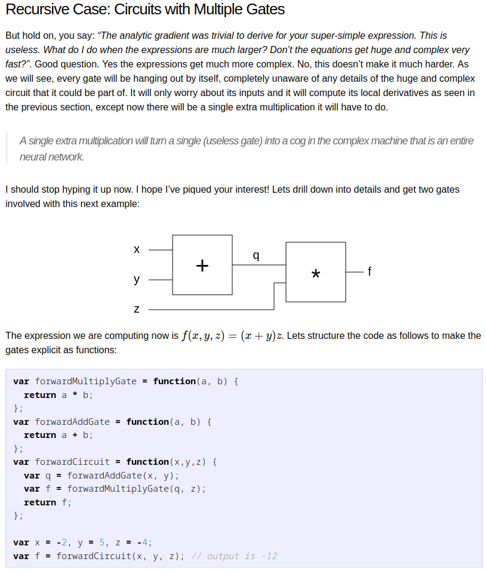
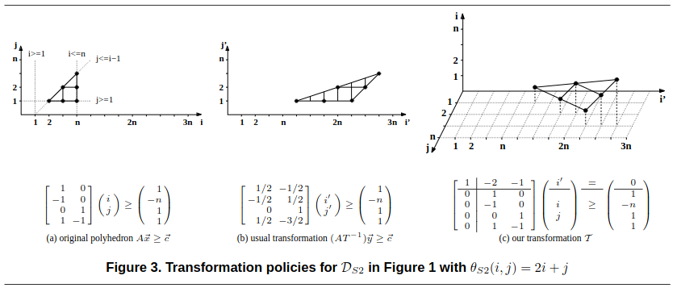
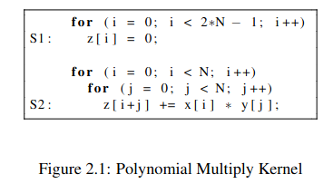
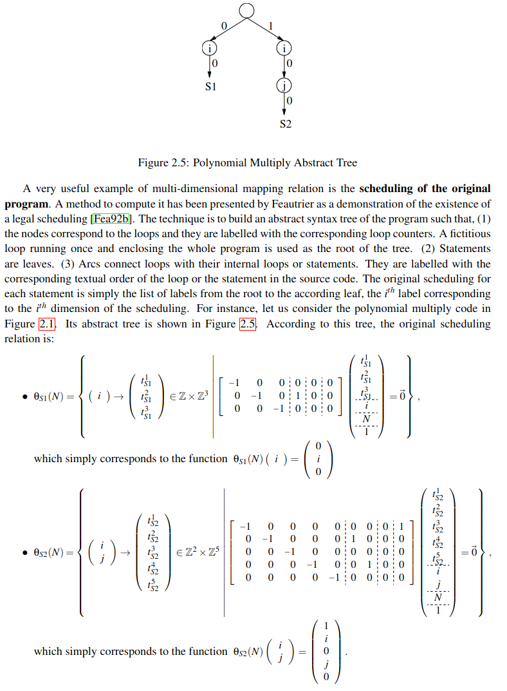

# Constraint System Intermediate Representation

<!-- TOC -->

- [Deep learning compilers & computation graphs](#deep-learning-compilers--computation-graphs)
- [Polyhedral compilers, Integer programming & constraint programming](#polyhedral-compilers-integer-programming--constraint-programming)
- [Deep dive in deep Learning inspiration](#deep-dive-in-deep-learning-inspiration)
    - [Code generation](#code-generation)
    - [Alternative HPC compiler](#alternative-hpc-compiler)
    - [Semantic pass and the expression problem](#semantic-pass-and-the-expression-problem)
    - [Computation Graph IRs](#computation-graph-irs)
    - [Prototype Deep-Learning DSL](#prototype-deep-learning-dsl)
- [Deep dive in polyhedral compiler inspiration](#deep-dive-in-polyhedral-compiler-inspiration)

<!-- /TOC -->

This collates research ideas towards an IR for polynomial constraint systems.

Cryptographic references:
- R1CS is introduced in Appendix E of
  - SNARKs for C: Verifying Program Executions Succinctly and in Zero Knowledge\
    Eli Ben-Sasson, Alessandro Chiesa, Daniel Genkin, Eran Tromer, and Madars Virza, 2013
    https://eprint.iacr.org/2013/507
- Description in LeastAuthority's MoonMath manual:
  https://leastauthority.com/community-matters/moonmath-manual/
- R1CS and UltraPlonk/Plonkish: (./r1cs_bin_format.md)[./r1cs_bin_format.md]
- AIR & Plonk: https://hackmd.io/@aztec-network/plonk-arithmetiization-air
- Plonkish:
- CCS: https://github.com/thor314/ccs-hack
- Folded Committed CCS: https://github.com/privacy-scaling-explorations/multifolding-poc
- GKR:
  - https://people.cs.georgetown.edu/jthaler/gkrnotes.pdf
  - https://ethresear.ch/t/performance-improvement-for-gkr/12228
  - https://eprint.iacr.org/2022/1072

## Deep learning compilers & computation graphs

A cryptographic constraint system is derived from an computation graph
whose representation is extremely similar to deep learning computation graphs.

For example you can map the concept of deep learning computation graphs, addition and multiplication gates forming a circuit
from deep learning (https://karpathy.github.io/neuralnets/) to gates and circuits in ZK proof systems.


Hence you likely can reuse research and inspiration from deep learning ASTs and IRs to design a suitable common representation.

There are several approaches that have been explored in my libraries:
- object algebra
- tagless final
- Algebraic datatypes (ADTs)
- shallow embeddings on top of deep embeddings

Overview from [mratsim/Arraymancer](https://github.com/mratsim/Arraymancer), experiments from [mratsim/compute-graph-optim](https://github.com/mratsim/compute-graph-optim) and a custom deep-learning abstract syntax tree (AST) from [mratsim/laser](https://github.com/mratsim/laser) are copy-pasted below.

## Polyhedral compilers, Integer programming & constraint programming

Another domain that we can use for inspiration is operation research.
Operation research deals with optimization problems that are often translated into [integer programming](https://en.wikipedia.org/wiki/Integer_programming), integer linear programming and [constraint programming](https://en.wikipedia.org/wiki/Constraint_programming).

Integer programming problems are transformed into an inequality matrix through quasi-polynomials. In particular, the domain of polyhedral compilers has by necessity transformations between constraints -> IR -> matrix.

See https://icps.u-strasbg.fr/people/bastoul/public_html/research/papers/Bas04-PACT.pdf

and https://icps.u-strasbg.fr/people/bastoul/public_html/research/papers/Bastoul_HDR.pdf



## Deep dive in deep Learning inspiration
https://github.com/mratsim/Arraymancer/issues/347#issuecomment-461009747

Some advances in my research (will find a place to store that in the future, probably in [Laser](https://github.com/numforge/laser))

### Code generation

- Kai Nacke, maintainer of LDC (LLVM D Compiler), did a very nice talk about what he learned by implementing his own compiler from scratch at FOSDEM 2019. [Slides](https://fosdem.org/2019/schedule/event/llvm_irgen/attachments/paper/3170/export/events/attachments/llvm_irgen/paper/3170/FOSDEM_2019_slides.pdf).

### Alternative HPC compiler

- http://okmij.org/ftp/meta-programming/HPC.html and the Shonan challenge, several HPC problems with a known tuned manual solution that would be nice to automatically optimize:
    - Paper - test cases: http://okmij.org/ftp/meta-programming/Shonan-challenge.pdf
    - Report: http://okmij.org/ftp/meta-programming/shonan2-report.pdf
    - 1D Conv optimisation in OCaml: http://okmij.org/ftp/meta-programming/lift/convolution.ml

### Semantic pass and the expression problem

Halide and PyTorch Glow are using the visitor pattern which looks to me like a workaround for a not expressive enough language.

We need to be able to extend functions without touching the core ones and if possible data types as well.

For example we could have the functions `Add` and `Mul` defined on `Tensor` and `CudaTensor` today and a user library implement `Div` and also extend `Add` and `Mul` on `VulkanTensor`.

Data types are probably not that critical, i.e. we could use ADTs + Generics for Tensor[float32], VulkanTensor[float16], ...

In research, there are several approaches to handle that:

  - Tagless Final, embedding DSL into a typed language: http://okmij.org/ftp/tagless-final/ and http://okmij.org/ftp/tagless-final/course/lecture.pdf
  - Object Algebra: http://ponies.io/posts/2015-07-15-solving-the-expression-problem-in-python-object-algebras-and-mypy-static-types.html
  - Attribute Grammar (needs lazy eval):
        - https://www.reddit.com/r/haskell/comments/6ugzhe/walking_the_ast_without_the_visitor_pattern/
        - https://play.rust-lang.org/?gist=1f7e5a01ec3d0010c50ecbccf93ad66b&version=nightly
        - [Functional Implementation of Multiple Traversals Program with Attribute Grammars in Scala](www.scholarpublishing.org/index.php/TMLAI/article/download/3397/1944)
  - Catamorphisms: https://medium.com/@olxc/catamorphisms-and-f-algebras-b4e91380d134
  - Transducers: http://sixty-north.com/blog/deriving-transducers-from-first-principles.html
  - Visitor vs Interpreter Pattern: https://homepages.cwi.nl/~storm/publications/visitor.pdf
  - Datatypes à la carte: http://www.cs.ru.nl/~W.Swierstra/Publications/DataTypesALaCarte.pdf
  - Functional Lenses / Multiplates: http://de.arxiv.org/ftp/arxiv/papers/1103/1103.2841.pdf
  - Monads (and Free Monads?):
    - [Generic Monadic Construcs for Embedded Languages](https://pdfs.semanticscholar.org/0c92/4ead3a6d833e049d8f224fd0526f47760336.pdf)
  - Object Algebra, traversals, visitor patterns, church encoding: [paper](http://www.informatik.uni-marburg.de/~rendel/oa2ag/rendel14object.pdf) and [slides](http://ps.informatik.uni-tuebingen.de/2014/10/23/presentation-at-oopsla/slides.pdf).
  - Developping extensible shallow embeddings (functions in host lang) on top of deep embeddings (fixed AST/IR):
      - [Folding Domain Specific Language: Deep and Shallow Embedding](https://www.cs.ox.ac.uk/people/jeremy.gibbons/publications/embedding-short.pdf)
      - [Combining Deep and SHallow Embedding for EDSL](http://www.cse.chalmers.se/~josefs/publications/TFP12.pdf) and [paper](http://www.cse.chalmers.se/~josefs/publications/svenningsson2015combining.pdf).
      - [Yin-Yang: Concealing the Deep Embedding of DSLs](http://citeseerx.ist.psu.edu/viewdoc/download?doi=10.1.1.697.1002&rep=rep1&type=pdf) and [project report](https://geirsson.com/assets/directembedding-report.pdf).
      - [Uniting Language Embedding for Fast and Friendly DSLs (thesis)](https://infoscience.epfl.ch/record/218036/files/EPFL_TH6882.pdf)
      - [Rewriting a Shallow DSL using a GHC extension](https://ku-fpg.github.io/files/Grebe-17-Transformations.pdf)
      - [An Image Processing Language: External and Shallow/Deep Embeddings](http://www.macs.hw.ac.uk/~rs46/papers/rwdsl2016/rwdsl-2016.pdf)

### Computation Graph IRs

https://github.com/mratsim/compute-graph-optim

- Object Algebra
- Typed Tagless Final
- ADTs
- DSL compiler

### Prototype Deep-Learning DSL

https://github.com/mratsim/laser/blob/master/laser/lux_compiler/core/lux_types.nim

```Nim
type

  # ###########################################
  #
  #         Internal AST Representation
  #
  # ###########################################

  UnaryOpKind* = enum
    Ln
    Exp

  BinaryOpKind* = enum
    # Must return a scalar for scalar expr check
    Add
    Mul
    Eq

  TernaryOpKind* = enum
    # Must return a scalar for scalar expr check
    Fma # FusedMultiplyAdd
    Mux # Multiplexer / Selector for example max(x, 0) == mux(x>0, x, 0)

  LuxNodeKind* = enum
    ## Computation Graph / Abstract Syntax Tree nodes
    ## that represents a Lux computation.

    # Order is important to separate Expression from statements

    # ################### High-level #########################
    # Functions are the high-level concepts of Lux

    # Scalars, Tensors, Chained Functions
    Func        # Everything is a function
                # to promote composability

    # ################### Expressions #########################

    # ----- Kinds not using "children: seq[LuxNode]" field
    # Scalar invariants
    IntLit      # Integer immediate (known at compile-time)
    FloatLit    # Float immediate (known at compile-time)
    IntParam    # Integer environment parameter (known at run-time, invariant during function execution)
    FloatParam  # Float environment parameter (known at run-time, invariant during function execution)
    BoolParam   # Bool environment parameter (known at run-time, invariant during function execution)

    # Affine loop expression
    Domain      # Iteration Domain

    # Scalar expressions built-ins
    BinOpKind   # Built-in binary operations

    # ----- Kinds using "children: seq[LuxNode]" field
    BinOp       #

    # Tensor/Function spatial indexing and properties
    Access      # Access a single element of a Tensor/Func
    DimSize     # Get the size of one of the Tensor/Func dimensions

    # Function Calls
    ExternCall  # Extern function call like CPUInfo

    # ################### Statements #########################
    # Statements are generate when the high-level functional AST
    # is lowered to an AST that more closely match Nim's AST.

    # General statement
    StatementList

    # Scalar statements
    Assign
    Check

    # Affine loop statements
    AffineFor   # Affine for loop
    AffineIf    # Affine if

    # Affine statements:
    # - for/if constraints are a linear expression of
    #   the function invariants and the iterator indices.
    #   with i and j iterator indices and M, N invariants,
    #   Here is an overview of affine/non-affine conditions:
    #   - for i in 0 ..< 10    is valid
    #   - for i in 0 ..< N     is valid
    #   - for i in j ..< 2j+10 is valid
    #   - for i in j ..< M*N   is valid
    #   - for i in j ..< j*j   is invalid, as it's quadratic (j is not an invariant)
    #   - if 2*i - 3*j == 0    is valid
    #   - if i*j < 20          is invalid, as it's quadratic
    #
    # Note: We may extend to "if" with modulo and division by a runtime invariant
    #       which will make it a quasi-affine statement.
    #       - A non-unit step in the for-loop is quasi-affine.
    #       - This will also allows branching depending of
    #         fraction if CPU/GPU charatectristics like cache or TLB size

  Id* = int

  LuxNode* = ref object
    id*: Id

    case kind*: LuxNodeKind
    of IntLit:
      intVal*: int
    of FloatLit:
      floatVal*: float
    of IntParam, FloatParam:
      symParam*: string
    of Func:
      fn*: Fn
    of Domain:
      # Domain represents an iteration domain.
      # During execution its value corresponds to the iteration index value
      #
      # Example: "for i in 0 ..< 10:"
      # would be Domain(symbol: "i", start: 0, stop: 10, step: 1)
      # and will be replaced by the value of "i" at run-time
      #
      # Stop is exclusive.
      # We usually steps from 0 to N with N the dimension of a tensor axis.
      # This might change as Nim is inclusive and polyhedral representation
      # uses inclusive constraints.
      iter*: Iter
    of BinOpKind:
      bopKind*: BinaryOpKind
    else:
      children*: seq[LuxNode]
```

## Deep dive in polyhedral compiler inspiration

Some intro papers

- Polyhedral AST generation is more than scanning polyhedra\
  Grosser, Verdoolaege, Cohen, 2015\
  Slides: https://raw.githubusercontent.com/emeryberger/PLDI-2016/master/presentations/pldi16-presentation-toplas-polyhedral.pdf \
  Paper: https://lirias.kuleuven.be/retrieve/319112
- Presburger sets and relations:\
  From high-level modeling to low-level implementations\
  Sven Veroolaege, 2013\
  http://labexcompilation.ens-lyon.fr/wp-content/uploads/2013/02/Sven-handouts.pdf
- Contributions to High-Level Optimizations\
  Bastoul, 2012, Habilitation Thesis
  https://icps.u-strasbg.fr/people/bastoul/public_html/research/papers/Bastoul_HDR.pdf
- Code Generation in the Polyhedral Model Is Easier Than You Think\
  Cédric Bastoul, 2004\
  https://icps.u-strasbg.fr/people/bastoul/public_html/research/papers/Bas04-PACT.pdf


The library used in LLVM is ISL (Integer Set Library) which powers Polly:
- https://repo.or.cz/w/isl.git
- https://libisl.sourceforge.io/tutorial.pdf
- https://polly.llvm.org/